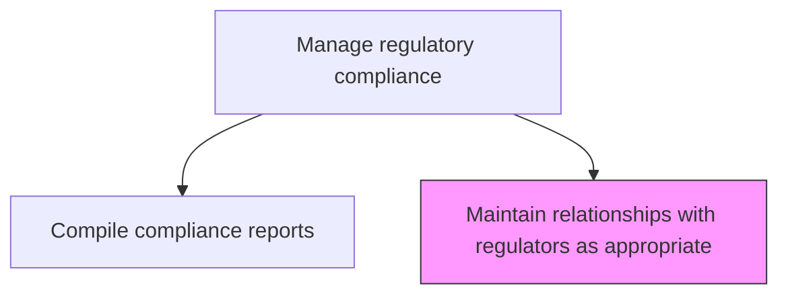
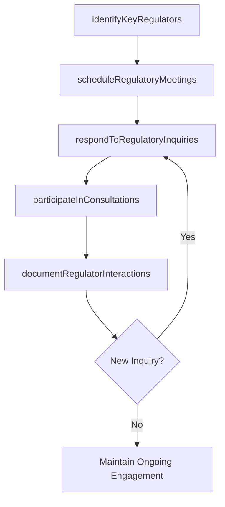

# Maintain relationships with regulators as appropriate

> Business-as-Code definition for developing and managing professional relationships with regulatory agencies while maintaining appropriate boundaries and compliance with communication protocols.

## Overview

Developing and preserving relationships with the regulators, without compromising the legal basis of the relationship.

## Process Hierarchy



## GraphDL

```yaml
maintain:
  object: Relationships With Regulators As Appropriate
  actor: RegulatoryAffairsManager
  result: RegulatorRelationshipLog
```

## Actions

| Action | Description |
|--------|-------------|
| identifyKeyRegulators | Determine the primary regulatory contacts for each compliance domain |
| scheduleRegulatoryMeetings | Arrange periodic meetings with regulatory agencies as appropriate |
| respondToRegulatoryInquiries | Address regulator questions and information requests promptly |
| participateInConsultations | Engage in regulatory rulemaking and public comment processes |
| documentRegulatorInteractions | Log all communications with regulatory agencies |

## Events

| Event | Description |
|-------|-------------|
| keyRegulatorsIdentified | Primary regulatory contacts established |
| regulatoryMeetingScheduled | Meeting with regulatory agency arranged |
| regulatoryInquiryResponded | Regulator question or information request addressed |
| consultationParticipated | Comment submitted on proposed regulation |
| regulatorInteractionDocumented | Communication with regulator formally recorded |

## Searches

| Search | Description |
|--------|-------------|
| getRegulatorContacts | Retrieve key regulatory agency contacts by domain |
| getRegulatoryMeetingHistory | Access history of meetings with regulatory agencies |
| getInquiryResponseLog | View responses to regulatory inquiries and requests |
| getConsultationSubmissions | Access public comments and consultation submissions |

## Process Flow



## RACI Matrix

| Activity | Responsible | Accountable | Consulted | Informed |
|----------|-------------|-------------|-----------|----------|
| identifyKeyRegulators | RegulatoryAffairsManager | ChiefComplianceOfficer | GovernmentAffairs | Legal |
| scheduleRegulatoryMeetings | RegulatoryAffairsManager | ChiefComplianceOfficer | GeneralCounsel | ExecutiveTeam |
| respondToRegulatoryInquiries | RegulatoryAffairsManager | GeneralCounsel | SubjectMatterExperts | ChiefComplianceOfficer |
| participateInConsultations | GovernmentRelationsSpecialist | RegulatoryAffairsManager | Legal | PublicAffairs |

## Related Processes

| Process | Relationship |
|---------|-------------|
| 11.2.2.8 Compile and communicate internal and regulatory compliance reports | Supporting - reporting supports regulator engagement |
| 11.2.2.3 Monitor the regulatory environment | Parallel - regulator relationships provide intelligence |
| 11.2.2.2 Identify applicable regulatory requirements | Supporting - regulator input clarifies requirements |
| 12.5.3 Manage government and public affairs | Parallel - government relations alignment |

## Related Departments

| Department | Role |
|-----------|------|
| Compliance | Manages day-to-day regulator interactions |
| Legal | Oversees legal aspects of regulator communications |
| Government Affairs | Coordinates public policy engagement |
| Executive Leadership | Participates in senior-level regulator meetings |

## Related Occupations

| Occupation | Involvement |
|-----------|-------------|
| Regulatory Affairs Manager | Primary relationship coordinator |
| Government Relations Specialist | Public policy engagement |
| General Counsel | Legal oversight of communications |
| Chief Compliance Officer | Senior regulator engagement |

## KPIs

| KPI | Description | Unit |
|-----|-------------|------|
| Inquiry Response Time | Average time to respond to regulatory inquiries | Days |
| Regulator Meeting Frequency | Number of scheduled regulator meetings per period | Per Quarter |
| Consultation Participation | Number of public comment submissions | Per Year |
| Interaction Documentation Rate | Percentage of regulator interactions formally documented | % |

## Usage

```typescript
import { maintainRelationshipsWithRegulatorsAsAppropriate } from '@headlessly/maintain-relationships-with-regulators-as-appropriate'

const regulators = maintainRelationshipsWithRegulatorsAsAppropriate()

// Identify key regulatory contacts
const contacts = await regulators.identifyKeyRegulators({
  domains: ['data-privacy', 'financial-services', 'environmental'],
  jurisdictions: ['US-Federal', 'EU']
})

// Respond to a regulatory inquiry
const response = await regulators.respondToRegulatoryInquiries({
  inquiryId: 'REG-INQ-2026-015',
  agency: 'FTC',
  responseDeadline: '2026-02-28',
  reviewRequired: ['legal', 'compliance']
})
```
