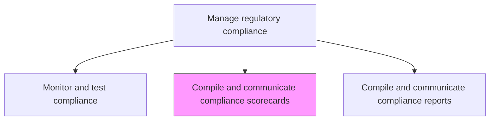
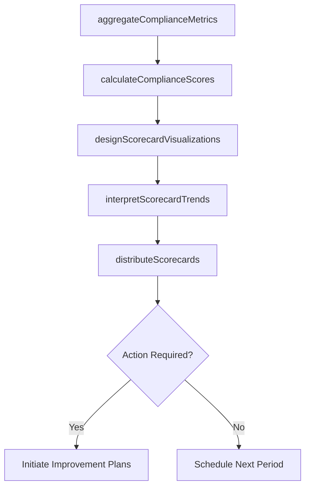

# Compile and communicate compliance scorecard(s)

> Business-as-Code definition for aggregating compliance metrics into visual scorecards that communicate the organization's compliance health to leadership and stakeholders.

## Overview

Creating a graphical representation of metrics in order to communicate the general health of the organization in relation to risk and compliancy.

## Process Hierarchy



## GraphDL

```yaml
compile:
  object: And Communicate Compliance Scorecard(s)
  actor: ComplianceReportingAnalyst
  result: ComplianceScorecard
```

## Actions

| Action | Description |
|--------|-------------|
| aggregateComplianceMetrics | Collect compliance data from monitoring, testing, and audit activities |
| calculateComplianceScores | Compute quantitative compliance scores by domain and regulation |
| designScorecardVisualizations | Create graphical representations of compliance health indicators |
| distributeScorecards | Deliver compliance scorecards to leadership and stakeholders |
| interpretScorecardTrends | Analyze scorecard data to identify improving or deteriorating compliance areas |

## Events

| Event | Description |
|-------|-------------|
| complianceMetricsAggregated | Compliance data collected from all sources |
| complianceScoresCalculated | Quantitative compliance scores computed |
| scorecardVisualizationsDesigned | Graphical compliance representations created |
| scorecardsDistributed | Compliance scorecards delivered to recipients |
| scorecardTrendsInterpreted | Trend analysis of scorecard data completed |

## Searches

| Search | Description |
|--------|-------------|
| getComplianceScorecards | Retrieve compliance scorecards by period or domain |
| getComplianceScoresByDomain | Access compliance scores filtered by regulatory domain |
| getScorecardTrends | View compliance score trends over time |
| getScoreBreakdown | Access detailed breakdown of a compliance score |

## Process Flow



## RACI Matrix

| Activity | Responsible | Accountable | Consulted | Informed |
|----------|-------------|-------------|-----------|----------|
| aggregateComplianceMetrics | ComplianceReportingAnalyst | RegulatoryComplianceManager | DataAnalytics | InternalAudit |
| calculateComplianceScores | ComplianceReportingAnalyst | RegulatoryComplianceManager | Compliance | RiskManagement |
| designScorecardVisualizations | DataVisualizationSpecialist | ComplianceReportingAnalyst | CorporateCommunications | IT |
| distributeScorecards | ComplianceReportingAnalyst | ChiefComplianceOfficer | ExecutiveTeam | BoardOfDirectors |

## Related Processes

| Process | Relationship |
|---------|-------------|
| 11.2.2.6 Monitor and test regulatory compliance position | Upstream - monitoring data feeds scorecards |
| 11.2.2.8 Compile and communicate internal and regulatory compliance reports | Parallel - reporting counterpart |
| 11.1.1.5 Prepare and report enterprise risk to executive management | Parallel - risk reporting alignment |
| 11.2.2.4 Assess current compliance position | Upstream - assessment data feeds scores |

## Related Departments

| Department | Role |
|-----------|------|
| Compliance | Compiles and distributes scorecards |
| Data Analytics | Supports data aggregation and visualization |
| Corporate Communications | Assists with scorecard design |
| Executive Leadership | Primary scorecard audience |

## Related Occupations

| Occupation | Involvement |
|-----------|-------------|
| Compliance Reporting Analyst | Primary scorecard compiler |
| Data Visualization Specialist | Visual design |
| Regulatory Compliance Manager | Content reviewer |
| Chief Compliance Officer | Scorecard presenter |

## KPIs

| KPI | Description | Unit |
|-----|-------------|------|
| Scorecard Timeliness | Percentage of scorecards delivered by scheduled date | % |
| Data Freshness | Age of most recent data in scorecards | Days |
| Stakeholder Readership | Percentage of recipients accessing scorecards | % |
| Score Accuracy | Number of post-publication corrections required | Count |

## Usage

```typescript
import { compileAndCommunicateComplianceScorecards } from '@headlessly/compile-and-communicate-compliance-scorecards'

const scorecards = compileAndCommunicateComplianceScorecards()

// Aggregate compliance metrics for the quarter
const metrics = await scorecards.aggregateComplianceMetrics({
  period: 'Q1-2026',
  domains: ['data-privacy', 'financial-reporting', 'anti-corruption', 'health-safety'],
  includeTrends: true
})

// Calculate compliance scores
const scores = await scorecards.calculateComplianceScores({
  data: metrics,
  weightingModel: 'risk-based',
  benchmarks: 'industry-average'
})
```
