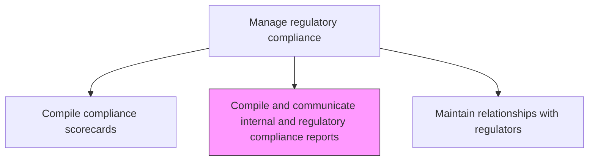
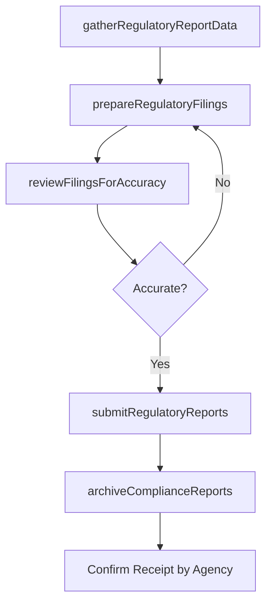

# Compile and communicate internal and regulatory compliance reports

> Business-as-Code definition for preparing and submitting compliance reports to internal stakeholders and external regulatory agencies as required by applicable laws and regulations.

## Overview

Submitting compliance reports to regulatory agencies. These reports can be made to environmental, securities, or human resources agencies as stipulated by the local governing body.

## Process Hierarchy



## GraphDL

```yaml
compile:
  object: And Communicate Internal And Regulatory Compliance Reports
  actor: RegulatoryReportingManager
  result: RegulatoryComplianceReport
```

## Actions

| Action | Description |
|--------|-------------|
| gatherRegulatoryReportData | Collect data required for regulatory filings and internal compliance reports |
| prepareRegulatoryFilings | Format compliance reports according to regulatory agency requirements |
| reviewFilingsForAccuracy | Validate report data and ensure completeness before submission |
| submitRegulatoryReports | File compliance reports with applicable regulatory agencies |
| archiveComplianceReports | Store submitted reports and supporting documentation |

## Events

| Event | Description |
|-------|-------------|
| regulatoryReportDataGathered | Required compliance report data collected |
| regulatoryFilingsPrepared | Compliance reports formatted for submission |
| filingsReviewedForAccuracy | Report accuracy and completeness validated |
| regulatoryReportsSubmitted | Compliance reports filed with regulatory agencies |
| complianceReportsArchived | Submitted reports and documentation stored |

## Searches

| Search | Description |
|--------|-------------|
| getRegulatoryFilings | Retrieve submitted regulatory filings by agency or period |
| getFilingDeadlines | Access upcoming regulatory filing deadlines |
| getFilingStatus | Check submission status of pending regulatory reports |
| getArchivedReports | Access historical compliance report archives |

## Process Flow



## RACI Matrix

| Activity | Responsible | Accountable | Consulted | Informed |
|----------|-------------|-------------|-----------|----------|
| gatherRegulatoryReportData | ComplianceAnalyst | RegulatoryReportingManager | BusinessUnitLeads | Finance |
| prepareRegulatoryFilings | RegulatoryReportingManager | ChiefComplianceOfficer | Legal | ExternalAuditor |
| reviewFilingsForAccuracy | GeneralCounsel | RegulatoryReportingManager | InternalAudit | CFO |
| submitRegulatoryReports | RegulatoryReportingManager | ChiefComplianceOfficer | GovernmentAffairs | ExecutiveTeam |

## Related Processes

| Process | Relationship |
|---------|-------------|
| 11.2.2.7 Compile and communicate compliance scorecards | Parallel - internal compliance reporting |
| 11.2.2.9 Maintain relationships with regulators | Supporting - regulator communications |
| 11.2.2.6 Monitor and test regulatory compliance | Upstream - monitoring data feeds reports |
| 9.5.2 Manage financial reporting | Parallel - financial regulatory filings |

## Related Departments

| Department | Role |
|-----------|------|
| Compliance | Prepares and submits regulatory reports |
| Legal | Reviews filings for legal accuracy |
| Finance | Provides financial compliance data |
| Government Affairs | Manages regulator submission channels |

## Related Occupations

| Occupation | Involvement |
|-----------|-------------|
| Regulatory Reporting Manager | Primary filing coordinator |
| Compliance Analyst | Data gathering and report preparation |
| General Counsel | Filing accuracy review |
| External Auditor | Independent report validation |

## KPIs

| KPI | Description | Unit |
|-----|-------------|------|
| Filing Timeliness | Percentage of regulatory reports filed before deadline | % |
| Filing Accuracy | Percentage of filings submitted without corrections | % |
| Reporting Coverage | Percentage of regulatory reporting obligations fulfilled | % |
| Agency Response Time | Average time to receive agency acknowledgment | Days |

## Usage

```typescript
import { compileAndCommunicateInternalAndRegulatoryComplianceReports } from '@headlessly/compile-and-communicate-internal-and-regulatory-compliance-reports'

const reporting = compileAndCommunicateInternalAndRegulatoryComplianceReports()

// Gather data for regulatory filing
const data = await reporting.gatherRegulatoryReportData({
  agency: 'SEC',
  filingType: 'annual-compliance-report',
  period: 'FY-2025'
})

// Prepare and submit the filing
const filing = await reporting.prepareRegulatoryFilings({
  agency: 'SEC',
  filingType: 'annual-compliance-report',
  data: data,
  deadline: '2026-03-31'
})
```
