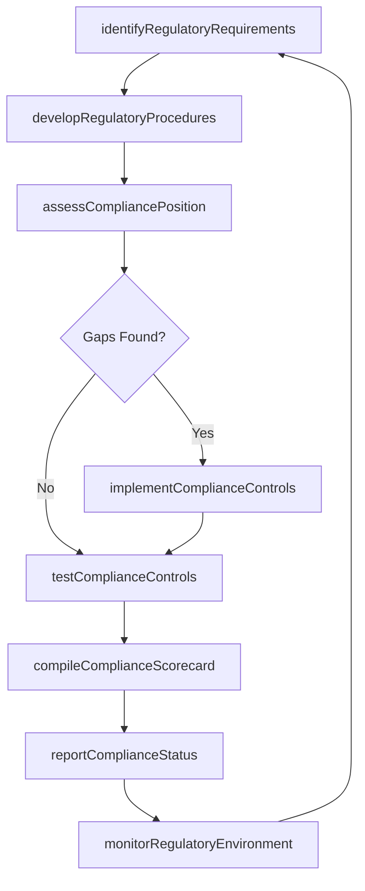

# Manage regulatory compliance

> Business-as-Code definition for developing regulatory compliance procedures, identifying applicable requirements, monitoring the regulatory environment, assessing compliance position, and maintaining regulator relationships.

## Overview

Obeying laws, guidelines, strategies, and stipulations related to the business.

## Process Hierarchy

```mermaid
graph TD
    A[Manage regulatory compliance]
    A --> B[Develop regulatory compliance procedures]
    A --> C[Identify applicable regulatory requirements]
    A --> D[Monitor the regulatory environment for changing or emerging regulations]
    A --> E[Assess current compliance position and identify weaknesses or shortfalls therein]
    A --> F[Implement missing or stronger regulatory compliance controls and policies]
    A --> G[Monitor and test regulatory compliance position and existing controls]
    A --> H[Compile and communicate compliance scorecard(s)]
    A --> I[Compile and communicate internal and regulatory compliance reports]
    A --> J[Maintain relationships with regulators as appropriate]
```

## GraphDL

```yaml
manage:
  object: Regulatory Compliance
  actor: RegulatoryComplianceManager
  result: ComplianceScorecard
```

## Actions

| Action | Description |
|--------|-------------|
| developRegulatoryProcedures | Create procedures and methodologies for regulatory compliance |
| identifyRegulatoryRequirements | Determine applicable regulations by jurisdiction and industry |
| monitorRegulatoryEnvironment | Track regulatory changes, proposed rules, and emerging requirements |
| assessCompliancePosition | Evaluate current compliance standing and identify gaps or shortfalls |
| implementComplianceControls | Deploy new or strengthened controls to close compliance gaps |
| testComplianceControls | Monitor and test the effectiveness of existing compliance controls |
| compileComplianceScorecard | Create visual dashboards showing compliance health metrics |
| reportComplianceStatus | Produce internal and regulatory compliance reports |
| maintainRegulatorRelationships | Develop and sustain constructive relationships with regulatory authorities |

## Events

| Event | Description |
|-------|-------------|
| regulatoryProceduresDeveloped | Regulatory compliance procedures published |
| regulatoryRequirementsIdentified | Applicable regulatory requirements cataloged |
| regulatoryEnvironmentMonitored | Regulatory landscape review completed |
| compliancePositionAssessed | Compliance gap assessment completed |
| complianceControlsImplemented | New or strengthened controls deployed |
| complianceControlsTested | Control testing cycle completed with results |
| complianceScorecardCompiled | Compliance scorecard published |
| complianceStatusReported | Compliance report submitted to regulators or management |
| regulatorRelationshipsMaintained | Regulator engagement activity completed |

## Searches

| Search | Description |
|--------|-------------|
| getRegulatoryRequirements | Retrieve applicable regulations by jurisdiction or domain |
| findComplianceGaps | List compliance gaps by severity, regulation, or business unit |
| getComplianceScorecard | Retrieve current compliance scorecard metrics |
| findRegulatoryChanges | List recent or upcoming regulatory changes affecting the organization |
| getControlTestResults | Query compliance control testing results by cycle or control type |

## Process Flow



## RACI Matrix

| Activity | Responsible | Accountable | Consulted | Informed |
|----------|-------------|-------------|-----------|----------|
| identifyRegulatoryRequirements | RegulatoryAnalyst | RegulatoryComplianceManager | Legal | Executive |
| assessCompliancePosition | ComplianceAnalyst | RegulatoryComplianceManager | InternalAudit | BusinessUnits |
| implementComplianceControls | ComplianceManager | ChiefComplianceOfficer | IT | Operations |
| compileComplianceScorecard | ComplianceAnalyst | RegulatoryComplianceManager | Finance | Board |
| maintainRegulatorRelationships | RegulatoryAffairsLead | ChiefComplianceOfficer | Legal | Executive |

## Sub-Processes

| ID | Name | Description |
|----|------|-------------|
| 11.2.2.1 | Develop regulatory compliance procedures | Developing procedures and methodologies to comply with relevant laws and regulations of an organizat |
| 11.2.2.2 | Identify applicable regulatory requirements | Determining the regulatory requirements that are most appropriate for the organization. Identify goa |
| 11.2.2.3 | Monitor the regulatory environment for changing or emerging regulations | Analyzing and overseeing the regulatory environment in order to spot any changing or emerging regula |
| 11.2.2.4 | Assess current compliance position and identify weaknesses or shortfalls therein | Evaluating current regulatory policies and regulations. Assess their performance. Make necessary cha |
| 11.2.2.5 | Implement missing or stronger regulatory compliance controls and policies | Assessing the current policies and policies. Implement missing and necessary changes environmental c |
| 11.2.2.6 | Monitor and test regulatory compliance position and existing controls | Monitoring, appraising, and evaluating the compliance position of the organization in order to fine- |
| 11.2.2.7 | Compile and communicate compliance scorecard(s) | Creating a graphical representation of metrics in order to communicate the general health of the org |
| 11.2.2.8 | Compile and communicate internal and regulatory compliance reports | Submitting compliance reports to regulatory agencies. These reports can be made to environmental, se |
| 11.2.2.9 | Maintain relationships with regulators as appropriate | Developing and preserving relationships with the regulators, without compromising the legal basis of |

## Related Processes

| Process | Relationship |
|---------|-------------|
| 11.2.1 Establish compliance framework and policies | Upstream - compliance framework provides the foundation for regulatory management |
| 11.1 Manage enterprise risk | Parallel - regulatory non-compliance is a key enterprise risk |
| 12.4.5 Ensure compliance | Parallel - legal compliance programs integrate with regulatory compliance |

## Related Departments

| Department | Role |
|-----------|------|
| Compliance | Develops procedures and monitors regulatory adherence |
| Legal | Interprets regulatory requirements and advises on obligations |
| Regulatory Affairs | Maintains relationships with regulatory authorities |
| Internal Audit | Tests and validates compliance controls |
| Finance | Ensures financial regulatory reporting compliance |

## Related Occupations

| Occupation | Involvement |
|-----------|-------------|
| Regulatory Compliance Manager | Oversees regulatory compliance procedures and reporting |
| Regulatory Analyst | Monitors regulatory changes and assesses applicability |
| Compliance Analyst | Conducts gap assessments and compiles compliance scorecards |

## KPIs

| KPI | Description | Unit |
|-----|-------------|------|
| Regulatory Compliance Score | Overall compliance rating across all applicable regulations | % |
| Regulatory Finding Count | Number of regulatory findings or citations per audit cycle | Count |
| Control Gap Closure Time | Average days to remediate identified compliance gaps | Days |
| Regulatory Report On-Time Rate | Percentage of regulatory reports submitted by deadline | % |
| Regulator Engagement Frequency | Number of proactive regulator interactions per year | Count |

## Usage

```typescript
import { manageRegulatoryCompliance } from '@headlessly/manage-regulatory-compliance'

const regulatory = manageRegulatoryCompliance()

// Monitor regulatory environment for changes
const changes = await regulatory.monitorRegulatoryEnvironment({
  jurisdictions: ['US-Federal', 'EU', 'UK'],
  domains: ['data-privacy', 'financial-reporting', 'environmental'],
  lookbackDays: 90
})

// Compile compliance scorecard
const scorecard = await regulatory.compileComplianceScorecard({
  period: '2025-Q2',
  regulations: ['GDPR', 'SOX', 'HIPAA'],
  includeControlTestResults: true,
  audience: 'board'
})
```
