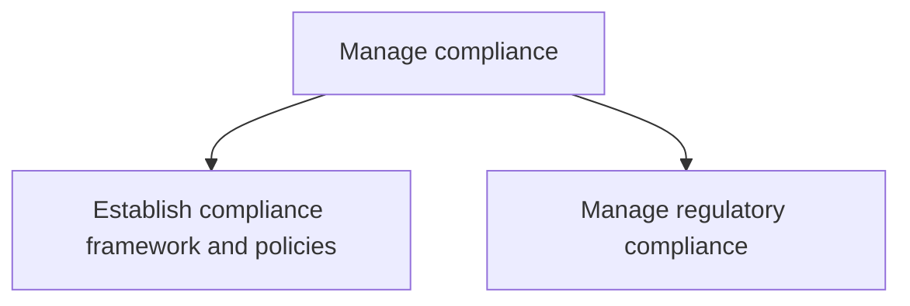
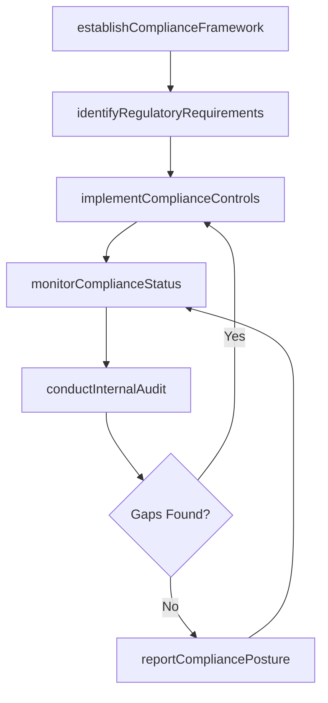

# Manage compliance

> Business-as-Code definition for establishing compliance frameworks, monitoring adherence to industry regulations and government legislation, conducting internal audits, and maintaining compliance controls and reporting.

## Overview

Managing steps to confirm enduring compliance to industry regulations and government legislation.

## Process Hierarchy



## GraphDL

```yaml
manage:
  object: Compliance
  actor: ComplianceOfficer
  result: CompliancePosture
```

## Actions

| Action | Description |
|--------|-------------|
| establishComplianceFramework | Define compliance policies, procedures, and governance structure |
| identifyRegulatoryRequirements | Catalog applicable regulations, standards, and legal obligations |
| implementComplianceControls | Deploy controls to ensure adherence to regulatory requirements |
| conductInternalAudit | Perform independent assessments of compliance control effectiveness |
| monitorComplianceStatus | Continuously track compliance metrics and control performance |
| reportCompliancePosture | Generate compliance scorecards and reports for management and regulators |

## Events

| Event | Description |
|-------|-------------|
| complianceFrameworkEstablished | Compliance policies and governance structure approved |
| regulatoryRequirementsIdentified | Applicable regulations cataloged and mapped to controls |
| complianceControlsImplemented | New or updated compliance controls deployed |
| internalAuditConducted | Audit completed with findings documented |
| complianceStatusMonitored | Compliance metrics reviewed and exceptions flagged |
| compliancePostureReported | Compliance scorecard delivered to management or regulators |

## Searches

| Search | Description |
|--------|-------------|
| findRegulations | List applicable regulations filtered by jurisdiction, industry, or domain |
| getComplianceScore | Retrieve compliance posture score for a regulation or control area |
| findAuditFindings | Query open audit findings by severity, age, or business unit |
| getControlEffectiveness | Retrieve test results for a specific compliance control |

## Process Flow



## RACI Matrix

| Activity | Responsible | Accountable | Consulted | Informed |
|----------|-------------|-------------|-----------|----------|
| establishComplianceFramework | ComplianceManager | GeneralCounsel | ChiefRiskOfficer | Board |
| identifyRegulatoryRequirements | RegulatoryAnalyst | ComplianceManager | Legal | BusinessUnitLeads |
| implementComplianceControls | ComplianceManager | GeneralCounsel | IT | Operations |
| conductInternalAudit | InternalAuditLead | AuditCommittee | ComplianceManager | CFO |
| reportCompliancePosture | ComplianceAnalyst | ComplianceManager | Legal | Executive |

## Sub-Processes

| ID | Name | Description |
|----|------|-------------|
| 11.2.1 | Establish compliance framework and policies | Developing a set of procedures detailing an organization's progress in complying with established gu |
| 11.2.2 | Manage regulatory compliance | Obeying laws, guidelines, strategies, and stipulations related to the business. |

## Related Processes

| Process | Relationship |
|---------|-------------|
| 11.1 Manage enterprise risk | Upstream - risk framework informs compliance priorities |
| 11.3 Manage remediation efforts | Downstream - compliance gaps trigger remediation |
| 12.4 Manage legal and ethical issues | Parallel - legal obligations drive compliance requirements |

## Related Departments

| Department | Role |
|-----------|------|
| Compliance | Owns compliance framework, monitoring, and reporting |
| Internal Audit | Independently tests compliance controls |
| Legal | Interprets regulatory requirements and obligations |
| Information Technology | Implements and maintains compliance technology tools |

## Related Occupations

| Occupation | Involvement |
|-----------|-------------|
| Compliance Officer | Oversees compliance program and regulatory relationships |
| Regulatory Analyst | Monitors regulatory changes and maps requirements to controls |
| Internal Auditor | Tests control effectiveness and documents findings |

## KPIs

| KPI | Description | Unit |
|-----|-------------|------|
| Compliance Score | Overall compliance posture rating across all regulations | Score (0-100) |
| Audit Finding Closure Rate | Percentage of audit findings remediated within target timeline | % |
| Regulatory Change Response Time | Average time to assess and implement new regulatory requirements | Days |
| Control Testing Coverage | Percentage of compliance controls tested within the reporting period | % |

## Usage

```typescript
import { manageCompliance } from '@headlessly/manage-compliance'

const compliance = manageCompliance()

// Identify applicable regulations for the organization
const regulations = await compliance.identifyRegulatoryRequirements({
  jurisdictions: ['US-Federal', 'EU'],
  industries: ['financial-services'],
  includeUpcoming: true
})

// Check current compliance posture
const score = await compliance.getComplianceScore({
  regulation: 'SOX',
  controlArea: 'financial-reporting'
})

// Conduct internal audit
const audit = await compliance.conductInternalAudit({
  scope: 'data-privacy',
  regulation: 'GDPR',
  businessUnit: 'european-operations'
})
```
