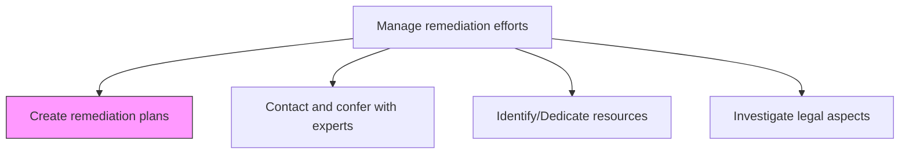
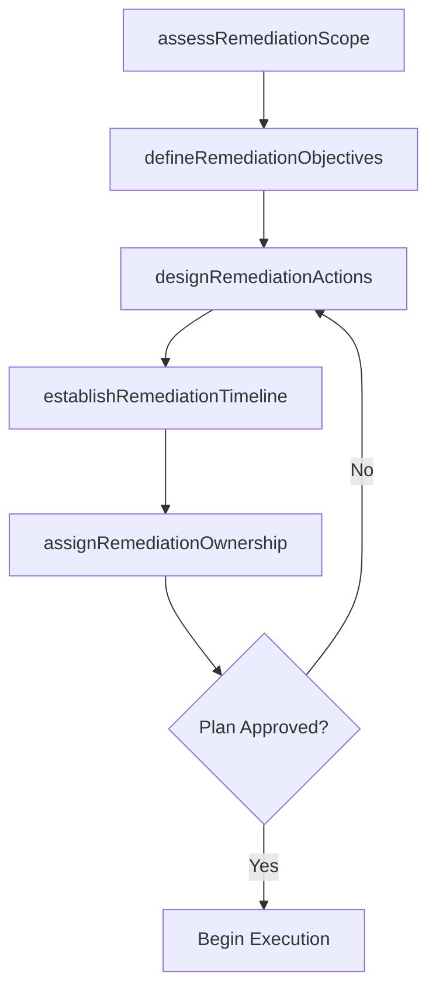

# Create remediation plans

> Business-as-Code definition for developing structured remediation plans to address compliance violations, audit findings, risk events, or environmental and operational incidents.

## Overview

Creating plans for remediation efforts. Make a plan to address a case of environmental adulteration. Identify and treat the adulteration so that the area will become operational again.

## Process Hierarchy



## GraphDL

```yaml
create:
  object: Remediation Plans
  actor: RemediationPlanningManager
  result: RemediationPlan
```

## Actions

| Action | Description |
|--------|-------------|
| assessRemediationScope | Evaluate the extent and severity of the issue requiring remediation |
| defineRemediationObjectives | Establish clear goals and success criteria for remediation |
| designRemediationActions | Create specific action steps to address the identified issue |
| establishRemediationTimeline | Set milestones, deadlines, and sequencing for remediation activities |
| assignRemediationOwnership | Designate responsible parties for each remediation action |

## Events

| Event | Description |
|-------|-------------|
| remediationScopeAssessed | Issue scope and severity evaluation completed |
| remediationObjectivesDefined | Remediation goals and success criteria established |
| remediationActionsDesigned | Specific action steps documented |
| remediationTimelineEstablished | Milestones and deadlines set |
| remediationOwnershipAssigned | Responsible parties designated |

## Searches

| Search | Description |
|--------|-------------|
| getRemediationPlans | Retrieve remediation plans by issue type or status |
| findActiveRemediations | List currently active remediation efforts |
| getRemediationTimeline | Access milestone timeline for a remediation plan |
| getPlansByOwner | Filter remediation plans by assigned responsible party |

## Process Flow



## RACI Matrix

| Activity | Responsible | Accountable | Consulted | Informed |
|----------|-------------|-------------|-----------|----------|
| assessRemediationScope | RemediationPlanningManager | ChiefRiskOfficer | SubjectMatterExperts | Legal |
| defineRemediationObjectives | RemediationPlanningManager | ExecutiveSponsor | Compliance | AuditCommittee |
| designRemediationActions | RemediationPlanningManager | ChiefRiskOfficer | OperationsManager | Finance |
| assignRemediationOwnership | ExecutiveSponsor | CEO | HumanResources | AllAffectedParties |

## Related Processes

| Process | Relationship |
|---------|-------------|
| 11.3.2 Contact and confer with experts | Parallel - expert input into plan design |
| 11.3.3 Identify/Dedicate resources | Downstream - plan drives resource allocation |
| 11.3.4 Investigate legal aspects | Parallel - legal considerations inform plan |
| 11.2.2.4 Assess current compliance position | Upstream - compliance gaps trigger remediation |

## Related Departments

| Department | Role |
|-----------|------|
| Risk Management | Leads remediation planning |
| Compliance | Provides compliance gap context |
| Operations | Contributes operational remediation expertise |
| Legal | Advises on legal implications of remediation approach |

## Related Occupations

| Occupation | Involvement |
|-----------|-------------|
| Remediation Planning Manager | Primary plan author |
| Project Manager | Timeline and milestone management |
| Subject Matter Expert | Technical input on remediation approach |
| Compliance Officer | Regulatory context for remediation |

## KPIs

| KPI | Description | Unit |
|-----|-------------|------|
| Plan Development Time | Average time from issue identification to approved plan | Days |
| Plan Completeness | Percentage of plans with all required elements documented | % |
| Stakeholder Approval Rate | Percentage of plans approved on first submission | % |
| Plan Execution Initiation | Average time from plan approval to first action execution | Days |

## Usage

```typescript
import { createRemediationPlans } from '@headlessly/create-remediation-plans'

const remediation = createRemediationPlans()

// Assess the scope of an issue requiring remediation
const scope = await remediation.assessRemediationScope({
  issueId: 'ISSUE-2026-004',
  type: 'audit-finding',
  severity: 'high',
  affectedAreas: ['financial-controls', 'data-management']
})

// Design remediation actions
const plan = await remediation.designRemediationActions({
  issueId: 'ISSUE-2026-004',
  objectives: ['close-control-gap', 'prevent-recurrence'],
  approach: 'corrective-and-preventive'
})
```
