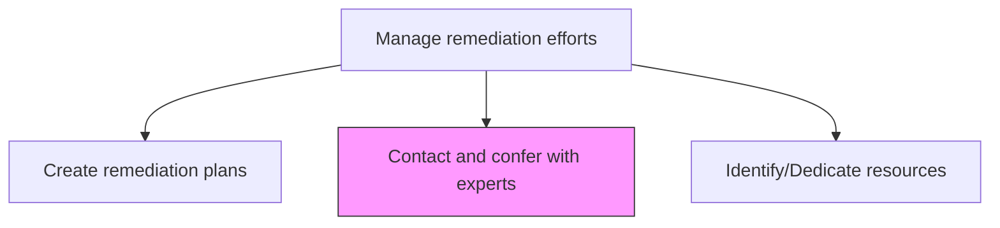
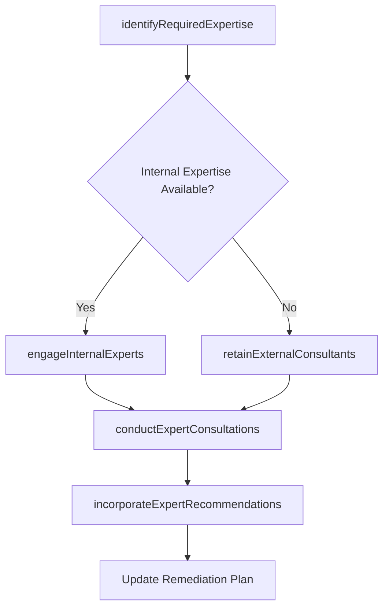

# Contact and confer with experts

> Business-as-Code definition for engaging internal and external subject matter experts to obtain specialized guidance for remediation planning and execution.

## Overview

Discussing and soliciting advice from experts for in order to incorporate their suggestion (regarding Create remediation plans [11201]).

## Process Hierarchy



## GraphDL

```yaml
contact:
  object: And Confer With Experts
  actor: RemediationCoordinator
  result: ExpertConsultationRecord
```

## Actions

| Action | Description |
|--------|-------------|
| identifyRequiredExpertise | Determine the specialized knowledge needed for the remediation effort |
| engageInternalExperts | Connect with internal subject matter experts for guidance |
| retainExternalConsultants | Engage external consultants or advisory firms for specialized expertise |
| conductExpertConsultations | Facilitate meetings and discussions with engaged experts |
| incorporateExpertRecommendations | Integrate expert guidance into the remediation plan |

## Events

| Event | Description |
|-------|-------------|
| expertiseRequirementsIdentified | Specialized knowledge needs for remediation determined |
| internalExpertsEngaged | Internal subject matter experts committed to consultation |
| externalConsultantsRetained | External advisory engagement formalized |
| expertConsultationConducted | Expert meeting or advisory session completed |
| expertRecommendationsIncorporated | Expert guidance integrated into remediation plan |

## Searches

| Search | Description |
|--------|-------------|
| findExpertsByDomain | Locate internal and external experts by specialty area |
| getConsultationHistory | Access records of past expert consultations |
| getExpertRecommendations | Retrieve recommendations provided by engaged experts |
| getConsultantEngagements | List active external consultant engagements |

## Process Flow



## RACI Matrix

| Activity | Responsible | Accountable | Consulted | Informed |
|----------|-------------|-------------|-----------|----------|
| identifyRequiredExpertise | RemediationCoordinator | RemediationPlanningManager | SubjectMatterExperts | Legal |
| engageInternalExperts | RemediationCoordinator | RemediationPlanningManager | HumanResources | BusinessUnitLeads |
| retainExternalConsultants | Procurement | RemediationPlanningManager | Legal | Finance |
| incorporateExpertRecommendations | RemediationPlanningManager | ChiefRiskOfficer | Experts | ExecutiveTeam |

## Related Processes

| Process | Relationship |
|---------|-------------|
| 11.3.1 Create remediation plans | Upstream - plans require expert input |
| 11.3.3 Identify/Dedicate resources | Parallel - expert costs require resource allocation |
| 11.3.4 Investigate legal aspects | Parallel - legal experts may be needed |
| 11.3.5 Investigate damage cause | Supporting - experts contribute to cause analysis |

## Related Departments

| Department | Role |
|-----------|------|
| Risk Management | Coordinates expert engagement |
| Procurement | Manages external consultant contracting |
| Legal | Advises on engagement terms and privilege |
| Finance | Manages expert engagement budgets |

## Related Occupations

| Occupation | Involvement |
|-----------|-------------|
| Remediation Coordinator | Expert engagement lead |
| Subject Matter Expert | Provides specialized guidance |
| External Consultant | Delivers advisory services |
| Procurement Specialist | Contract management |

## KPIs

| KPI | Description | Unit |
|-----|-------------|------|
| Expert Engagement Time | Average time from expertise need identification to engagement | Days |
| Consultation Satisfaction | Rating of expert consultation usefulness | Score (1-5) |
| Recommendation Adoption Rate | Percentage of expert recommendations incorporated into plans | % |
| Expert Cost Efficiency | Expert engagement cost relative to remediation budget | % |

## Usage

```typescript
import { contactAndConferWithExperts } from '@headlessly/contact-and-confer-with-experts'

const experts = contactAndConferWithExperts()

// Identify required expertise
const needs = await experts.identifyRequiredExpertise({
  remediationId: 'REM-2026-004',
  domains: ['environmental-remediation', 'regulatory-compliance'],
  urgency: 'high'
})

// Engage internal experts
const engagement = await experts.engageInternalExperts({
  domains: ['environmental-engineering'],
  availability: 'immediate',
  estimatedDuration: '4-weeks'
})
```
