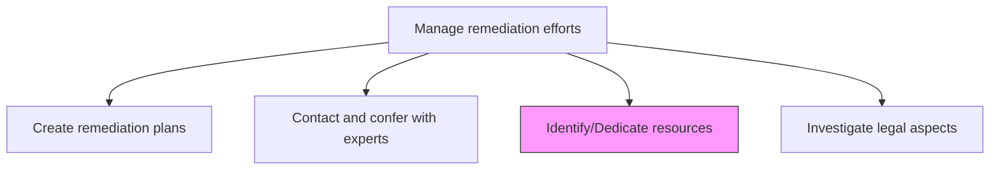
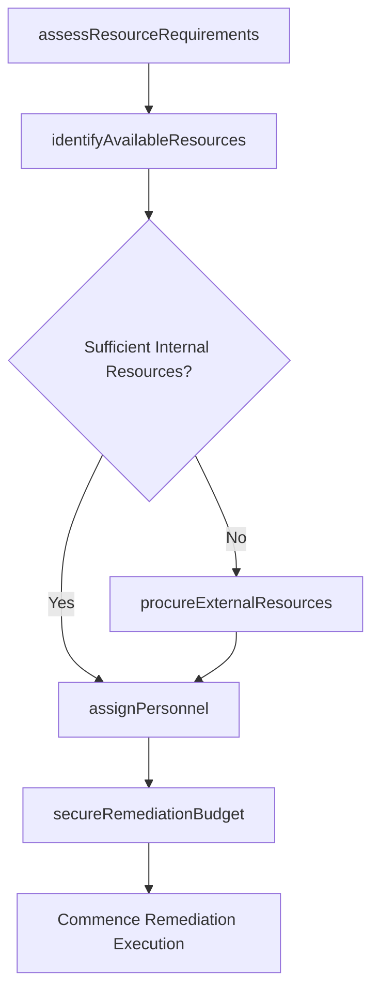

# Identify/Dedicate resources

> Business-as-Code definition for determining and allocating the personnel, budget, technology, and materials needed to execute remediation plans effectively.

## Overview

Identifying and dedicating the resources for managing remediation efforts. Discern the resources needed for remediation efforts. Dispense with resources in a sound and well-reasoned manner.

## Process Hierarchy



## GraphDL

```yaml
identify/dedicate:
  object: Resources
  actor: RemediationResourceManager
  result: ResourceAllocationPlan
```

## Actions

| Action | Description |
|--------|-------------|
| assessResourceRequirements | Evaluate the personnel, financial, and material needs for remediation |
| identifyAvailableResources | Survey available internal resources that can be allocated to remediation |
| secureRemediationBudget | Obtain financial approval and budget allocation for remediation activities |
| assignPersonnel | Dedicate staff members to remediation tasks based on skills and availability |
| procureExternalResources | Engage vendors, contractors, or tools needed for remediation execution |

## Events

| Event | Description |
|-------|-------------|
| resourceRequirementsAssessed | Remediation resource needs evaluated and documented |
| availableResourcesIdentified | Internal resource availability surveyed |
| remediationBudgetSecured | Financial allocation for remediation approved |
| personnelAssigned | Staff members dedicated to remediation activities |
| externalResourcesProcured | Vendors or contractors engaged for remediation |

## Searches

| Search | Description |
|--------|-------------|
| getResourceAllocations | Retrieve resource allocations for active remediation efforts |
| findAvailablePersonnel | List staff members available for remediation assignments |
| getRemediationBudget | Access budget allocation and spending data for remediation |
| getVendorEngagements | View external vendor and contractor engagements |

## Process Flow



## RACI Matrix

| Activity | Responsible | Accountable | Consulted | Informed |
|----------|-------------|-------------|-----------|----------|
| assessResourceRequirements | RemediationResourceManager | RemediationPlanningManager | ProjectManager | Finance |
| identifyAvailableResources | HumanResources | RemediationResourceManager | BusinessUnitLeads | Operations |
| secureRemediationBudget | CFO | CEO | ChiefRiskOfficer | AuditCommittee |
| procureExternalResources | Procurement | RemediationResourceManager | Legal | Finance |

## Related Processes

| Process | Relationship |
|---------|-------------|
| 11.3.1 Create remediation plans | Upstream - plans define resource requirements |
| 11.3.2 Contact and confer with experts | Parallel - expert costs are part of resource planning |
| 11.3.5 Investigate damage cause | Supporting - cause investigation influences resource needs |
| 9.2.2 Perform revenue accounting | Supporting - budget allocation accounting |

## Related Departments

| Department | Role |
|-----------|------|
| Risk Management | Coordinates resource identification and allocation |
| Finance | Manages remediation budget approvals |
| Human Resources | Identifies and assigns personnel |
| Procurement | Engages external vendors and contractors |

## Related Occupations

| Occupation | Involvement |
|-----------|-------------|
| Remediation Resource Manager | Primary resource coordinator |
| Financial Controller | Budget management |
| HR Business Partner | Personnel allocation |
| Procurement Specialist | External resource acquisition |

## KPIs

| KPI | Description | Unit |
|-----|-------------|------|
| Resource Allocation Time | Average time from plan approval to full resource allocation | Days |
| Budget Utilization | Percentage of allocated remediation budget spent | % |
| Personnel Availability | Percentage of required personnel assigned within target timeline | % |
| Resource Cost Efficiency | Actual remediation cost versus budgeted amount | Ratio |

## Usage

```typescript
import { identifyDedicateResources } from '@headlessly/identify-dedicate-resources'

const resources = identifyDedicateResources()

// Assess resource requirements for a remediation plan
const requirements = await resources.assessResourceRequirements({
  remediationPlanId: 'REM-PLAN-2026-004',
  resourceTypes: ['personnel', 'budget', 'technology', 'materials'],
  urgency: 'high'
})

// Secure the remediation budget
const budget = await resources.secureRemediationBudget({
  remediationPlanId: 'REM-PLAN-2026-004',
  amount: 750000,
  justification: 'Critical audit finding remediation',
  approvalChain: ['cfo', 'ceo']
})
```
