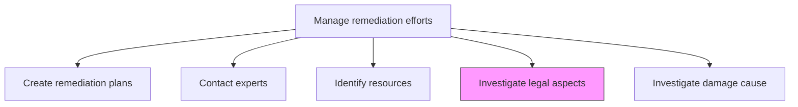
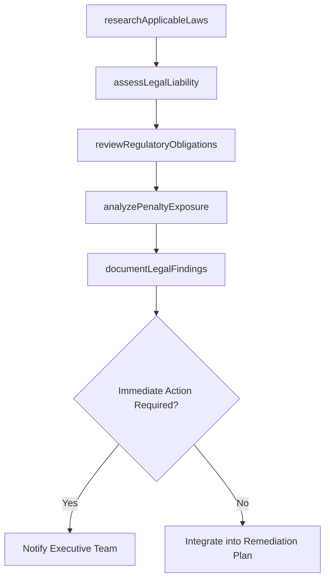

# Investigate legal aspects

> Business-as-Code definition for researching and analyzing the legal and regulatory implications of incidents, violations, or damages to inform remediation planning and organizational obligations.

## Overview

Examining regulatory and legislative frameworks. Obligate the organization to remediate any damages through compensations, fines, and any other remedial efforts necessitated to correct the situations. Analyze local environmental laws, binding international covenants, etc. in order to examine legal accuracy about the rules and procedures.

## Process Hierarchy



## GraphDL

```yaml
investigate:
  object: Legal Aspects
  actor: LegalCounsel
  result: LegalAnalysisReport
```

## Actions

| Action | Description |
|--------|-------------|
| researchApplicableLaws | Identify laws, regulations, and legal precedents relevant to the incident |
| assessLegalLiability | Evaluate the organization's legal exposure and potential liability |
| reviewRegulatoryObligations | Determine mandatory remediation requirements imposed by regulators |
| analyzePenaltyExposure | Estimate potential fines, penalties, and damages the organization may face |
| documentLegalFindings | Prepare a comprehensive legal analysis report for decision-makers |

## Events

| Event | Description |
|-------|-------------|
| applicableLawsResearched | Relevant laws and precedents identified |
| legalLiabilityAssessed | Organization's legal exposure evaluated |
| regulatoryObligationsReviewed | Mandatory remediation requirements determined |
| penaltyExposureAnalyzed | Potential fines and damages estimated |
| legalFindingsDocumented | Legal analysis report completed and distributed |

## Searches

| Search | Description |
|--------|-------------|
| getLegalAnalysisReports | Retrieve legal analysis reports by incident or issue |
| findApplicableRegulations | List regulations relevant to a specific incident type |
| getLiabilityAssessments | Access legal liability assessments |
| getPenaltyEstimates | Retrieve potential penalty and fine estimates |

## Process Flow



## RACI Matrix

| Activity | Responsible | Accountable | Consulted | Informed |
|----------|-------------|-------------|-----------|----------|
| researchApplicableLaws | LegalCounsel | GeneralCounsel | ExternalCounsel | ChiefComplianceOfficer |
| assessLegalLiability | GeneralCounsel | CEO | ChiefRiskOfficer | AuditCommittee |
| reviewRegulatoryObligations | RegulatoryAffairsManager | GeneralCounsel | ComplianceOfficer | GovernmentAffairs |
| documentLegalFindings | LegalCounsel | GeneralCounsel | RemediationPlanningManager | ExecutiveTeam |

## Related Processes

| Process | Relationship |
|---------|-------------|
| 11.3.1 Create remediation plans | Downstream - legal findings inform plan requirements |
| 11.3.5 Investigate damage cause | Parallel - cause investigation supports legal analysis |
| 11.3.6 Amend or create policy | Downstream - legal findings drive policy changes |
| 11.2.2.2 Identify applicable regulatory requirements | Supporting - regulatory requirement identification |

## Related Departments

| Department | Role |
|-----------|------|
| Legal | Leads legal investigation and analysis |
| Compliance | Provides regulatory context |
| Risk Management | Integrates legal findings into risk assessment |
| Government Affairs | Manages regulatory agency communications |

## Related Occupations

| Occupation | Involvement |
|-----------|-------------|
| Legal Counsel | Primary investigator |
| General Counsel | Investigation oversight |
| External Legal Advisor | Specialized legal expertise |
| Regulatory Affairs Manager | Regulatory obligation analysis |

## KPIs

| KPI | Description | Unit |
|-----|-------------|------|
| Investigation Completion Time | Average time from incident to completed legal analysis | Days |
| Liability Assessment Accuracy | Percentage of liability estimates within actual outcome range | % |
| Regulatory Response Timeliness | Percentage of regulatory obligations identified before deadline | % |
| Legal Cost Management | Legal investigation costs versus budget | % |

## Usage

```typescript
import { investigateLegalAspects } from '@headlessly/investigate-legal-aspects'

const legal = investigateLegalAspects()

// Research applicable laws for an incident
const laws = await legal.researchApplicableLaws({
  incidentId: 'INC-2026-012',
  incidentType: 'data-breach',
  jurisdictions: ['US-Federal', 'US-State-CA', 'EU']
})

// Assess legal liability
const liability = await legal.assessLegalLiability({
  incidentId: 'INC-2026-012',
  applicableLaws: laws.regulations,
  impactScope: { recordsAffected: 50000, jurisdictions: 3 }
})
```
