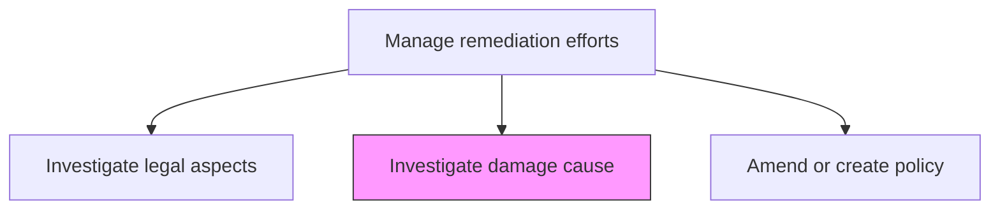
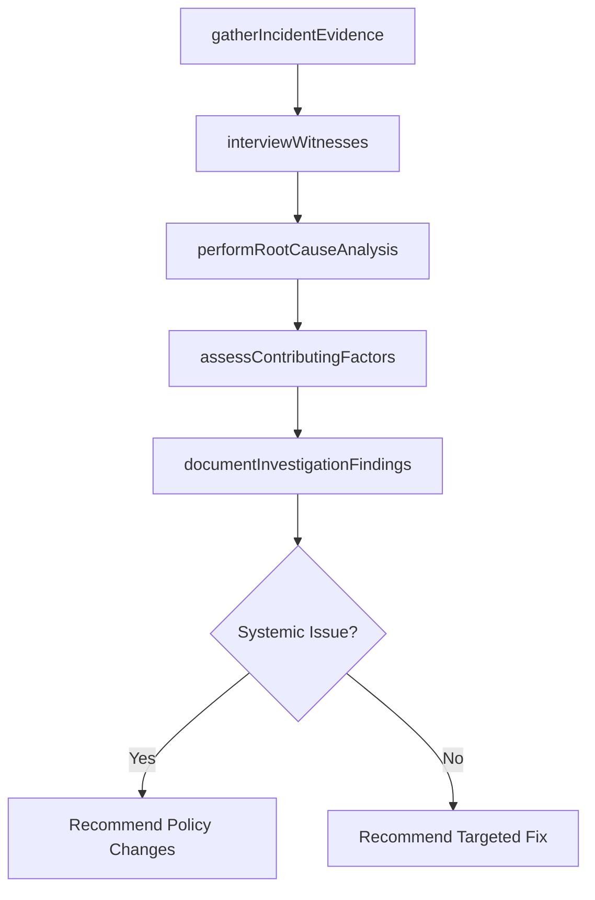

# Investigate damage cause

> Business-as-Code definition for conducting thorough investigations into the root causes of incidents, damages, or compliance failures to inform remediation and prevent recurrence.

## Overview

Studying the causes of damage, which could be environmental, physical, social, etc. at country level in order to institute better policies and regulations.

## Process Hierarchy



## GraphDL

```yaml
investigate:
  object: Damage Cause
  actor: IncidentInvestigator
  result: RootCauseAnalysisReport
```

## Actions

| Action | Description |
|--------|-------------|
| gatherIncidentEvidence | Collect physical evidence, documentation, and data related to the incident |
| interviewWitnesses | Conduct interviews with individuals who witnessed or were involved in the incident |
| performRootCauseAnalysis | Apply structured methodologies to identify underlying causes |
| assessContributingFactors | Evaluate systemic, environmental, and human factors that contributed |
| documentInvestigationFindings | Prepare a comprehensive root cause analysis report |

## Events

| Event | Description |
|-------|-------------|
| incidentEvidenceGathered | Evidence collection for incident investigation completed |
| witnessesInterviewed | Witness interviews conducted and documented |
| rootCauseAnalysisCompleted | Structured root cause analysis methodology applied |
| contributingFactorsAssessed | Contributing factors identified and evaluated |
| investigationFindingsDocumented | Root cause analysis report completed |

## Searches

| Search | Description |
|--------|-------------|
| getInvestigationReports | Retrieve root cause analysis reports by incident type |
| findSimilarIncidents | List past incidents with similar root causes |
| getEvidenceRecords | Access collected evidence for an investigation |
| getContributingFactors | Retrieve identified contributing factors by category |

## Process Flow



## RACI Matrix

| Activity | Responsible | Accountable | Consulted | Informed |
|----------|-------------|-------------|-----------|----------|
| gatherIncidentEvidence | IncidentInvestigator | InvestigationLead | SecurityTeam | Legal |
| interviewWitnesses | IncidentInvestigator | InvestigationLead | HumanResources | Compliance |
| performRootCauseAnalysis | InvestigationLead | ChiefRiskOfficer | SubjectMatterExperts | Operations |
| documentInvestigationFindings | InvestigationLead | ChiefRiskOfficer | Legal | ExecutiveTeam |

## Related Processes

| Process | Relationship |
|---------|-------------|
| 11.3.4 Investigate legal aspects | Parallel - legal context for investigation |
| 11.3.6 Amend or create policy | Downstream - findings drive policy changes |
| 11.3.1 Create remediation plans | Downstream - root cause informs remediation design |
| 11.1.4.6 Analyze risk activities and update plans | Parallel - investigation findings feed risk analysis |

## Related Departments

| Department | Role |
|-----------|------|
| Risk Management | Leads incident investigations |
| Operations | Provides operational context and access |
| Safety | Contributes safety expertise for physical incidents |
| Legal | Manages evidence preservation and legal implications |

## Related Occupations

| Occupation | Involvement |
|-----------|-------------|
| Incident Investigator | Primary field investigator |
| Root Cause Analyst | Structured analysis methodology |
| Safety Engineer | Physical incident expertise |
| Forensic Specialist | Evidence analysis |

## KPIs

| KPI | Description | Unit |
|-----|-------------|------|
| Investigation Completion Time | Average time from incident to completed root cause report | Days |
| Root Cause Identification Rate | Percentage of investigations identifying definitive root cause | % |
| Recurrence Prevention | Percentage of investigated issues that do not recur | % |
| Evidence Collection Completeness | Percentage of investigations with complete evidence records | % |

## Usage

```typescript
import { investigateDamageCause } from '@headlessly/investigate-damage-cause'

const investigation = investigateDamageCause()

// Perform root cause analysis
const rootCause = await investigation.performRootCauseAnalysis({
  incidentId: 'INC-2026-012',
  methodology: 'five-whys',
  scope: ['process-failure', 'human-factors', 'system-failure']
})

// Assess contributing factors
const factors = await investigation.assessContributingFactors({
  incidentId: 'INC-2026-012',
  categories: ['organizational', 'environmental', 'technical', 'human'],
  includeTimeline: true
})
```
