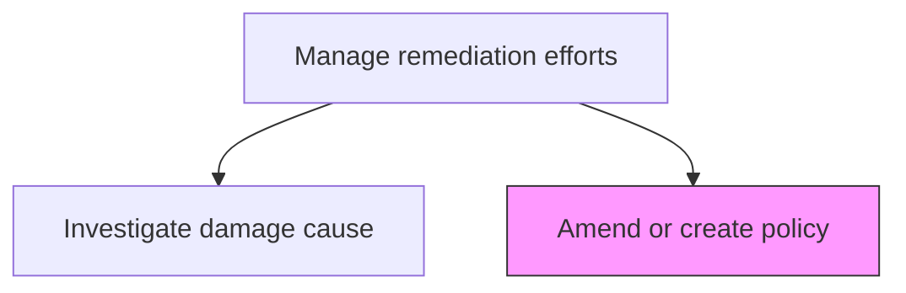
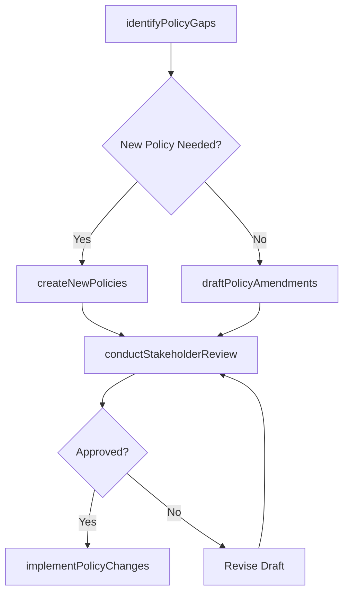

# Amend or create policy

> Business-as-Code definition for creating new policies or amending existing ones to address root causes identified through remediation investigations and prevent future incidents.

## Overview

Crafting a new framework of policies and procedures for deploying remediation efforts, or change existing policies and procedures. Adapt the policy structure to the context of the apposite national and international regulatory frameworks.

## Process Hierarchy



## GraphDL

```yaml
amend:
  object: Or Create Policy
  actor: PolicyDevelopmentManager
  result: AmendedOrNewPolicy
```

## Actions

| Action | Description |
|--------|-------------|
| identifyPolicyGaps | Determine which policies are missing or inadequate based on investigation findings |
| draftPolicyAmendments | Write revisions to existing policies to address identified deficiencies |
| createNewPolicies | Author new policies where no existing policy covers the identified risk area |
| conductStakeholderReview | Circulate draft policies for review by affected departments and legal |
| implementPolicyChanges | Publish and communicate approved policy amendments or new policies |

## Events

| Event | Description |
|-------|-------------|
| policyGapsIdentified | Missing or inadequate policies determined from investigation |
| policyAmendmentsDrafted | Revisions to existing policies authored |
| newPoliciesCreated | New policies authored for uncovered risk areas |
| stakeholderReviewCompleted | Draft policy review by stakeholders concluded |
| policyChangesImplemented | Approved policy changes published and communicated |

## Searches

| Search | Description |
|--------|-------------|
| getPolicyAmendments | Retrieve policy amendments triggered by remediation efforts |
| findPoliciesByIncident | List policies created or amended due to a specific incident |
| getPolicyDraftStatus | Access status of policies in the review and approval workflow |
| getAmendmentHistory | View historical policy amendments and their triggers |

## Process Flow



## RACI Matrix

| Activity | Responsible | Accountable | Consulted | Informed |
|----------|-------------|-------------|-----------|----------|
| identifyPolicyGaps | PolicyDevelopmentManager | ChiefRiskOfficer | InvestigationLead | Compliance |
| draftPolicyAmendments | PolicyDevelopmentManager | ChiefComplianceOfficer | Legal | BusinessUnitLeads |
| conductStakeholderReview | PolicyDevelopmentManager | ChiefRiskOfficer | ExecutiveTeam | AuditCommittee |
| implementPolicyChanges | CorporateCommunications | ChiefRiskOfficer | HumanResources | AllEmployees |

## Related Processes

| Process | Relationship |
|---------|-------------|
| 11.3.5 Investigate damage cause | Upstream - investigation findings drive policy changes |
| 11.3.4 Investigate legal aspects | Upstream - legal analysis informs policy requirements |
| 11.1.1.2 Develop and maintain enterprise risk policies | Parallel - enterprise risk policy alignment |
| 11.2.1.1 Develop enterprise compliance policies and procedures | Parallel - compliance policy alignment |

## Related Departments

| Department | Role |
|-----------|------|
| Risk Management | Identifies policy gaps from remediation findings |
| Legal | Reviews policy amendments for legal compliance |
| Compliance | Ensures alignment with regulatory requirements |
| Corporate Communications | Communicates policy changes to the organization |

## Related Occupations

| Occupation | Involvement |
|-----------|-------------|
| Policy Development Manager | Primary author and coordinator |
| General Counsel | Legal review and approval |
| Chief Risk Officer | Policy gap identification and oversight |
| Corporate Communications Specialist | Change communication |

## KPIs

| KPI | Description | Unit |
|-----|-------------|------|
| Policy Update Cycle Time | Average time from investigation finding to approved policy change | Days |
| Policy Gap Closure Rate | Percentage of identified policy gaps addressed | % |
| Stakeholder Approval Rate | Percentage of draft policies approved on first review cycle | % |
| Policy Communication Reach | Percentage of affected employees acknowledging policy changes | % |

## Usage

```typescript
import { amendOrCreatePolicy } from '@headlessly/amend-or-create-policy'

const policy = amendOrCreatePolicy()

// Identify policy gaps from investigation findings
const gaps = await policy.identifyPolicyGaps({
  investigationId: 'INV-2026-012',
  findings: ['inadequate-access-controls', 'missing-incident-response-policy'],
  currentPolicies: 'all'
})

// Draft policy amendments
const amendment = await policy.draftPolicyAmendments({
  policyId: 'POL-IT-SEC-003',
  amendments: [{
    section: 'access-controls',
    change: 'Add multi-factor authentication requirement for all privileged access'
  }],
  effectiveDate: '2026-04-01'
})
```
