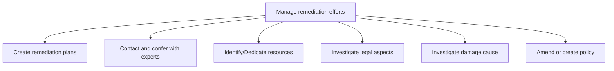
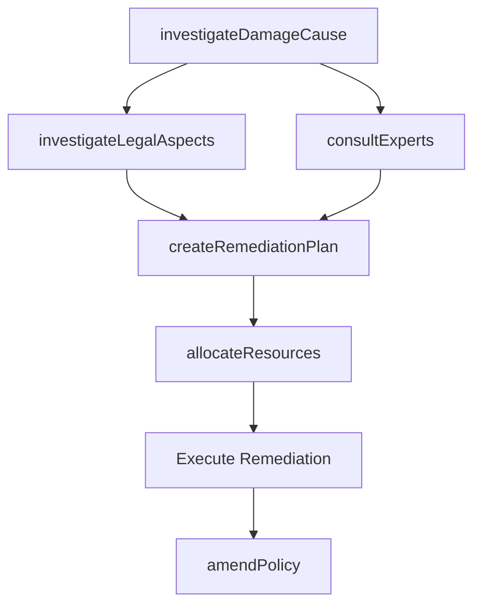

# Manage remediation efforts

> Business-as-Code definition for planning, resourcing, and executing corrective actions to address compliance gaps, risk events, audit findings, and environmental or operational damage through structured remediation programs.

## Overview

Administering the efforts and activities for remediation. This process element requires the organization to create plans for corrective action in collaboration with government agencies and pertinent professional services agencies which specialize in remediation efforts relevant to the organization's operations. Additionally, the organization needs to consult experts to validate the plan, determine resources allocation, resolve any legal concerns, and formulate a company-wide policy for remediation.

## Process Hierarchy



## GraphDL

```yaml
manage:
  object: Remediation Efforts
  actor: RemediationManager
  result: RemediationOutcome
```

## Actions

| Action | Description |
|--------|-------------|
| createRemediationPlan | Develop corrective action plan with timeline, milestones, and success criteria |
| consultExperts | Engage internal and external subject matter experts for remediation guidance |
| allocateResources | Identify and dedicate personnel, budget, and tools to remediation work |
| investigateLegalAspects | Examine regulatory and legislative implications of the incident |
| investigateDamageCause | Perform root cause analysis to determine the origin and extent of damage |
| amendPolicy | Update or create organizational policies to prevent recurrence |

## Events

| Event | Description |
|-------|-------------|
| remediationPlanCreated | Corrective action plan approved and assigned |
| expertsConsulted | Expert guidance received and incorporated into plan |
| resourcesAllocated | Personnel and budget dedicated to remediation effort |
| legalAspectsInvestigated | Regulatory and legislative review completed |
| damageCauseInvestigated | Root cause analysis completed with findings documented |
| policyAmended | Organizational policy updated or created to prevent recurrence |

## Searches

| Search | Description |
|--------|-------------|
| findRemediationPlans | Query open remediation plans by priority, owner, or target date |
| getRemediationStatus | Retrieve detailed progress on a specific remediation effort |
| findRootCauseAnalyses | List completed root cause investigations by incident type |
| getPolicyChanges | Retrieve policy amendments resulting from remediation activities |

## Process Flow



## RACI Matrix

| Activity | Responsible | Accountable | Consulted | Informed |
|----------|-------------|-------------|-----------|----------|
| investigateDamageCause | RemediationLead | ChiefRiskOfficer | SubjectMatterExperts | Legal |
| createRemediationPlan | RemediationLead | ChiefRiskOfficer | ComplianceManager | CFO |
| allocateResources | ResourceManager | COO | Finance | HR |
| investigateLegalAspects | LegalCounsel | GeneralCounsel | ExternalCounsel | ChiefRiskOfficer |
| amendPolicy | PolicyAnalyst | ChiefRiskOfficer | ComplianceManager | AllStaff |

## Sub-Processes

| ID | Name | Description |
|----|------|-------------|
| 11.3.1 | Create remediation plans | Creating plans for remediation efforts. Make a plan to address a case of environmental adulteration. |
| 11.3.2 | Contact and confer with experts | Discussing and soliciting advice from experts for in order to incorporate their suggestion (regardin |
| 11.3.3 | Identify/Dedicate resources | Identifying and dedicating the resources for managing remediation efforts. Discern the resources nee |
| 11.3.4 | Investigate legal aspects | Examining regulatory and legislative frameworks. Obligate the organization to remediate any damages  |
| 11.3.5 | Investigate damage cause | Studying the causes of damage, which could be environmental, physical, social, etc. at country level |
| 11.3.6 | Amend or create policy | Crafting a new framework of policies and procedures for deploying remediation efforts, or change exi |

## Related Processes

| Process | Relationship |
|---------|-------------|
| 11.1 Manage enterprise risk | Upstream - risk events trigger remediation activities |
| 11.2 Manage compliance | Upstream - compliance gaps drive remediation plans |
| 11.4 Manage business resiliency | Parallel - remediation lessons inform continuity planning |
| 12.4 Manage legal and ethical issues | Parallel - legal counsel supports remediation investigations |

## Related Departments

| Department | Role |
|-----------|------|
| Risk Management | Owns remediation planning and root cause investigation |
| Legal | Manages regulatory and litigation aspects of remediation |
| Compliance | Identifies compliance gaps requiring remediation |
| Operations | Provides resources and implements corrective actions |
| Finance | Allocates budget and tracks remediation costs |

## Related Occupations

| Occupation | Involvement |
|-----------|-------------|
| Remediation Manager | Leads corrective action planning and execution |
| Root Cause Analyst | Investigates incident origins and contributing factors |
| Environmental Specialist | Addresses environmental remediation and regulatory compliance |

## KPIs

| KPI | Description | Unit |
|-----|-------------|------|
| Remediation Closure Rate | Percentage of remediation plans completed within target timeline | % |
| Time to Remediate | Average elapsed time from incident to remediation closure | Days |
| Recurrence Rate | Percentage of remediated issues that recur within 12 months | % |
| Resource Utilization | Percentage of allocated remediation budget actually consumed | % |

## Usage

```typescript
import { manageRemediationEfforts } from '@headlessly/manage-remediation-efforts'

const remediation = manageRemediationEfforts()

// Create a remediation plan for audit finding
const plan = await remediation.createRemediationPlan({
  findingId: 'AUD-2025-0089',
  severity: 'high',
  targetDate: '2025-06-30',
  owner: 'compliance-team'
})

// Investigate root cause of incident
const rootCause = await remediation.investigateDamageCause({
  incidentId: 'INC-2025-0034',
  methodology: 'five-whys',
  scope: 'environmental'
})

// Query open remediation plans
const openPlans = await remediation.findRemediationPlans({
  status: 'in-progress',
  priority: 'critical',
  overdue: true
})
```
