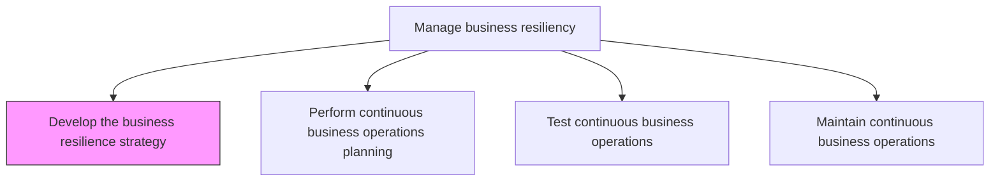
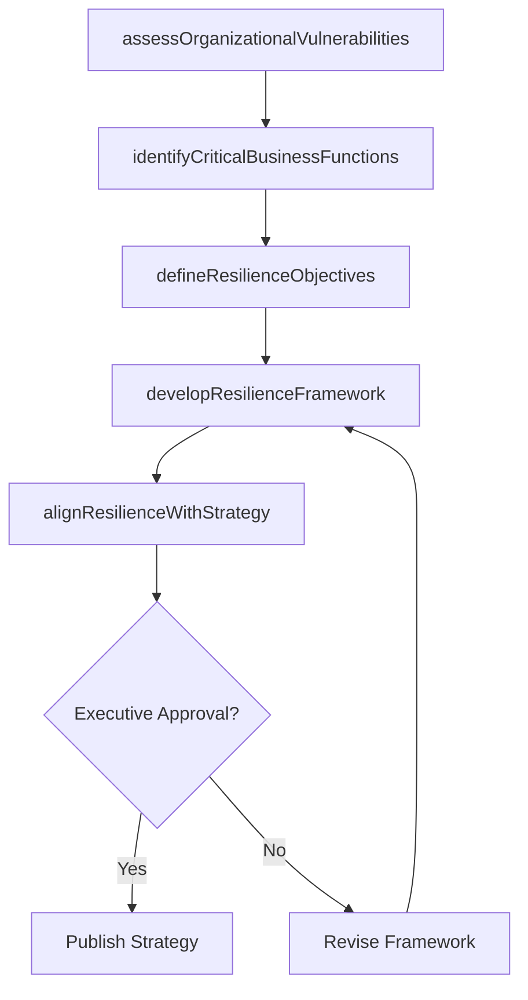

# Develop the business resilience strategy

> Business-as-Code definition for creating a comprehensive strategy that enables the organization to rapidly adapt to disruptions, maintain continuous business processes, and protect employees, assets, and brand equity.

## Overview

Creating a strategy for rapidly adapting to disturbances. Maintain continuous business processes and protecting employees, assets, and overall brand equity.

## Process Hierarchy



## GraphDL

```yaml
develop:
  object: Business Resilience Strategy
  actor: BusinessResilienceManager
  result: ResilienceStrategyDocument
```

## Actions

| Action | Description |
|--------|-------------|
| assessOrganizationalVulnerabilities | Evaluate the organization's exposure to disruptions across operations, technology, and supply chain |
| defineResilienceObjectives | Establish recovery time objectives, recovery point objectives, and minimum acceptable service levels |
| identifyCriticalBusinessFunctions | Determine which business processes and systems are essential for organizational survival |
| developResilienceFramework | Create the overarching framework of policies, procedures, and governance for business resilience |
| alignResilienceWithStrategy | Ensure the resilience strategy supports and integrates with the overall enterprise strategy |

## Events

| Event | Description |
|-------|-------------|
| vulnerabilitiesAssessed | Organizational vulnerability assessment completed across all domains |
| resilienceObjectivesDefined | Recovery objectives and minimum service levels established |
| criticalFunctionsIdentified | Essential business processes and systems cataloged and prioritized |
| resilienceFrameworkDeveloped | Comprehensive resilience framework document approved |
| resilienceStrategyAligned | Resilience strategy validated against enterprise strategic objectives |

## Searches

| Search | Description |
|--------|-------------|
| getResilienceStrategy | Retrieve the current business resilience strategy and its components |
| findCriticalFunctions | List critical business functions by priority tier or business unit |
| getRecoveryObjectives | Access recovery time and recovery point objectives for specific functions |
| getVulnerabilityAssessments | Retrieve vulnerability assessments by domain or risk category |

## Process Flow



## RACI Matrix

| Activity | Responsible | Accountable | Consulted | Informed |
|----------|-------------|-------------|-----------|----------|
| assessOrganizationalVulnerabilities | BusinessResilienceManager | ChiefRiskOfficer | BusinessUnitLeads | ExecutiveTeam |
| identifyCriticalBusinessFunctions | BusinessResilienceManager | COO | ITDirector | Finance |
| defineResilienceObjectives | BusinessResilienceManager | ChiefRiskOfficer | Operations | AuditCommittee |
| developResilienceFramework | BusinessResilienceManager | CEO | Legal | AllDepartments |

## Related Processes

| Process | Relationship |
|---------|-------------|
| 11.4.2 Perform continuous business operations planning | Downstream - strategy drives continuity planning |
| 11.1.1 Establish the enterprise risk framework and policies | Upstream - risk framework informs resilience strategy |
| 11.1.2.1 Identify enterprise-level risks | Supporting - risk identification feeds vulnerability assessment |
| 11.4.5 Share knowledge of specific risks across other parts of the organization | Downstream - strategy guides risk knowledge sharing |

## Related Departments

| Department | Role |
|-----------|------|
| Risk Management | Leads resilience strategy development and governance |
| Operations | Identifies critical operational processes and dependencies |
| Information Technology | Assesses technology resilience and disaster recovery capabilities |
| Executive Leadership | Approves strategy and allocates resources |

## Related Occupations

| Occupation | Involvement |
|-----------|-------------|
| Business Resilience Manager | Primary strategy author and coordinator |
| Chief Risk Officer | Strategy oversight and executive sponsorship |
| Business Continuity Planner | Operational planning input |
| IT Disaster Recovery Specialist | Technology resilience assessment |

## KPIs

| KPI | Description | Unit |
|-----|-------------|------|
| Critical Function Coverage | Percentage of critical business functions with defined resilience plans | % |
| Recovery Objective Achievement | Percentage of functions meeting their defined recovery time objectives | % |
| Strategy Review Frequency | How often the resilience strategy is formally reviewed and updated | Per Year |
| Vulnerability Assessment Completeness | Percentage of organizational domains with current vulnerability assessments | % |

## Usage

```typescript
import { developBusinessResilienceStrategy } from '@headlessly/develop-business-resilience-strategy'

const resilience = developBusinessResilienceStrategy()

// Assess organizational vulnerabilities
const vulnerabilities = await resilience.assessOrganizationalVulnerabilities({
  domains: ['operations', 'technology', 'supply-chain', 'workforce'],
  assessmentDepth: 'comprehensive',
  includeExternalThreats: true
})

// Define resilience objectives for critical functions
const objectives = await resilience.defineResilienceObjectives({
  businessFunction: 'order-fulfillment',
  recoveryTimeObjective: '4-hours',
  recoveryPointObjective: '1-hour',
  minimumServiceLevel: 0.8
})
```
