# Perform continuous business operations planning

> Business-as-Code definition for developing detailed business continuity plans that ensure critical operations can be sustained or rapidly restored during disruptions, disasters, or emergencies.

## Overview

Developing plans to ensure continuous business operations.

## Process Hierarchy

```mermaid
graph TD
    A[Manage business resiliency] --> B[Develop the business resilience strategy]
    A --> C[Perform continuous business operations planning]
    A --> D[Test continuous business operations]
    style C fill:#f9f,stroke:#333
```



## GraphDL

```yaml
perform:
  object: Continuous Business Operations Planning
  actor: BusinessContinuityPlanner
  result: BusinessContinuityPlan
```

## Actions

| Action | Description |
|--------|-------------|
| conductBusinessImpactAnalysis | Assess the potential impact of disruptions on each critical business function |
| developContinuityPlans | Author detailed plans for maintaining or recovering operations during disruptions |
| defineAlternateOperatingProcedures | Establish workaround procedures for operating when primary systems are unavailable |
| identifyDependenciesAndSinglePoints | Map dependencies between processes, systems, and vendors to identify single points of failure |
| assignContinuityRolesAndResponsibilities | Designate personnel responsible for executing continuity plans during an event |

## Events

| Event | Description |
|-------|-------------|
| businessImpactAnalysisConducted | Business impact analysis completed for critical functions |
| continuityPlansDeveloped | Business continuity plans authored and documented |
| alternateOperatingProceduresDefined | Workaround procedures established for disruption scenarios |
| dependenciesMapped | Process, system, and vendor dependencies cataloged |
| continuityRolesAssigned | Personnel designated for continuity plan execution |

## Searches

| Search | Description |
|--------|-------------|
| getContinuityPlans | Retrieve business continuity plans by function, location, or scenario type |
| findSinglePointsOfFailure | List identified single points of failure across operations |
| getBusinessImpactAnalysis | Access business impact analysis results by function or business unit |
| getContinuityRoleAssignments | Retrieve personnel assigned to continuity roles |

## Process Flow


## RACI Matrix

| Activity | Responsible | Accountable | Consulted | Informed |
|----------|-------------|-------------|-----------|----------|
| conductBusinessImpactAnalysis | BusinessContinuityPlanner | BusinessResilienceManager | BusinessUnitLeads | Finance |
| developContinuityPlans | BusinessContinuityPlanner | BusinessResilienceManager | ITDirector | Operations |
| defineAlternateOperatingProcedures | BusinessUnitLeads | BusinessContinuityPlanner | SubjectMatterExperts | HumanResources |
| assignContinuityRolesAndResponsibilities | BusinessContinuityPlanner | COO | HumanResources | AllEmployees |

## Related Processes

| Process | Relationship |
|---------|-------------|
| 11.4.1 Develop the business resilience strategy | Upstream - strategy guides continuity planning |
| 11.4.3 Test continuous business operations | Downstream - plans are validated through testing |
| 11.1.4.1 Identify risks | Supporting - risk identification informs continuity scenarios |
| 8.6.1 Develop IT resiliency/business continuity strategy | Parallel - IT continuity planning alignment |

## Related Departments

| Department | Role |
|-----------|------|
| Risk Management | Leads business continuity planning activities |
| Operations | Provides operational requirements and dependencies |
| Information Technology | Develops IT disaster recovery components of plans |
| Human Resources | Manages personnel assignments and communication plans |

## Related Occupations

| Occupation | Involvement |
|-----------|-------------|
| Business Continuity Planner | Primary plan author and coordinator |
| Business Impact Analyst | Conducts impact and dependency analysis |
| IT Disaster Recovery Planner | Technology recovery planning |
| Operations Manager | Validates operational continuity procedures |

## KPIs

| KPI | Description | Unit |
|-----|-------------|------|
| Plan Coverage | Percentage of critical business functions with documented continuity plans | % |
| Plan Currency | Percentage of continuity plans updated within the last 12 months | % |
| Impact Analysis Completeness | Percentage of business units with completed business impact analyses | % |
| Single Point of Failure Resolution | Percentage of identified single points of failure with mitigation plans | % |

## Usage

```typescript
import { performContinuousBusinessOperationsPlanning } from '@headlessly/perform-continuous-business-operations-planning'

const continuity = performContinuousBusinessOperationsPlanning()

// Conduct business impact analysis
const impact = await continuity.conductBusinessImpactAnalysis({
  businessUnit: 'supply-chain',
  scenarios: ['natural-disaster', 'cyber-attack', 'pandemic'],
  maxTolerableDowntime: '24-hours'
})

// Develop continuity plans based on analysis
const plan = await continuity.developContinuityPlans({
  businessFunction: 'order-processing',
  recoveryStrategy: 'warm-standby',
  alternateLocation: 'secondary-data-center',
  activationTriggers: ['site-unavailable', 'system-failure']
})
```
