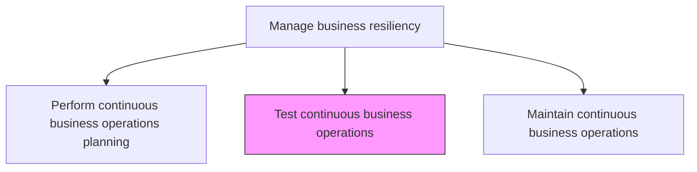
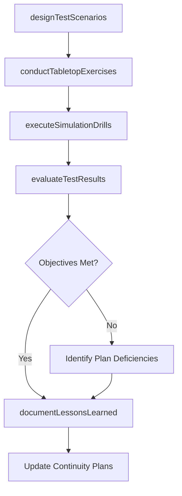

# Test continuous business operations

> Business-as-Code definition for validating business continuity plans through structured exercises, drills, and simulations to ensure the organization can maintain operations during disruptions.

## Overview

Assessing ongoing activities within the organization that are not intended to stop except for in an emergency.

## Process Hierarchy



## GraphDL

```yaml
test:
  object: Continuous Business Operations
  actor: ContinuityTestCoordinator
  result: ContinuityTestReport
```

## Actions

| Action | Description |
|--------|-------------|
| designTestScenarios | Create realistic disruption scenarios to validate continuity plan effectiveness |
| conductTabletopExercises | Facilitate discussion-based exercises walking through plan activation and response |
| executeSimulationDrills | Run live or simulated drills that test plan execution under realistic conditions |
| evaluateTestResults | Assess exercise outcomes against defined recovery objectives and success criteria |
| documentLessonsLearned | Capture findings, gaps, and improvement recommendations from test exercises |

## Events

| Event | Description |
|-------|-------------|
| testScenariosDesigned | Disruption test scenarios created and approved |
| tabletopExerciseConducted | Discussion-based continuity exercise completed |
| simulationDrillExecuted | Live or simulated continuity drill completed |
| testResultsEvaluated | Exercise outcomes assessed against recovery objectives |
| lessonsLearnedDocumented | Post-exercise findings and recommendations recorded |

## Searches

| Search | Description |
|--------|-------------|
| getTestSchedule | Retrieve the business continuity testing calendar and upcoming exercises |
| findTestResults | List test results by scenario type, business unit, or date range |
| getLessonsLearned | Access documented lessons learned from past continuity exercises |
| getTestGapAnalysis | Retrieve gaps identified through testing against recovery objectives |

## Process Flow



## RACI Matrix

| Activity | Responsible | Accountable | Consulted | Informed |
|----------|-------------|-------------|-----------|----------|
| designTestScenarios | ContinuityTestCoordinator | BusinessResilienceManager | BusinessUnitLeads | RiskManagement |
| conductTabletopExercises | ContinuityTestCoordinator | BusinessResilienceManager | ExecutiveTeam | HumanResources |
| executeSimulationDrills | ContinuityTestCoordinator | COO | ITDirector | AllParticipants |
| evaluateTestResults | ContinuityTestCoordinator | BusinessResilienceManager | InternalAudit | AuditCommittee |

## Related Processes

| Process | Relationship |
|---------|-------------|
| 11.4.2 Perform continuous business operations planning | Upstream - plans are the subject of testing |
| 11.4.4 Maintain continuous business operations | Downstream - test findings drive plan maintenance |
| 11.1.4.6 Analyze risk activities and update plans | Parallel - test results inform risk activity analysis |
| 8.6.2 Develop and test IT resiliency/business continuity plans | Parallel - IT continuity testing coordination |

## Related Departments

| Department | Role |
|-----------|------|
| Risk Management | Coordinates testing program and evaluates results |
| Operations | Participates in exercises and validates operational procedures |
| Information Technology | Tests technology recovery and failover capabilities |
| Internal Audit | Provides independent assessment of test adequacy |

## Related Occupations

| Occupation | Involvement |
|-----------|-------------|
| Continuity Test Coordinator | Primary test planner and facilitator |
| Business Resilience Manager | Test program oversight and approval |
| IT Disaster Recovery Engineer | Technology failover testing |
| Internal Auditor | Independent test assessment |

## KPIs

| KPI | Description | Unit |
|-----|-------------|------|
| Test Completion Rate | Percentage of planned continuity tests executed on schedule | % |
| Recovery Objective Achievement | Percentage of tests meeting defined recovery time and point objectives | % |
| Deficiency Resolution Rate | Percentage of test-identified deficiencies resolved before next test cycle | % |
| Exercise Participation Rate | Percentage of designated personnel participating in continuity exercises | % |

## Usage

```typescript
import { testContinuousBusinessOperations } from '@headlessly/test-continuous-business-operations'

const testing = testContinuousBusinessOperations()

// Design a test scenario
const scenario = await testing.designTestScenarios({
  scenarioType: 'data-center-outage',
  targetFunctions: ['order-processing', 'customer-support'],
  simulationLevel: 'full-scale',
  expectedDuration: '4-hours'
})

// Evaluate test results against objectives
const results = await testing.evaluateTestResults({
  exerciseId: 'EX-2026-Q1-003',
  recoveryObjectives: { rto: '4-hours', rpo: '1-hour' },
  actualRecoveryTime: '3.5-hours',
  participantFeedback: true
})
```
