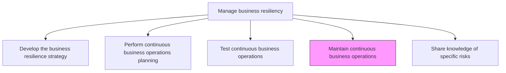
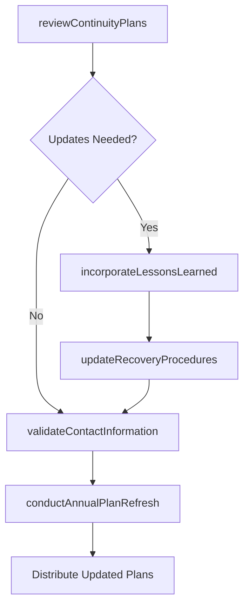

# Maintain continuous business operations

> Business-as-Code definition for keeping business continuity plans current, incorporating lessons learned, and ensuring the organization sustains operational readiness for disruption events.

## Overview

Evaluating business operations. Determine which activities generate revenues, perform best, and provide good returns.

## Process Hierarchy



## GraphDL

```yaml
maintain:
  object: Continuous Business Operations
  actor: BusinessContinuityManager
  result: UpdatedContinuityPlan
```

## Actions

| Action | Description |
|--------|-------------|
| reviewContinuityPlans | Periodically review existing business continuity plans for accuracy and relevance |
| incorporateLessonsLearned | Update plans based on findings from tests, exercises, and actual disruption events |
| updateRecoveryProcedures | Revise recovery procedures to reflect changes in technology, personnel, or operations |
| validateContactInformation | Verify that emergency contact lists, escalation paths, and vendor contacts are current |
| conductAnnualPlanRefresh | Perform a comprehensive annual update cycle for all business continuity documentation |

## Events

| Event | Description |
|-------|-------------|
| continuityPlansReviewed | Periodic review of existing business continuity plans completed |
| lessonsLearnedIncorporated | Test and incident findings integrated into continuity plans |
| recoveryProceduresUpdated | Recovery procedures revised to reflect current operations |
| contactInformationValidated | Emergency contact lists and escalation paths verified |
| annualPlanRefreshCompleted | Comprehensive annual continuity plan update cycle finished |

## Searches

| Search | Description |
|--------|-------------|
| getPlanMaintenanceSchedule | Retrieve the schedule for continuity plan reviews and updates |
| findOutdatedPlans | List continuity plans that have not been updated within the required cycle |
| getChangeLog | Access the history of changes made to continuity plans |
| getPendingUpdates | Retrieve a list of pending plan updates triggered by tests or incidents |

## Process Flow



## RACI Matrix

| Activity | Responsible | Accountable | Consulted | Informed |
|----------|-------------|-------------|-----------|----------|
| reviewContinuityPlans | BusinessContinuityManager | BusinessResilienceManager | BusinessUnitLeads | InternalAudit |
| incorporateLessonsLearned | BusinessContinuityManager | BusinessResilienceManager | ContinuityTestCoordinator | Operations |
| updateRecoveryProcedures | BusinessContinuityManager | COO | ITDirector | HumanResources |
| conductAnnualPlanRefresh | BusinessContinuityManager | ChiefRiskOfficer | ExecutiveTeam | AuditCommittee |

## Related Processes

| Process | Relationship |
|---------|-------------|
| 11.4.3 Test continuous business operations | Upstream - test results drive plan maintenance |
| 11.4.2 Perform continuous business operations planning | Parallel - planning and maintenance are iterative |
| 11.4.1 Develop the business resilience strategy | Upstream - strategy changes require plan updates |
| 11.1.4.6 Analyze risk activities and update plans | Parallel - risk analysis updates feed continuity maintenance |

## Related Departments

| Department | Role |
|-----------|------|
| Risk Management | Oversees continuity plan maintenance program |
| Operations | Validates that updated procedures reflect operational reality |
| Information Technology | Maintains technology recovery documentation |
| Human Resources | Updates personnel rosters and emergency contact information |

## Related Occupations

| Occupation | Involvement |
|-----------|-------------|
| Business Continuity Manager | Primary plan maintenance coordinator |
| Business Resilience Manager | Maintenance program oversight |
| Documentation Specialist | Plan documentation and version control |
| Change Management Analyst | Tracks organizational changes impacting plans |

## KPIs

| KPI | Description | Unit |
|-----|-------------|------|
| Plan Currency Rate | Percentage of continuity plans updated within their required review cycle | % |
| Lessons Learned Integration Time | Average time from test or incident finding to plan update | Days |
| Contact Information Accuracy | Percentage of emergency contacts verified as current | % |
| Annual Refresh Completion | Percentage of plans completing the annual refresh cycle on schedule | % |

## Usage

```typescript
import { maintainContinuousBusinessOperations } from '@headlessly/maintain-continuous-business-operations'

const maintenance = maintainContinuousBusinessOperations()

// Review continuity plans for a business unit
const review = await maintenance.reviewContinuityPlans({
  businessUnit: 'finance',
  reviewScope: 'all-plans',
  lastReviewedBefore: '2025-06-01'
})

// Incorporate lessons learned from a recent exercise
const update = await maintenance.incorporateLessonsLearned({
  exerciseId: 'EX-2026-Q1-003',
  findings: ['communication-delays', 'outdated-vendor-contacts'],
  affectedPlans: ['BCP-FIN-001', 'BCP-FIN-002'],
  priority: 'high'
})
```
