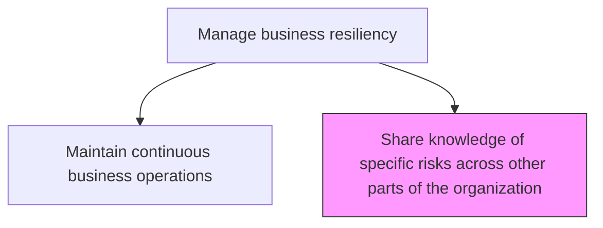
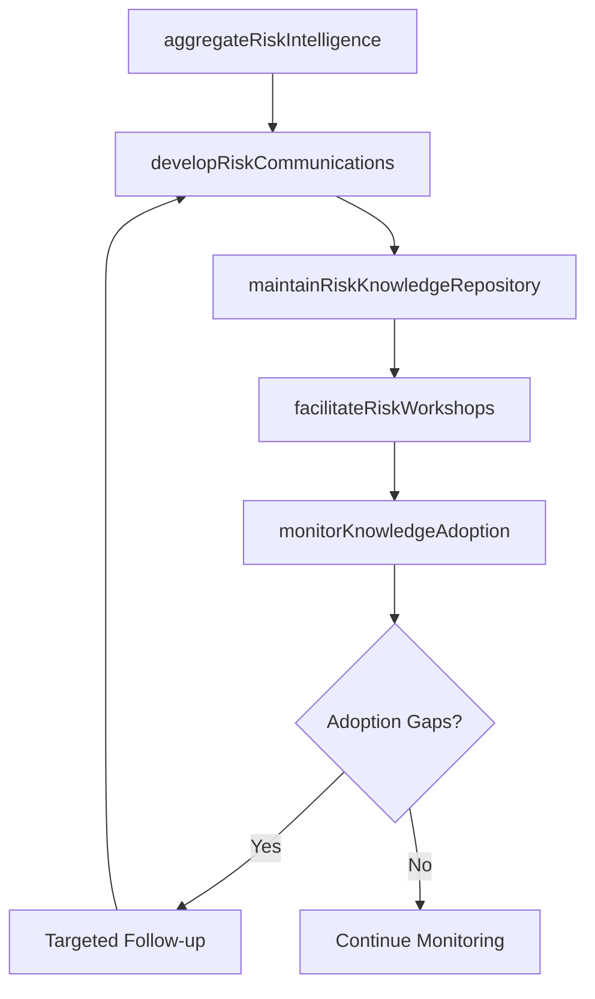

# Share knowledge of specific risks across other parts of the organization

> Business-as-Code definition for disseminating risk intelligence, resilience insights, and lessons learned across organizational units to build enterprise-wide awareness and prevent avoidable disruptions.

## Overview

Sharing information about risks and resilience strategies of business operations across the organization so that prospective risks can be avoided.

## Process Hierarchy



## GraphDL

```yaml
share:
  object: Knowledge Of Specific Risks Across Other Parts Of Organization
  actor: RiskKnowledgeManager
  result: RiskKnowledgeDisseminationRecord
```

## Actions

| Action | Description |
|--------|-------------|
| aggregateRiskIntelligence | Collect risk findings, incident reports, and lessons learned from across business units |
| developRiskCommunications | Create targeted risk briefings, alerts, and knowledge articles for organizational distribution |
| facilitateRiskWorkshops | Conduct cross-functional workshops to share risk experiences and best practices |
| maintainRiskKnowledgeRepository | Curate and update a centralized repository of risk knowledge and resilience practices |
| monitorKnowledgeAdoption | Track whether shared risk knowledge is being incorporated into business unit practices |

## Events

| Event | Description |
|-------|-------------|
| riskIntelligenceAggregated | Risk findings and lessons learned collected from business units |
| riskCommunicationsDeveloped | Risk briefings and knowledge articles created for distribution |
| riskWorkshopFacilitated | Cross-functional risk knowledge sharing workshop completed |
| riskKnowledgeRepositoryUpdated | Centralized risk knowledge repository refreshed with new content |
| knowledgeAdoptionMonitored | Business unit adoption of shared risk knowledge assessed |

## Searches

| Search | Description |
|--------|-------------|
| getRiskKnowledgeArticles | Retrieve risk knowledge articles by topic, business unit, or risk category |
| findLessonsLearned | List lessons learned from incidents and exercises by domain |
| getRiskBriefings | Access risk briefings and alerts distributed to the organization |
| getKnowledgeAdoptionMetrics | Retrieve metrics on how effectively risk knowledge is being adopted |

## Process Flow



## RACI Matrix

| Activity | Responsible | Accountable | Consulted | Informed |
|----------|-------------|-------------|-----------|----------|
| aggregateRiskIntelligence | RiskKnowledgeManager | ChiefRiskOfficer | BusinessUnitRiskLeads | InternalAudit |
| developRiskCommunications | RiskKnowledgeManager | BusinessResilienceManager | CorporateCommunications | AllDepartments |
| facilitateRiskWorkshops | RiskKnowledgeManager | ChiefRiskOfficer | SubjectMatterExperts | ExecutiveTeam |
| monitorKnowledgeAdoption | RiskKnowledgeManager | ChiefRiskOfficer | BusinessUnitLeads | AuditCommittee |

## Related Processes

| Process | Relationship |
|---------|-------------|
| 11.4.1 Develop the business resilience strategy | Upstream - strategy defines knowledge sharing priorities |
| 11.1.1.4 Coordinate the sharing of risk knowledge across the organization | Parallel - enterprise risk knowledge sharing alignment |
| 11.1.2.6 Report on enterprise risk activities | Supporting - risk reports feed knowledge sharing content |
| 11.3.5 Investigate damage cause | Upstream - investigation findings are key knowledge to share |

## Related Departments

| Department | Role |
|-----------|------|
| Risk Management | Leads risk knowledge aggregation and sharing program |
| Corporate Communications | Supports distribution of risk communications |
| Training and Development | Incorporates risk knowledge into organizational learning |
| All Business Units | Both contribute to and consume shared risk knowledge |

## Related Occupations

| Occupation | Involvement |
|-----------|-------------|
| Risk Knowledge Manager | Primary knowledge sharing coordinator |
| Corporate Communications Specialist | Risk communication design and distribution |
| Training Program Manager | Risk awareness training integration |
| Business Unit Risk Lead | Local risk knowledge contributor and champion |

## KPIs

| KPI | Description | Unit |
|-----|-------------|------|
| Knowledge Dissemination Rate | Percentage of business units receiving risk briefings within target timeframe | % |
| Knowledge Repository Usage | Number of unique users accessing the risk knowledge repository per month | Count |
| Workshop Participation Rate | Percentage of targeted personnel attending risk knowledge workshops | % |
| Risk Recurrence Reduction | Decrease in similar risk events across business units after knowledge sharing | % |

## Usage

```typescript
import { shareKnowledgeOfSpecificRisks } from '@headlessly/share-knowledge-of-specific-risks-across-other-parts-of-organization'

const knowledge = shareKnowledgeOfSpecificRisks()

// Aggregate risk intelligence from business units
const intelligence = await knowledge.aggregateRiskIntelligence({
  sources: ['incident-reports', 'audit-findings', 'exercise-lessons'],
  timePeriod: 'last-quarter',
  riskCategories: ['operational', 'technology', 'compliance']
})

// Develop risk communications for distribution
const briefing = await knowledge.developRiskCommunications({
  topic: 'supply-chain-disruption-patterns',
  targetAudience: ['operations', 'procurement', 'logistics'],
  format: 'risk-briefing',
  urgency: 'standard'
})
```
