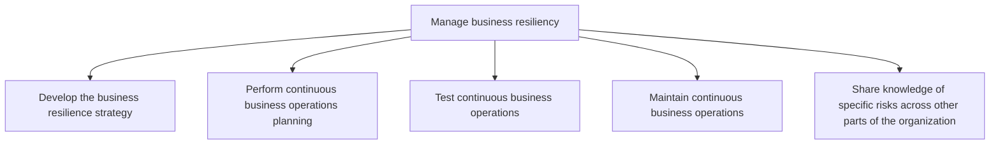
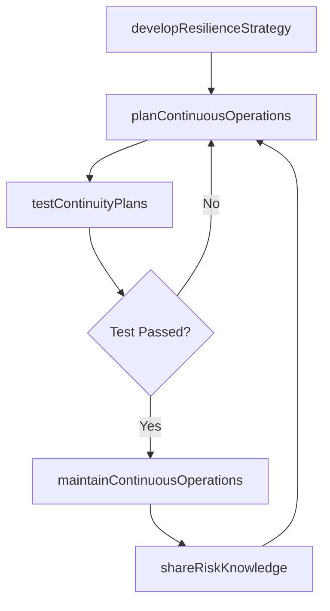

# Manage business resiliency

> Business-as-Code definition for developing, testing, and maintaining the organization's ability to rapidly adapt and respond to disruptions, ensuring continuous business operations and knowledge sharing of risk-related insights across the enterprise.

## Overview

Including the processes required to rapidly adapt and respond to any internal or external opportunity, demand, disruption, or threat. Develop a more dynamic, strategic, and integrated approach to managing compliance obligations.

## Process Hierarchy



## GraphDL

```yaml
manage:
  object: Business Resiliency
  actor: BusinessContinuityManager
  result: ResiliencyPosture
```

## Actions

| Action | Description |
|--------|-------------|
| developResilienceStrategy | Define the overarching approach to business continuity and disaster recovery |
| planContinuousOperations | Create detailed plans to maintain critical operations during disruptions |
| testContinuityPlans | Conduct tabletop exercises, simulations, and failover tests |
| maintainContinuousOperations | Execute and sustain business operations during actual disruptions |
| shareRiskKnowledge | Disseminate lessons learned and risk insights across the organization |

## Events

| Event | Description |
|-------|-------------|
| resilienceStrategyDeveloped | Business continuity and disaster recovery strategy approved |
| continuousOperationsPlanned | Continuity plans created for critical business functions |
| continuityPlansTested | Simulation or failover test completed with results documented |
| continuousOperationsMaintained | Critical operations sustained during a disruption event |
| riskKnowledgeShared | Lessons learned and risk insights distributed to stakeholders |

## Searches

| Search | Description |
|--------|-------------|
| findContinuityPlans | List business continuity plans by business function or criticality |
| getTestResults | Retrieve continuity test results and improvement recommendations |
| getRecoveryObjectives | Query recovery time and recovery point objectives by system |
| findLessonsLearned | Search post-incident reviews and lessons learned repository |

## Process Flow



## RACI Matrix

| Activity | Responsible | Accountable | Consulted | Informed |
|----------|-------------|-------------|-----------|----------|
| developResilienceStrategy | BCPManager | COO | ChiefRiskOfficer | Board |
| planContinuousOperations | BCPCoordinator | BCPManager | IT | BusinessUnitLeads |
| testContinuityPlans | BCPCoordinator | BCPManager | IT | Operations |
| maintainContinuousOperations | IncidentCommander | COO | IT | AllStaff |
| shareRiskKnowledge | RiskCommunications | ChiefRiskOfficer | HR | AllStaff |

## Sub-Processes

| ID | Name | Description |
|----|------|-------------|
| 11.4.1 | Develop the business resilience strategy | Creating a strategy for rapidly adapting to disturbances. Maintain continuous business processes and |
| 11.4.2 | Perform continuous business operations planning | Developing plans to ensure continuous business operations. |
| 11.4.3 | Test continuous business operations | Assessing ongoing activities within the organization that are not intended to stop except for in an  |
| 11.4.4 | Maintain continuous business operations | Evaluating business operations. Determine which activities generate revenues, perform best, and prov |
| 11.4.5 | Share knowledge of specific risks across other parts of the organization | Sharing information about risks and resilience strategies of business operations across the organiza |

## Related Processes

| Process | Relationship |
|---------|-------------|
| 11.1 Manage enterprise risk | Upstream - risk assessments inform continuity planning |
| 11.3 Manage remediation efforts | Parallel - incident remediation feeds lessons learned |
| 7.0 Manage Information Technology | Parallel - IT disaster recovery supports business continuity |

## Related Departments

| Department | Role |
|-----------|------|
| Business Continuity | Owns resilience strategy, planning, and testing |
| Information Technology | Manages IT disaster recovery and system failover |
| Operations | Implements continuity procedures for critical processes |
| Human Resources | Manages workforce continuity and employee communications |
| Facilities | Ensures physical workspace recovery and alternate sites |

## Related Occupations

| Occupation | Involvement |
|-----------|-------------|
| Business Continuity Manager | Develops and maintains resilience strategy and plans |
| Disaster Recovery Specialist | Manages IT failover and system recovery procedures |
| Crisis Communications Manager | Coordinates internal and external communications during events |

## KPIs

| KPI | Description | Unit |
|-----|-------------|------|
| Recovery Time Objective Achievement | Percentage of systems recovered within target RTO during tests | % |
| Continuity Plan Coverage | Percentage of critical business functions with current continuity plans | % |
| Test Frequency | Number of continuity plan tests conducted per year | Count |
| Incident Response Time | Average time from disruption detection to incident response activation | Minutes |

## Usage

```typescript
import { manageBusinessResiliency } from '@headlessly/manage-business-resiliency'

const resiliency = manageBusinessResiliency()

// Plan continuity for critical operations
const plan = await resiliency.planContinuousOperations({
  businessFunction: 'order-processing',
  criticality: 'tier-1',
  recoveryTimeObjective: '4-hours',
  recoveryPointObjective: '1-hour'
})

// Test continuity plan via simulation
const test = await resiliency.testContinuityPlans({
  planId: 'BCP-2025-012',
  testType: 'tabletop-exercise',
  scenario: 'data-center-outage',
  participants: ['IT', 'operations', 'finance']
})

// Retrieve lessons learned from recent incidents
const lessons = await resiliency.findLessonsLearned({
  incidentType: 'supply-chain-disruption',
  timeframe: 'last-12-months'
})
```
