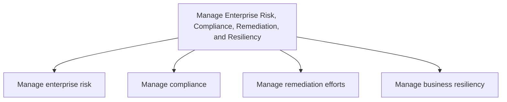
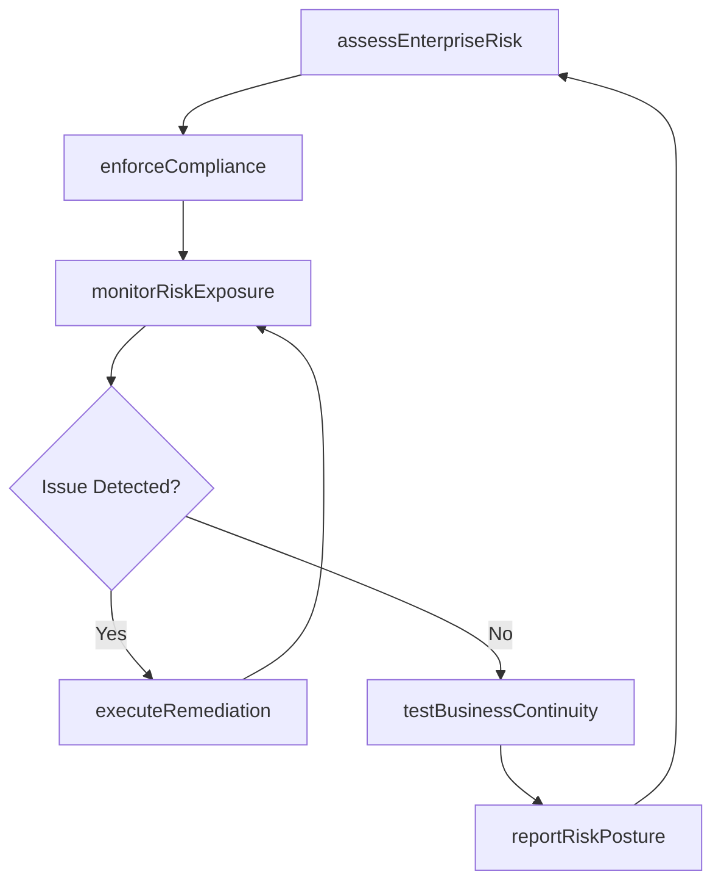

# Manage Enterprise Risk, Compliance, Remediation, and Resiliency

> Business-as-Code definition for the integrated management of enterprise risk, regulatory compliance, remediation activities, and business continuity to protect organizational value and ensure operational resilience.

## Overview

Ensuring that an organization effectively manages its risk. Process groups are aligned with traditional risk management activities.

## Process Hierarchy



## GraphDL

```yaml
manage:
  object: Enterprise Risk, Compliance, Remediation, And Resiliency
  actor: ChiefRiskOfficer
  result: RiskAndCompliancePosture
```

## Actions

| Action | Description |
|--------|-------------|
| assessEnterpriseRisk | Identify and evaluate risks across the organization using established frameworks |
| enforceCompliance | Ensure adherence to regulatory requirements and internal policies |
| executeRemediation | Carry out corrective actions to address identified deficiencies or incidents |
| testBusinessContinuity | Validate disaster recovery and continuity plans through simulations |
| monitorRiskExposure | Continuously track risk indicators and compliance metrics |
| reportRiskPosture | Generate consolidated risk, compliance, and resiliency status reports |

## Events

| Event | Description |
|-------|-------------|
| enterpriseRiskAssessed | Organization-wide risk assessment completed and scored |
| complianceEnforced | Regulatory compliance controls verified and documented |
| remediationExecuted | Corrective action plan completed for identified deficiency |
| businessContinuityTested | Continuity plan simulation completed with results documented |
| riskExposureMonitored | Risk indicators and thresholds reviewed and updated |
| riskPostureReported | Consolidated risk and compliance report delivered to stakeholders |

## Searches

| Search | Description |
|--------|-------------|
| findRisks | List enterprise risks filtered by category, severity, or business unit |
| getComplianceStatus | Retrieve current compliance posture for a regulation or control area |
| findRemediationPlans | Query open remediation actions by priority, owner, or due date |
| getResiliencyTestResults | Retrieve results from business continuity tests and simulations |
| getRiskDashboard | Get aggregated risk exposure metrics across the enterprise |

## Process Flow



## RACI Matrix

| Activity | Responsible | Accountable | Consulted | Informed |
|----------|-------------|-------------|-----------|----------|
| assessEnterpriseRisk | RiskAnalyst | ChiefRiskOfficer | BusinessUnitLeads | Board |
| enforceCompliance | ComplianceManager | GeneralCounsel | InternalAudit | CFO |
| executeRemediation | RemediationLead | ChiefRiskOfficer | Legal | OperationsDirector |
| testBusinessContinuity | BCPCoordinator | COO | IT | HumanResources |
| reportRiskPosture | RiskAnalyst | ChiefRiskOfficer | Finance | AuditCommittee |

## Sub-Processes

| ID | Name | Description |
|----|------|-------------|
| 11.1 | Manage enterprise risk | Creating requisite frameworks and coordinating all risk management activities for the entire organiz |
| 11.2 | Manage compliance | Managing steps to confirm enduring compliance to industry regulations and government legislation. |
| 11.3 | Manage remediation efforts | Administering the efforts and activities for remediation. This process element requires the organiza |
| 11.4 | Manage business resiliency | Including the processes required to rapidly adapt and respond to any internal or external opportunit |

## Related Processes

| Process | Relationship |
|---------|-------------|
| 12.4 Manage legal and ethical issues | Parallel - legal compliance feeds enterprise risk posture |
| 8.0 Manage Financial Resources | Upstream - financial controls inform risk assessment |
| 7.0 Manage Information Technology | Parallel - cybersecurity risk managed jointly |
| 13.3 Manage enterprise quality | Downstream - quality incidents trigger remediation |

## Related Departments

| Department | Role |
|-----------|------|
| Enterprise Risk Management | Primary owner of risk identification, assessment, and mitigation |
| Compliance | Manages regulatory adherence and internal control programs |
| Internal Audit | Provides independent assurance on control effectiveness |
| Legal | Advises on regulatory obligations and litigation exposure |
| Information Security | Manages cybersecurity risk and data protection compliance |

## Related Occupations

| Occupation | Involvement |
|-----------|-------------|
| Chief Risk Officer | Executive accountability for enterprise risk posture |
| Compliance Analyst | Monitors regulatory requirements and control adherence |
| Internal Auditor | Assesses control effectiveness and identifies gaps |
| Business Continuity Planner | Develops and tests resiliency and recovery plans |

## KPIs

| KPI | Description | Unit |
|-----|-------------|------|
| Risk Exposure Index | Aggregate weighted score of outstanding enterprise risks | Score |
| Compliance Rate | Percentage of regulatory controls rated as fully compliant | % |
| Remediation Closure Rate | Percentage of remediation actions closed within target timeline | % |
| Business Continuity Recovery Time | Average time to restore critical operations during tests | Hours |
| Audit Finding Aging | Average age of open audit findings | Days |

## Usage

```typescript
import { manageEnterpriseRisk } from '@headlessly/manage-enterprise-risk-compliance-remediation-and-resiliency'

const risk = manageEnterpriseRisk()

// Assess enterprise-wide risk exposure
const assessment = await risk.assessEnterpriseRisk({
  scope: 'enterprise',
  framework: 'COSO-ERM',
  businessUnits: ['operations', 'finance', 'IT']
})

// Monitor risk indicators in real time
const exposure = await risk.monitorRiskExposure({
  riskCategory: 'operational',
  threshold: 'high',
  alertOnBreach: true
})

// Query open remediation plans
const plans = await risk.findRemediationPlans({
  status: 'open',
  priority: 'critical',
  dueBefore: '2025-06-30'
})
```
