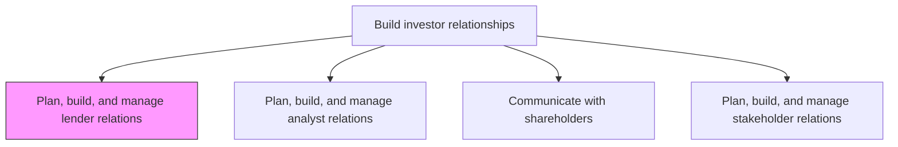
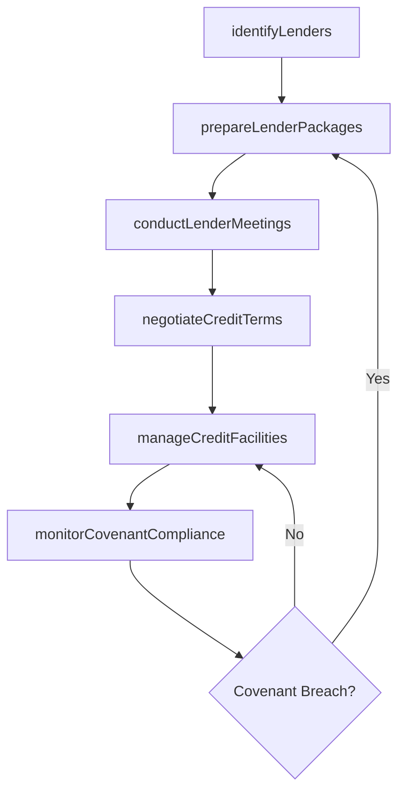

# Plan, build, and manage lender relations

> Business-as-Code definition for cultivating and sustaining relationships with banks, creditors, and lending institutions to secure favorable financing terms, maintain credit facility access, and ensure ongoing lender confidence in the organization.

## Overview

Building and managing relations with bankers or lenders through strong products/services strategies that bankers would want to invest in. Foster a receptive environment for low rates of interest, easy access to loans, etc.

## Process Hierarchy



## GraphDL

```yaml
plan:
  object: Lender Relations
  actor: TreasuryManager
  result: LenderRelationshipPortfolio
```

## Actions

| Action | Description |
|--------|-------------|
| identifyLenders | Research and evaluate potential lending institutions based on credit appetite and terms |
| negotiateCreditTerms | Negotiate interest rates, covenants, and repayment schedules with lenders |
| prepareLenderPackages | Compile financial statements, projections, and covenant compliance reports for lender review |
| conductLenderMeetings | Organize periodic meetings and site visits with bank relationship managers |
| monitorCovenantCompliance | Track adherence to financial covenants and lending agreement terms |
| manageCreditFacilities | Administer revolving credit lines, term loans, and other debt instruments |

## Events

| Event | Description |
|-------|-------------|
| lendersIdentified | Prospective lending institutions evaluated and shortlisted |
| creditTermsNegotiated | Lending agreement terms finalized with counterparty |
| lenderPackagePrepared | Financial reporting package distributed to lender group |
| lenderMeetingConducted | Periodic lender meeting or site visit completed |
| covenantComplianceMonitored | Covenant compliance review completed for reporting period |
| creditFacilityManaged | Credit facility renewed, amended, or terminated |

## Searches

| Search | Description |
|--------|-------------|
| findLenders | List lending institutions by facility type, rate, or relationship status |
| getCreditFacilities | Retrieve active credit facilities with terms and utilization data |
| getCovenantStatus | Query covenant compliance status by facility or reporting period |
| getLenderCorrespondence | Retrieve communication history with specific lending institutions |

## Process Flow



## RACI Matrix

| Activity | Responsible | Accountable | Consulted | Informed |
|----------|-------------|-------------|-----------|----------|
| identifyLenders | TreasuryAnalyst | TreasuryManager | CFO | Legal |
| negotiateCreditTerms | TreasuryManager | CFO | GeneralCounsel | Board |
| prepareLenderPackages | TreasuryAnalyst | TreasuryManager | Controller | InvestorRelations |
| monitorCovenantCompliance | TreasuryAnalyst | CFO | InternalAudit | ExternalAuditor |

## Related Processes

| Process | Relationship |
|---------|-------------|
| 12.1.2 Plan, build, and manage analyst relations | Parallel - analyst sentiment affects lender confidence |
| 12.1.3 Communicate with shareholders | Parallel - shareholder communications may reference debt posture |
| 8.3 Manage treasury operations | Upstream - treasury manages cash and debt positions |

## Related Departments

| Department | Role |
|-----------|------|
| Treasury | Primary owner of lender relationships and credit facility management |
| Finance | Provides financial data and covenant compliance reporting |
| Legal | Reviews and negotiates lending agreement terms |
| Internal Audit | Validates covenant compliance calculations |

## Related Occupations

| Occupation | Involvement |
|-----------|-------------|
| Treasury Manager | Leads lender relationship strategy and credit negotiations |
| Treasury Analyst | Prepares lender packages and monitors covenants |
| Corporate Controller | Provides financial statements for lender reporting |

## KPIs

| KPI | Description | Unit |
|-----|-------------|------|
| Weighted Average Cost of Debt | Blended interest rate across all outstanding facilities | % |
| Credit Facility Utilization | Percentage of available credit lines drawn | % |
| Covenant Compliance Rate | Percentage of covenant tests passed without waiver | % |
| Lender Meeting Frequency | Number of substantive lender meetings per year | Count |

## Usage

```typescript
import { planBuildAndManageLenderRelations } from '@headlessly/plan-build-and-manage-lender-relations'

const lenderRelations = planBuildAndManageLenderRelations()

// Prepare quarterly lender reporting package
const lenderPackage = await lenderRelations.prepareLenderPackages({
  period: 'Q4-2024',
  facilities: ['revolving-credit', 'term-loan-A'],
  includeCovenantCertificate: true
})

// Monitor covenant compliance across facilities
const compliance = await lenderRelations.monitorCovenantCompliance({
  facilityId: 'RCF-2024-001',
  covenants: ['leverage-ratio', 'interest-coverage', 'minimum-liquidity']
})

// Negotiate credit facility renewal
const renewal = await lenderRelations.negotiateCreditTerms({
  facility: 'revolving-credit',
  requestedAmount: 500000000,
  targetRate: 'SOFR+150bps',
  term: '5-years'
})
```
