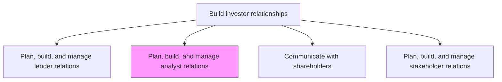
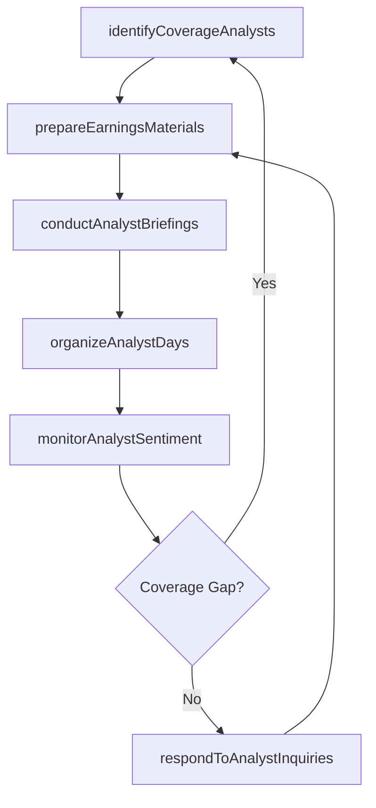

# Plan, build, and manage analyst relations

> Business-as-Code definition for developing and sustaining strategic relationships with sell-side and buy-side financial analysts to ensure accurate equity research coverage and fair market valuation of the organization.

## Overview

Creating and maintaining long-term relations with analysts. Involve analysts in strategy and product decisions in order to elicit valuable information.

## Process Hierarchy



## GraphDL

```yaml
plan:
  object: Analyst Relations
  actor: InvestorRelationsManager
  result: AnalystCoverageProfile
```

## Actions

| Action | Description |
|--------|-------------|
| identifyCoverageAnalysts | Research and target sell-side and buy-side analysts for coverage initiation |
| conductAnalystBriefings | Host one-on-one and group briefings with equity research analysts |
| prepareEarningsMaterials | Develop earnings call scripts, supplemental data, and Q&A guidance |
| organizeAnalystDays | Plan and execute analyst day events and investor conferences |
| monitorAnalystSentiment | Track analyst ratings, price targets, and research report themes |
| respondToAnalystInquiries | Address analyst questions and data requests in a timely manner |

## Events

| Event | Description |
|-------|-------------|
| coverageAnalystsIdentified | Target analyst list compiled and outreach initiated |
| analystBriefingConducted | Analyst meeting or briefing session completed |
| earningsMaterialsPrepared | Earnings call presentation and supplemental data finalized |
| analystDayOrganized | Analyst day event or investor conference executed |
| analystSentimentMonitored | Analyst ratings and research theme review completed |
| analystInquiryResponded | Analyst data request or question addressed |

## Searches

| Search | Description |
|--------|-------------|
| findAnalysts | List covering analysts by firm, rating, or coverage tenure |
| getAnalystRatings | Retrieve current analyst ratings and price targets |
| getEarningsCallHistory | Query past earnings call transcripts and Q&A summaries |
| getAnalystMeetingLog | Retrieve analyst meeting history by date or analyst firm |

## Process Flow



## RACI Matrix

| Activity | Responsible | Accountable | Consulted | Informed |
|----------|-------------|-------------|-----------|----------|
| identifyCoverageAnalysts | IRManager | CFO | CEO | Marketing |
| conductAnalystBriefings | IRManager | CFO | Legal | CEO |
| prepareEarningsMaterials | IRSpecialist | IRManager | Controller | Legal |
| monitorAnalystSentiment | IRSpecialist | IRManager | Strategy | CEO |

## Related Processes

| Process | Relationship |
|---------|-------------|
| 12.1.1 Plan, build, and manage lender relations | Parallel - lender and analyst relations share financial messaging |
| 12.1.3 Communicate with shareholders | Downstream - analyst coverage influences shareholder decisions |
| 12.5.4 Create press releases | Parallel - earnings releases coordinate with analyst briefings |

## Related Departments

| Department | Role |
|-----------|------|
| Investor Relations | Primary owner of analyst engagement and coverage management |
| Finance | Supplies financial data and forecasts for analyst materials |
| Legal | Reviews disclosures for Regulation FD compliance |
| Corporate Communications | Coordinates press releases with analyst event timing |

## Related Occupations

| Occupation | Involvement |
|-----------|-------------|
| Investor Relations Manager | Leads analyst engagement strategy and event coordination |
| IR Specialist | Prepares analyst materials and tracks coverage metrics |
| Chief Financial Officer | Presents financial results and guidance to analysts |

## KPIs

| KPI | Description | Unit |
|-----|-------------|------|
| Analyst Coverage Count | Number of sell-side analysts actively covering the stock | Count |
| Consensus Accuracy | Deviation between analyst consensus and actual earnings | % |
| Analyst Meeting Volume | Number of analyst meetings conducted per quarter | Count |
| Price Target Spread | Range between highest and lowest analyst price targets | Currency |

## Usage

```typescript
import { planBuildAndManageAnalystRelations } from '@headlessly/plan-build-and-manage-analyst-relations'

const analystRelations = planBuildAndManageAnalystRelations()

// Prepare materials for upcoming earnings call
const materials = await analystRelations.prepareEarningsMaterials({
  quarter: 'Q4-2024',
  includeGuidance: true,
  supplementalMetrics: ['ARR', 'NRR', 'customer-count']
})

// Monitor current analyst sentiment
const sentiment = await analystRelations.monitorAnalystSentiment({
  period: 'last-90-days',
  includeRatingChanges: true,
  includePriceTargetRevisions: true
})

// Organize analyst day event
const event = await analystRelations.organizeAnalystDays({
  format: 'in-person',
  location: 'headquarters',
  agenda: ['strategy-update', 'product-demos', 'Q&A-sessions']
})
```
