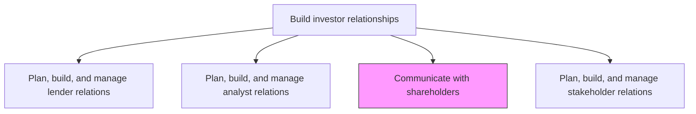
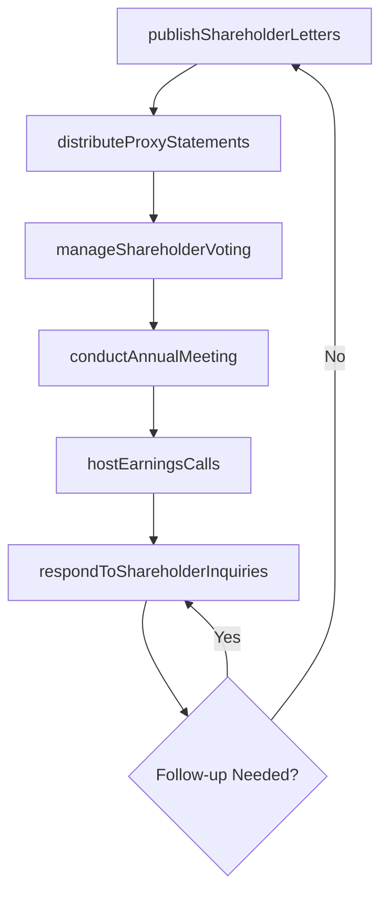

# Communicate with shareholders

> Business-as-Code definition for delivering transparent, timely, and regulatory-compliant communications to shareholders through annual meetings, quarterly earnings calls, proxy statements, and direct correspondence.

## Overview

Practicing regular, transparent communication with shareholders through annual shareholders' meetings, quarterly earnings calls, shareholders letters, one-on-one emails or calls, etc.

## Process Hierarchy



## GraphDL

```yaml
communicate:
  object: Shareholders
  actor: InvestorRelationsManager
  result: ShareholderCommunicationRecord
```

## Actions

| Action | Description |
|--------|-------------|
| conductAnnualMeeting | Plan and execute the annual general meeting of shareholders |
| hostEarningsCalls | Organize and deliver quarterly earnings conference calls |
| distributeProxyStatements | Prepare and distribute proxy materials for shareholder voting |
| publishShareholderLetters | Draft and distribute CEO or board letters to shareholders |
| respondToShareholderInquiries | Address individual shareholder questions and concerns |
| manageShareholderVoting | Administer proxy voting processes and tabulate results |

## Events

| Event | Description |
|-------|-------------|
| annualMeetingConducted | Annual shareholder meeting completed with minutes recorded |
| earningsCallHosted | Quarterly earnings conference call delivered |
| proxyStatementDistributed | Proxy materials mailed or filed electronically with shareholders |
| shareholderLetterPublished | Shareholder letter distributed to investor base |
| shareholderInquiryResponded | Individual shareholder question addressed and documented |
| shareholderVotingManaged | Proxy vote tabulated and results certified |

## Searches

| Search | Description |
|--------|-------------|
| findShareholders | List shareholders by holding size, type, or voting record |
| getProxyMaterials | Retrieve proxy statements and voting results by year |
| getEarningsCallTranscripts | Query earnings call transcripts by quarter |
| getShareholderCorrespondence | Retrieve shareholder inquiries and response history |

## Process Flow



## RACI Matrix

| Activity | Responsible | Accountable | Consulted | Informed |
|----------|-------------|-------------|-----------|----------|
| conductAnnualMeeting | CorporateSecretary | CEO | Legal | Board |
| hostEarningsCalls | IRManager | CFO | Legal | CEO |
| distributeProxyStatements | CorporateSecretary | GeneralCounsel | IRManager | Shareholders |
| respondToShareholderInquiries | IRManager | CFO | Legal | CorporateSecretary |

## Related Processes

| Process | Relationship |
|---------|-------------|
| 12.1.2 Plan, build, and manage analyst relations | Parallel - earnings calls serve both analysts and shareholders |
| 12.3.1 Report financial results | Upstream - financial results are a core shareholder communication topic |
| 12.5.5 Issue press releases | Parallel - public announcements coordinate with shareholder communications |

## Related Departments

| Department | Role |
|-----------|------|
| Investor Relations | Manages shareholder communications and engagement programs |
| Corporate Secretary | Administers annual meetings, proxy voting, and governance communications |
| Legal | Ensures SEC compliance for proxy materials and disclosures |
| Finance | Provides earnings data and financial performance narratives |

## Related Occupations

| Occupation | Involvement |
|-----------|-------------|
| Investor Relations Manager | Coordinates shareholder communications and earnings calls |
| Corporate Secretary | Manages annual meeting logistics and proxy processes |
| Securities Counsel | Reviews shareholder disclosures for regulatory compliance |

## KPIs

| KPI | Description | Unit |
|-----|-------------|------|
| Annual Meeting Attendance | Percentage of outstanding shares represented at the annual meeting | % |
| Earnings Call Participation | Number of analysts and investors on quarterly earnings calls | Count |
| Shareholder Inquiry Response Time | Average time to respond to shareholder inquiries | Business Days |
| Proxy Vote Participation Rate | Percentage of outstanding shares voted in proxy elections | % |

## Usage

```typescript
import { communicateWithShareholders } from '@headlessly/communicate-with-shareholders'

const shareholderComms = communicateWithShareholders()

// Host quarterly earnings call
const earningsCall = await shareholderComms.hostEarningsCalls({
  quarter: 'Q4-2024',
  format: 'webcast',
  presenters: ['CEO', 'CFO'],
  includeQA: true
})

// Distribute proxy materials for annual meeting
const proxy = await shareholderComms.distributeProxyStatements({
  meetingDate: '2025-06-15',
  proposals: ['board-elections', 'auditor-ratification', 'executive-compensation'],
  distributionMethod: 'electronic'
})

// Respond to shareholder inquiry
const response = await shareholderComms.respondToShareholderInquiries({
  inquiryId: 'SH-2025-0042',
  topic: 'dividend-policy',
  priority: 'high'
})
```
