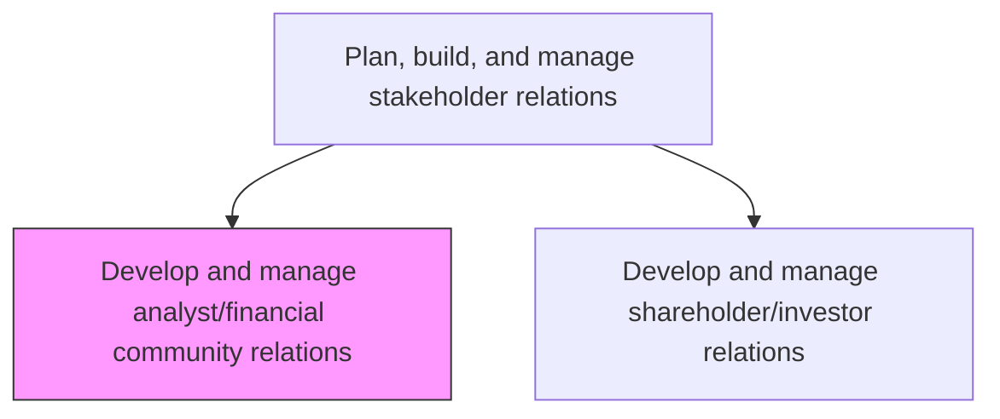
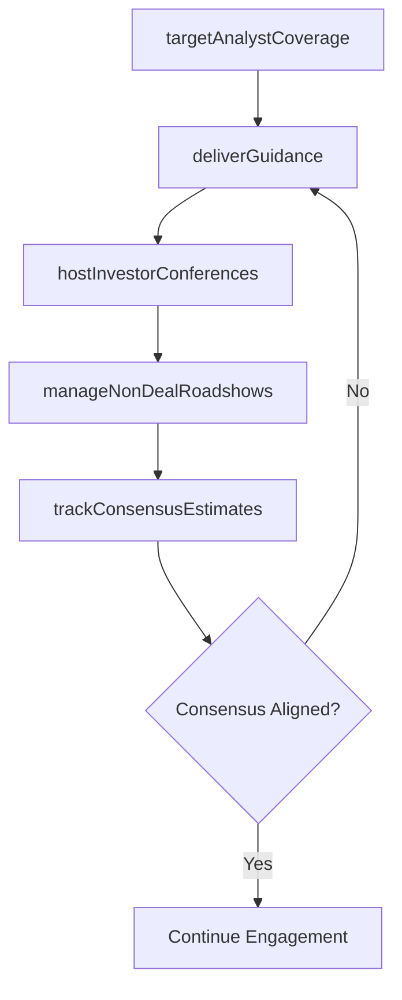

# Develop and manage analyst/financial community relations

> Business-as-Code definition for building and maintaining productive relationships with sell-side analysts, buy-side portfolio managers, and the broader financial community to ensure accurate company valuation and favorable market positioning.

## Overview

Developing and managing ongoing relationships with equity research analysts and the financial community. Coordinate analyst outreach, host investor conferences, provide timely financial guidance, and ensure the investment community receives consistent, compliant messaging about the organization's performance and outlook.

## Process Hierarchy



## GraphDL

```yaml
develop:
  object: Analyst Financial Community Relations
  actor: InvestorRelationsManager
  result: AnalystEngagementRecord
```

## Actions

| Action | Description |
|--------|-------------|
| targetAnalystCoverage | Identify and pursue sell-side analysts for coverage initiation |
| hostInvestorConferences | Organize and participate in investor conferences and roadshows |
| deliverGuidance | Communicate forward-looking financial guidance to the analyst community |
| manageNonDealRoadshows | Coordinate non-deal roadshows to engage institutional investors |
| trackConsensusEstimates | Monitor sell-side consensus estimates and identify variances |

## Events

| Event | Description |
|-------|-------------|
| analystCoverageTargeted | New analyst coverage outreach campaign completed |
| investorConferenceHosted | Investor conference presentation or meeting completed |
| guidanceDelivered | Forward-looking financial guidance communicated to analysts |
| nonDealRoadshowManaged | Non-deal roadshow meetings conducted across target cities |
| consensusEstimatesTracked | Consensus estimate review and variance analysis completed |

## Searches

| Search | Description |
|--------|-------------|
| findCoveringAnalysts | List analysts covering the company by firm or rating |
| getConferenceSchedule | Retrieve upcoming investor conference calendar and participation status |
| getConsensusData | Query current consensus estimates by metric or analyst firm |
| getGuidanceHistory | Retrieve history of financial guidance provided by period |

## Process Flow



## RACI Matrix

| Activity | Responsible | Accountable | Consulted | Informed |
|----------|-------------|-------------|-----------|----------|
| targetAnalystCoverage | IRManager | CFO | CEO | Marketing |
| hostInvestorConferences | IRManager | CFO | Legal | CorporateCommunications |
| deliverGuidance | CFO | CEO | Legal | IRManager |
| trackConsensusEstimates | IRSpecialist | IRManager | Finance | CFO |

## Related Processes

| Process | Relationship |
|---------|-------------|
| 12.1.4.2 Develop and manage shareholder/investor relations | Parallel - analyst and shareholder engagement share financial messaging |
| 12.1.2 Plan, build, and manage analyst relations | Parent - analyst relations strategy informs this activity |
| 12.5.4 Create press releases | Parallel - earnings releases coordinate with analyst communications |

## Related Departments

| Department | Role |
|-----------|------|
| Investor Relations | Primary owner of analyst and financial community engagement |
| Finance | Provides financial models, projections, and earnings data |
| Legal | Reviews analyst communications for Regulation FD compliance |
| Corporate Communications | Coordinates public messaging with analyst outreach |

## Related Occupations

| Occupation | Involvement |
|-----------|-------------|
| Investor Relations Manager | Manages day-to-day analyst relationships and event coordination |
| Chief Financial Officer | Presents financial results and provides guidance |
| IR Communications Specialist | Prepares analyst-facing materials and tracks coverage |

## KPIs

| KPI | Description | Unit |
|-----|-------------|------|
| Analyst Coverage Breadth | Number of unique firms providing active research coverage | Count |
| Conference Participation Rate | Percentage of target investor conferences attended per year | % |
| Consensus Estimate Accuracy | Average deviation of consensus from actual results | % |
| Analyst Interaction Frequency | Number of substantive analyst meetings per quarter | Count |

## Usage

```typescript
import { developAndManageAnalystFinancialCommunityRelations } from '@headlessly/develop-and-manage-analyst-financial-community-relations'

const analystRelations = developAndManageAnalystFinancialCommunityRelations()

// Target new analyst coverage
const outreach = await analystRelations.targetAnalystCoverage({
  firms: ['Goldman-Sachs', 'Barclays', 'Jefferies'],
  sector: 'enterprise-software',
  strategy: 'coverage-initiation'
})

// Track consensus estimates against internal forecasts
const consensus = await analystRelations.trackConsensusEstimates({
  metrics: ['revenue', 'EPS', 'EBITDA'],
  quarter: 'Q1-2025',
  compareToInternal: true
})
```
