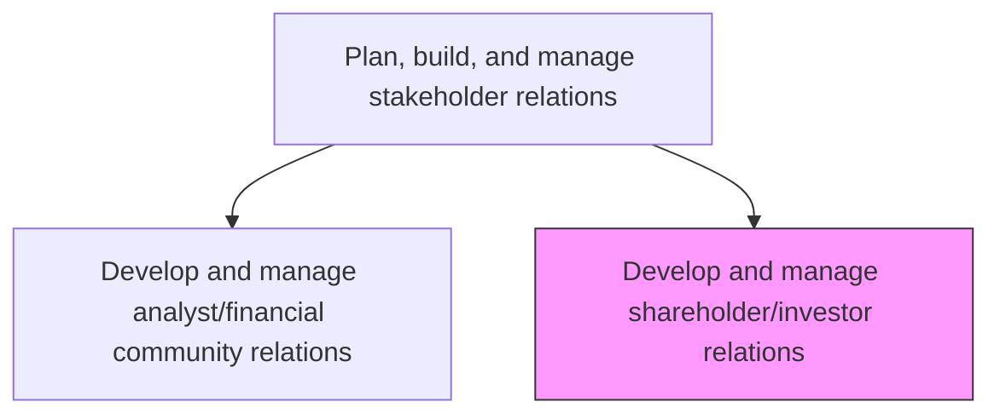
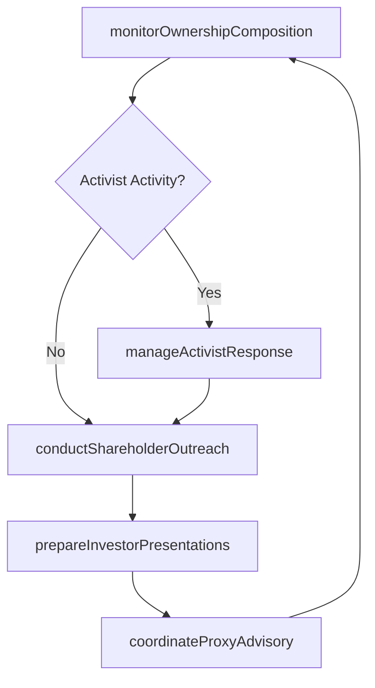

# Develop and manage shareholder/investor relations

> Business-as-Code definition for cultivating ongoing relationships with institutional and retail shareholders, managing ownership composition, and ensuring transparent investor communications that sustain market confidence.

## Overview

Developing and managing relationships with institutional investors, retail shareholders, and activist investors. Monitor ownership composition, conduct targeted outreach campaigns, address investor concerns, and maintain a governance framework that ensures shareholders remain informed and engaged with the organization's strategic direction.

## Process Hierarchy



## GraphDL

```yaml
develop:
  object: Shareholder Investor Relations
  actor: InvestorRelationsManager
  result: ShareholderEngagementRecord
```

## Actions

| Action | Description |
|--------|-------------|
| monitorOwnershipComposition | Track institutional and retail shareholder ownership changes |
| conductShareholderOutreach | Engage top institutional investors through meetings and calls |
| manageActivistResponse | Monitor and respond to activist investor campaigns and proposals |
| coordinateProxyAdvisory | Engage with proxy advisory firms on governance recommendations |
| prepareInvestorPresentations | Develop targeted presentations for investor meetings and conferences |

## Events

| Event | Description |
|-------|-------------|
| ownershipCompositionMonitored | Shareholder ownership analysis completed for reporting period |
| shareholderOutreachConducted | Institutional investor engagement activity completed |
| activistResponseManaged | Activist investor communication or defense action taken |
| proxyAdvisoryCoordinated | Proxy advisory firm engagement completed |
| investorPresentationPrepared | Investor meeting presentation finalized and delivered |

## Searches

| Search | Description |
|--------|-------------|
| findInstitutionalShareholders | List institutional investors by holding size or ownership change |
| getOwnershipHistory | Retrieve ownership composition trends over time |
| getActivistActivity | Query activist investor campaigns targeting the organization |
| getInvestorMeetingLog | Retrieve investor meeting records by date or institution |

## Process Flow



## RACI Matrix

| Activity | Responsible | Accountable | Consulted | Informed |
|----------|-------------|-------------|-----------|----------|
| monitorOwnershipComposition | IRSpecialist | IRManager | Finance | CFO |
| conductShareholderOutreach | IRManager | CFO | CEO | Legal |
| manageActivistResponse | IRManager | CEO | GeneralCounsel | Board |
| coordinateProxyAdvisory | IRManager | GeneralCounsel | CorporateSecretary | CFO |

## Related Processes

| Process | Relationship |
|---------|-------------|
| 12.1.4.1 Develop and manage analyst/financial community relations | Parallel - analyst sentiment influences investor behavior |
| 12.1.3 Communicate with shareholders | Parent - shareholder communication is a core delivery channel |
| 12.3.3 Nominate and elect board of directors | Downstream - shareholder sentiment affects board elections |

## Related Departments

| Department | Role |
|-----------|------|
| Investor Relations | Manages shareholder engagement and ownership monitoring |
| Legal | Advises on SEC compliance and activist defense strategies |
| Corporate Secretary | Coordinates proxy processes and governance communications |
| Finance | Provides financial data for investor presentations |

## Related Occupations

| Occupation | Involvement |
|-----------|-------------|
| Investor Relations Manager | Leads shareholder outreach and activist monitoring |
| Securities Counsel | Advises on proxy rules and investor communication regulations |
| IR Analyst | Tracks ownership changes and prepares investor materials |

## KPIs

| KPI | Description | Unit |
|-----|-------------|------|
| Institutional Ownership Stability | Quarter-over-quarter change in institutional ownership | % |
| Shareholder Meeting Coverage | Percentage of top-20 shareholders engaged per quarter | % |
| Proxy Advisory Alignment | Percentage of proxy advisory recommendations supporting management | % |
| Investor Meeting Volume | Number of investor meetings conducted per quarter | Count |

## Usage

```typescript
import { developAndManageShareholderInvestorRelations } from '@headlessly/develop-and-manage-shareholder-investor-relations'

const shareholderRelations = developAndManageShareholderInvestorRelations()

// Monitor institutional ownership changes
const ownership = await shareholderRelations.monitorOwnershipComposition({
  period: 'Q4-2024',
  thresholdChange: 0.5,
  includeActivistFlags: true
})

// Conduct outreach to top institutional shareholders
const outreach = await shareholderRelations.conductShareholderOutreach({
  targetInvestors: ['BlackRock', 'Vanguard', 'Fidelity'],
  format: 'one-on-one',
  topics: ['capital-allocation', 'ESG-strategy']
})
```
