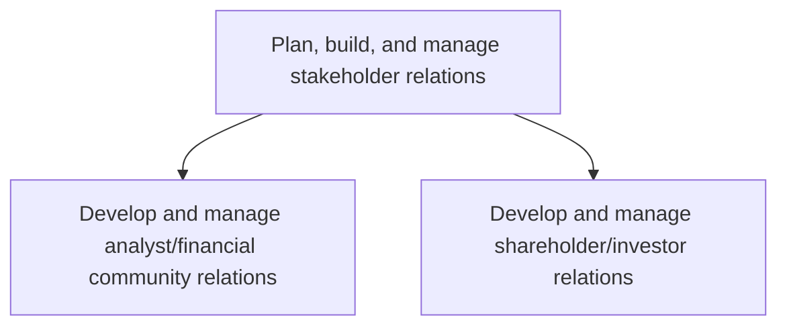
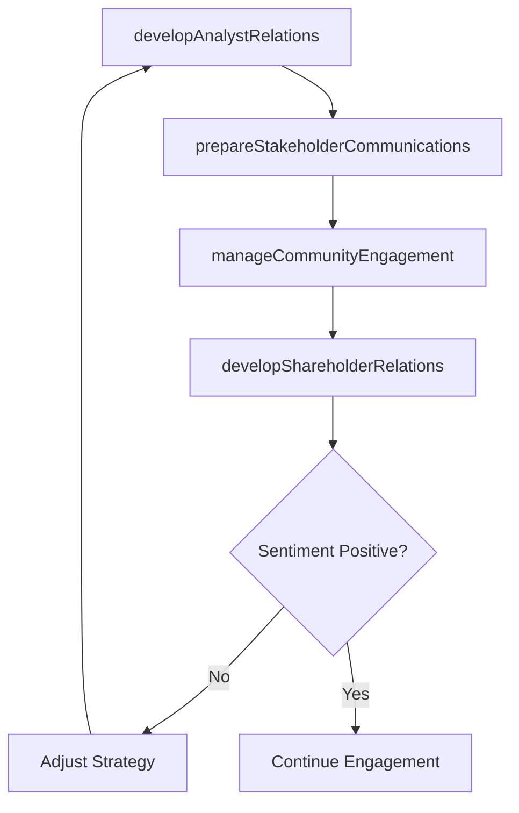

# Plan, build, and manage stakeholder relations

> Business-as-Code definition for planning, building, and managing relationships with financial analysts, shareholders, investors, and other key stakeholders to ensure transparent communication and sustained confidence in the organization.

## Overview

Planning, building, and managing relationships with key stakeholders including financial analysts, institutional investors, and shareholders. Develop communication strategies, manage expectations, and ensure consistent engagement across the investment community.

## Process Hierarchy



## GraphDL

```yaml
plan,:
  object: Build, And Manage Stakeholder Relations
  actor: InvestorRelationsDirector
  result: StakeholderEngagementPlan
```

## Actions

| Action | Description |
|--------|-------------|
| developAnalystRelations | Build and maintain relationships with sell-side and buy-side financial analysts |
| manageCommunityEngagement | Coordinate investor conferences, roadshows, and financial community events |
| developShareholderRelations | Maintain ongoing communication and engagement with institutional and retail shareholders |
| prepareStakeholderCommunications | Draft earnings releases, investor presentations, and annual reports |

## Events

| Event | Description |
|-------|-------------|
| analystRelationsDeveloped | Financial analyst engagement activity completed |
| communityEngagementManaged | Investor conference or roadshow event completed |
| shareholderRelationsDeveloped | Shareholder communication or engagement activity completed |
| stakeholderCommunicationsPrepared | Investor communication materials published |

## Searches

| Search | Description |
|--------|-------------|
| getAnalystCoverage | Retrieve analyst coverage details by firm or rating |
| findShareholderCompositions | Query institutional and retail shareholder ownership data |
| getStakeholderEngagementHistory | Retrieve stakeholder interaction records by type or date |

## Process Flow



## RACI Matrix

| Activity | Responsible | Accountable | Consulted | Informed |
|----------|-------------|-------------|-----------|----------|
| developAnalystRelations | InvestorRelationsManager | CFO | Finance | CEO |
| developShareholderRelations | InvestorRelationsManager | CFO | Legal | Board |
| prepareStakeholderCommunications | IRCommunicationsSpecialist | InvestorRelationsDirector | Legal | Marketing |

## Sub-Processes

| ID | Name | Description |
|----|------|-------------|
| 12.1.4.1 | Develop and manage analyst/financial community relations | Building and maintaining relationships with sell-side and buy-side analysts, conducting investor conf |
| 12.1.4.2 | Develop and manage shareholder/investor relations | Maintaining ongoing communication with institutional and retail shareholders through annual meetings, |

## Related Processes

| Process | Relationship |
|---------|-------------|
| 12.1.1 Plan, build, and manage lender relations | Parallel - lender relations complement broader stakeholder management |
| 12.1.3 Communicate with shareholders | Parallel - shareholder communications are a key stakeholder activity |
| 12.3 Manage relations with board of directors | Downstream - board communications reflect stakeholder sentiment |

## Related Departments

| Department | Role |
|-----------|------|
| Investor Relations | Manages analyst and shareholder engagement programs |
| Finance | Provides financial data for investor communications |
| Legal | Reviews investor disclosures for regulatory compliance |
| Corporate Communications | Supports messaging and media for stakeholder outreach |

## Related Occupations

| Occupation | Involvement |
|-----------|-------------|
| Investor Relations Director | Leads stakeholder engagement strategy and execution |
| Investor Relations Manager | Manages day-to-day analyst and shareholder interactions |
| IR Communications Specialist | Prepares investor presentations and earnings materials |

## KPIs

| KPI | Description | Unit |
|-----|-------------|------|
| Analyst Coverage Count | Number of sell-side analysts actively covering the company | Count |
| Investor Meeting Frequency | Number of investor meetings or roadshows per quarter | Count |
| Shareholder Engagement Score | Satisfaction rating from annual shareholder survey | Score (1-5) |

## Usage

```typescript
import { planBuildAndManageStakeholderRelations } from '@headlessly/plan-build-and-manage-stakeholder-relations'

const stakeholders = planBuildAndManageStakeholderRelations()

// Develop analyst relations for upcoming earnings
const engagement = await stakeholders.developAnalystRelations({
  event: 'Q2-2025-earnings',
  analysts: ['Goldman-Sachs', 'Morgan-Stanley', 'JP-Morgan'],
  format: 'one-on-one'
})

// Prepare shareholder communications
const comms = await stakeholders.prepareStakeholderCommunications({
  type: 'annual-report',
  fiscalYear: 2025,
  includeESGDisclosure: true
})
```
