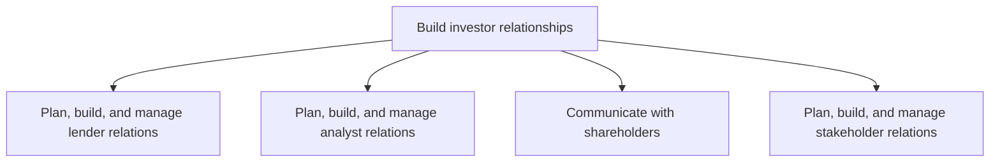
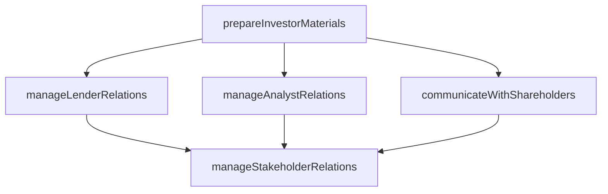

# Build investor relationships

> Business-as-Code definition for strategically managing investor relations across lenders, analysts, shareholders, and stakeholders to enable transparent two-way communication and provide market intelligence to corporate management.

## Overview

Creating a strategic management responsibility for integrating finance, communication, marketing, and securities law compliance. Allow the most effective two-way communication among the organization, the financial community, and other constituencies. Enlist the investor relations function to provide market intelligence to corporate management.

## Process Hierarchy



## GraphDL

```yaml
build:
  object: Investor Relationships
  actor: InvestorRelationsManager
  result: InvestorRelationshipPortfolio
```

## Actions

| Action | Description |
|--------|-------------|
| manageLenderRelations | Build and maintain relationships with banks, creditors, and lenders |
| manageAnalystRelations | Coordinate engagement with financial analysts and research firms |
| communicateWithShareholders | Deliver transparent updates to shareholders through meetings and reports |
| manageStakeholderRelations | Develop and sustain strategic relationships with key stakeholders |
| prepareInvestorMaterials | Create presentations, fact sheets, and earnings call materials |

## Events

| Event | Description |
|-------|-------------|
| lenderRelationsManaged | Lender engagement activity completed and documented |
| analystRelationsManaged | Analyst briefing or meeting conducted |
| shareholdersCommunicated | Shareholder update or annual meeting completed |
| stakeholderRelationsManaged | Stakeholder engagement strategy reviewed and updated |
| investorMaterialsPrepared | Investor presentation or fact sheet published |

## Searches

| Search | Description |
|--------|-------------|
| findInvestors | List institutional and retail investors by holding size or type |
| getAnalystCoverage | Retrieve analyst coverage, ratings, and price targets |
| getShareholderCommunications | Query shareholder correspondence and meeting records |
| getStakeholderEngagementHistory | Retrieve engagement history for a specific stakeholder |

## Process Flow



## RACI Matrix

| Activity | Responsible | Accountable | Consulted | Informed |
|----------|-------------|-------------|-----------|----------|
| manageLenderRelations | TreasuryManager | CFO | Legal | CEO |
| manageAnalystRelations | IRManager | CFO | Marketing | CEO |
| communicateWithShareholders | IRManager | CFO | Legal | Board |
| manageStakeholderRelations | IRManager | CFO | CorporateSecretary | Executive |

## Sub-Processes

| ID | Name | Description |
|----|------|-------------|
| 12.1.1 | Plan, build, and manage lender relations | Building and managing relations with bankers or lenders through strong products/services strategies  |
| 12.1.2 | Plan, build, and manage analyst relations | Creating and maintaining long-term relations with analysts. Involve analysts in strategy and product |
| 12.1.3 | Communicate with shareholders | Practicing regular, transparent communication with shareholders through annual shareholders' meeting |
| 12.1.4 | Plan, build, and manage stakeholder relations | Planning, building, and managing relationships with key stakeholders including financial analysts, in |

## Related Processes

| Process | Relationship |
|---------|-------------|
| 12.3 Manage relations with board of directors | Downstream - investor feedback informs board reporting |
| 8.0 Manage Financial Resources | Upstream - financial results drive investor communications |
| 12.5 Manage public relations program | Parallel - public disclosures complement investor relations |

## Related Departments

| Department | Role |
|-----------|------|
| Investor Relations | Primary owner of all investor and analyst communications |
| Finance | Provides financial data, forecasts, and earnings materials |
| Treasury | Manages lender relationships and credit facility negotiations |
| Legal | Ensures securities law compliance in investor disclosures |

## Related Occupations

| Occupation | Involvement |
|-----------|-------------|
| Investor Relations Manager | Coordinates all investor and analyst engagement activities |
| Treasury Analyst | Manages lender relationships and credit agreements |
| Financial Communications Specialist | Prepares earnings releases and investor presentations |

## KPIs

| KPI | Description | Unit |
|-----|-------------|------|
| Analyst Coverage Count | Number of sell-side analysts actively covering the company | Count |
| Shareholder Meeting Attendance | Percentage of outstanding shares represented at annual meeting | % |
| Investor Inquiry Response Time | Average time to respond to investor inquiries | Hours |
| Cost of Capital | Weighted average cost of capital reflecting investor confidence | % |

## Usage

```typescript
import { buildInvestorRelationships } from '@headlessly/build-investor-relationships'

const ir = buildInvestorRelationships()

// Prepare materials for quarterly earnings call
const materials = await ir.prepareInvestorMaterials({
  type: 'earnings-presentation',
  quarter: 'Q4-2024',
  includeGuidance: true
})

// Get analyst coverage summary
const coverage = await ir.getAnalystCoverage({
  includeRatings: true,
  includePriceTargets: true
})

// Communicate with shareholders
const communication = await ir.communicateWithShareholders({
  type: 'annual-meeting',
  agenda: ['financial-review', 'board-elections', 'strategic-outlook']
})
```
