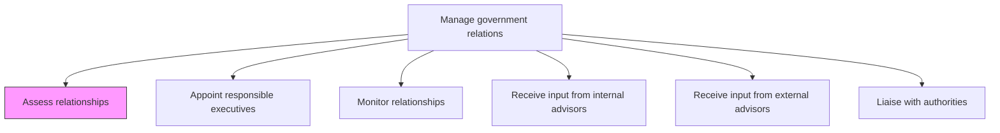
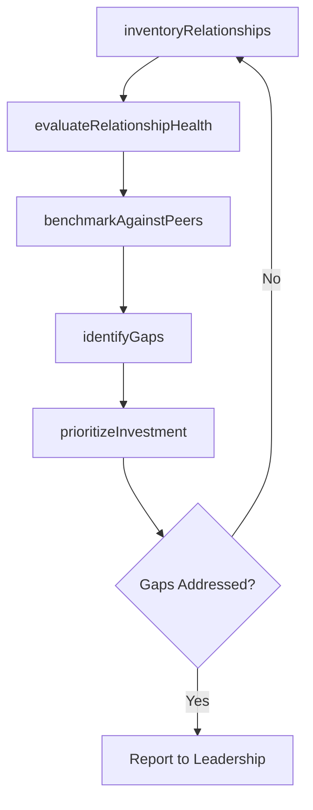

# Assess relationships

> Business-as-Code definition for evaluating the organization's current government relationships across all jurisdictional levels, identifying gaps, and prioritizing areas requiring investment to strengthen engagement.

## Overview

Ascertaining how the business entity relates to all levels of government. Identify areas that needs further growth and resources to foster those relationships.

## Process Hierarchy



## GraphDL

```yaml
assess:
  object: Relationships
  actor: GovernmentAffairsDirector
  result: GovernmentRelationshipAssessment
```

## Actions

| Action | Description |
|--------|-------------|
| inventoryRelationships | Catalog all current government relationships across jurisdictions and agencies |
| evaluateRelationshipHealth | Score each relationship based on engagement frequency, responsiveness, and outcomes |
| identifyGaps | Determine jurisdictions or agencies where relationships are absent or underperforming |
| prioritizeInvestment | Rank relationship gaps by strategic importance and allocate resources accordingly |
| benchmarkAgainstPeers | Compare the organization's government engagement posture against industry peers |

## Events

| Event | Description |
|-------|-------------|
| relationshipsInventoried | Complete catalog of government relationships compiled |
| relationshipHealthEvaluated | Relationship health scores calculated for all active contacts |
| gapsIdentified | Missing or underperforming government relationships flagged |
| investmentPrioritized | Resource allocation plan for relationship development approved |
| peerBenchmarkCompleted | Industry peer government engagement comparison completed |

## Searches

| Search | Description |
|--------|-------------|
| findGovernmentRelationships | List government relationships by jurisdiction, agency, or health score |
| getRelationshipScorecard | Retrieve health assessment data for a specific government relationship |
| getGapAnalysis | Query identified relationship gaps by priority or jurisdiction |
| getBenchmarkResults | Retrieve peer benchmarking data for government engagement |

## Process Flow



## RACI Matrix

| Activity | Responsible | Accountable | Consulted | Informed |
|----------|-------------|-------------|-----------|----------|
| inventoryRelationships | GovernmentAffairsManager | GovernmentAffairsDirector | Legal | Executive |
| evaluateRelationshipHealth | GovernmentAffairsManager | GovernmentAffairsDirector | PublicPolicy | CEO |
| identifyGaps | GovernmentAffairsDirector | CEO | Strategy | Board |
| prioritizeInvestment | GovernmentAffairsDirector | CEO | Finance | GovernmentAffairsManager |

## Related Processes

| Process | Relationship |
|---------|-------------|
| 12.2.1.2 Appoint responsible executives | Downstream - assessment results inform executive liaison assignments |
| 12.2.1.3 Monitor relationships | Parallel - monitoring provides ongoing data for assessments |
| 12.2.4 Manage lobby activities | Consumer - relationship gaps inform lobbying strategy |

## Related Departments

| Department | Role |
|-----------|------|
| Government Affairs | Conducts relationship assessments and gap analyses |
| Legal | Advises on regulatory landscape affecting relationship priorities |
| Strategy | Aligns government relationship priorities with corporate strategy |
| Public Policy | Provides input on legislative environment for prioritization |

## Related Occupations

| Occupation | Involvement |
|-----------|-------------|
| Government Affairs Director | Leads assessment process and presents findings to leadership |
| Government Affairs Manager | Inventories relationships and evaluates health metrics |
| Policy Analyst | Researches jurisdictional requirements and peer benchmarks |

## KPIs

| KPI | Description | Unit |
|-----|-------------|------|
| Relationship Coverage Rate | Percentage of key jurisdictions with active government relationships | % |
| Average Relationship Health Score | Mean score across all assessed government relationships | Score (1-10) |
| Gap Closure Rate | Percentage of identified gaps addressed within assessment cycle | % |
| Assessment Cycle Time | Time from assessment initiation to final report delivery | Days |

## Usage

```typescript
import { assessRelationships } from '@headlessly/assess-relationships'

const assessment = assessRelationships()

// Inventory all government relationships
const relationships = await assessment.inventoryRelationships({
  jurisdictions: ['US-Federal', 'California', 'EU'],
  includeInactive: true
})

// Evaluate health of current relationships
const scorecard = await assessment.evaluateRelationshipHealth({
  relationshipId: 'EPA-Region-9',
  metrics: ['engagement-frequency', 'response-time', 'outcome-rate']
})

// Identify and prioritize gaps
const gaps = await assessment.identifyGaps({
  minStrategicImportance: 'high',
  jurisdictions: ['US-Federal'],
  excludeAgencies: ['DOD']
})
```
