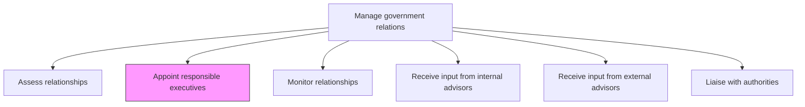
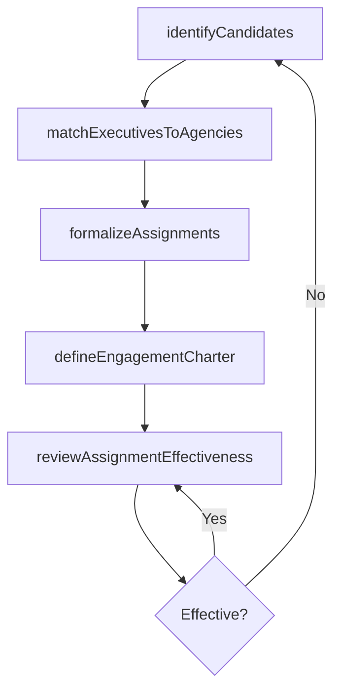

# Appoint responsible executives

> Business-as-Code definition for designating executive-level liaisons to own, cultivate, and advance government relationships across key agencies and jurisdictions.

## Overview

Assigning executive level resources to manage, grow, and drive relationships with government bodies.

## Process Hierarchy



## GraphDL

```yaml
appoint:
  object: Responsible Executives
  actor: CEO
  result: ExecutiveLiaisonAssignment
```

## Actions

| Action | Description |
|--------|-------------|
| identifyCandidates | Evaluate executive capabilities and existing government connections for liaison roles |
| matchExecutivesToAgencies | Align executive expertise and relationships with specific government bodies |
| formalizeAssignments | Document and communicate executive liaison appointments and responsibilities |
| defineEngagementCharter | Establish objectives, meeting cadence, and reporting requirements for each assignment |
| reviewAssignmentEffectiveness | Periodically evaluate whether executive liaisons are achieving engagement goals |

## Events

| Event | Description |
|-------|-------------|
| candidatesIdentified | Executive liaison candidate pool evaluated and shortlisted |
| executivesMatchedToAgencies | Executive-to-agency alignment completed and approved |
| assignmentsFormalized | Executive liaison appointments officially documented |
| engagementCharterDefined | Liaison engagement charter with objectives and cadence established |
| assignmentEffectivenessReviewed | Executive liaison performance review completed |

## Searches

| Search | Description |
|--------|-------------|
| findExecutiveLiaisons | List current executive liaison assignments by agency or jurisdiction |
| getCandidatePool | Retrieve executive candidates for government liaison roles by expertise |
| getAssignmentHistory | Query historical liaison assignments and their outcomes |
| getLiaisonPerformance | Retrieve effectiveness metrics for a specific executive liaison |

## Process Flow



## RACI Matrix

| Activity | Responsible | Accountable | Consulted | Informed |
|----------|-------------|-------------|-----------|----------|
| identifyCandidates | GovernmentAffairsDirector | CEO | HR | Board |
| matchExecutivesToAgencies | GovernmentAffairsDirector | CEO | Legal | ExecutiveTeam |
| formalizeAssignments | CEO | Board | GovernmentAffairsDirector | HR |
| reviewAssignmentEffectiveness | GovernmentAffairsDirector | CEO | Legal | Board |

## Related Processes

| Process | Relationship |
|---------|-------------|
| 12.2.1.1 Assess relationships | Upstream - assessment identifies where executive liaisons are needed |
| 12.2.1.6 Liaise with authorities | Downstream - appointed executives conduct authority engagements |
| 9.3.3 Manage employee development | Parallel - executive development supports liaison effectiveness |

## Related Departments

| Department | Role |
|-----------|------|
| Government Affairs | Recommends and coordinates executive liaison assignments |
| Executive Leadership | Provides executive-level candidates for liaison roles |
| Human Resources | Supports competency assessment and development planning |
| Legal | Advises on conflict-of-interest and regulatory considerations |

## Related Occupations

| Occupation | Involvement |
|-----------|-------------|
| CEO | Approves and oversees executive liaison assignments |
| Government Affairs Director | Identifies needs and recommends executive matches |
| Chief Human Resources Officer | Ensures liaison duties are reflected in executive role definitions |

## KPIs

| KPI | Description | Unit |
|-----|-------------|------|
| Agency Coverage Rate | Percentage of key agencies with a designated executive liaison | % |
| Liaison Tenure Stability | Average duration of executive liaison assignments | Months |
| Engagement Goal Achievement | Percentage of liaison engagement objectives met per review cycle | % |
| Assignment Fill Time | Time from identified need to formalized executive appointment | Days |

## Usage

```typescript
import { appointResponsibleExecutives } from '@headlessly/appoint-responsible-executives'

const appointments = appointResponsibleExecutives()

// Identify executive candidates for government liaison roles
const candidates = await appointments.identifyCandidates({
  agencies: ['EPA', 'SEC', 'FTC'],
  requiredExperience: 'regulatory-affairs',
  minimumSeniority: 'VP'
})

// Formalize an executive liaison assignment
const assignment = await appointments.formalizeAssignments({
  executiveId: 'exec-vp-ops-001',
  agency: 'EPA',
  objectives: ['emissions-standards', 'permitting-processes'],
  meetingCadence: 'quarterly'
})
```
