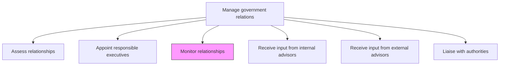
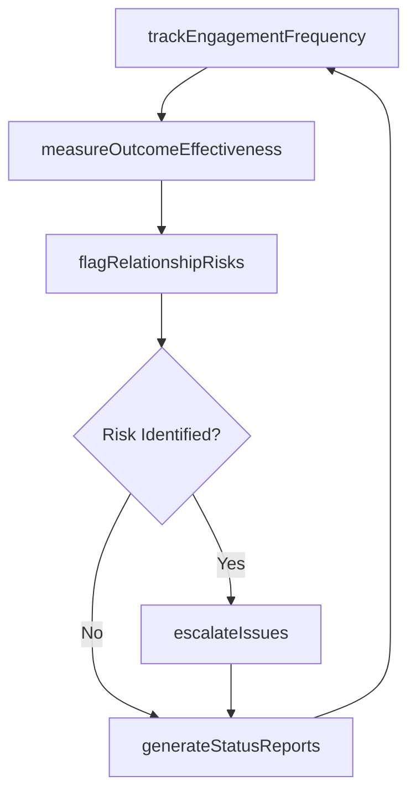

# Monitor relationships

> Business-as-Code definition for continuously tracking the health, engagement frequency, and effectiveness of government relationships to identify risks and opportunities.

## Overview

Analyzing current relationships with government bodies and entities.

## Process Hierarchy



## GraphDL

```yaml
monitor:
  object: Relationships
  actor: GovernmentAffairsManager
  result: RelationshipMonitoringReport
```

## Actions

| Action | Description |
|--------|-------------|
| trackEngagementFrequency | Record and measure the cadence of interactions with each government body |
| measureOutcomeEffectiveness | Evaluate whether government engagements are producing favorable results |
| flagRelationshipRisks | Identify relationships showing signs of deterioration or disengagement |
| generateStatusReports | Produce periodic relationship health dashboards for leadership |
| escalateIssues | Raise critical relationship concerns to senior leadership for intervention |

## Events

| Event | Description |
|-------|-------------|
| engagementFrequencyTracked | Interaction frequency metrics updated for reporting period |
| outcomeEffectivenessMeasured | Government engagement outcomes evaluated against objectives |
| relationshipRisksFlagged | At-risk relationships identified and escalation triggered |
| statusReportGenerated | Periodic relationship monitoring report published |
| issuesEscalated | Critical relationship issue elevated to senior leadership |

## Searches

| Search | Description |
|--------|-------------|
| getRelationshipStatus | Retrieve current status and health metrics for government relationships |
| findAtRiskRelationships | List relationships flagged as declining or at risk |
| getEngagementHistory | Query interaction history with a specific government body |
| getStatusReports | Retrieve historical monitoring reports by period or jurisdiction |

## Process Flow



## RACI Matrix

| Activity | Responsible | Accountable | Consulted | Informed |
|----------|-------------|-------------|-----------|----------|
| trackEngagementFrequency | GovernmentAffairsManager | GovernmentAffairsDirector | ExecutiveLiaisons | Legal |
| measureOutcomeEffectiveness | GovernmentAffairsManager | GovernmentAffairsDirector | Strategy | CEO |
| flagRelationshipRisks | GovernmentAffairsManager | GovernmentAffairsDirector | Legal | Executive |
| escalateIssues | GovernmentAffairsDirector | CEO | Legal | Board |

## Related Processes

| Process | Relationship |
|---------|-------------|
| 12.2.1.1 Assess relationships | Upstream - assessment establishes baselines for monitoring |
| 12.2.1.6 Liaise with authorities | Parallel - liaison activities generate data for monitoring |
| 12.2.4 Manage lobby activities | Consumer - monitoring insights inform lobbying priorities |

## Related Departments

| Department | Role |
|-----------|------|
| Government Affairs | Conducts ongoing monitoring and produces status reports |
| Legal | Advises on regulatory implications of relationship changes |
| Strategy | Interprets monitoring data in context of corporate priorities |
| Executive Leadership | Receives escalations and directs corrective action |

## Related Occupations

| Occupation | Involvement |
|-----------|-------------|
| Government Affairs Manager | Performs day-to-day relationship monitoring and reporting |
| Government Affairs Director | Reviews monitoring reports and manages escalations |
| Policy Analyst | Provides context on legislative developments affecting relationships |

## KPIs

| KPI | Description | Unit |
|-----|-------------|------|
| Engagement Cadence Compliance | Percentage of relationships meeting target interaction frequency | % |
| Outcome Achievement Rate | Percentage of government engagements producing favorable outcomes | % |
| Risk Escalation Response Time | Average time from risk identification to leadership action | Days |
| Report Timeliness | Percentage of monitoring reports delivered on schedule | % |

## Usage

```typescript
import { monitorRelationships } from '@headlessly/monitor-relationships'

const monitor = monitorRelationships()

// Track engagement frequency across jurisdictions
const frequency = await monitor.trackEngagementFrequency({
  period: 'Q4-2024',
  jurisdictions: ['US-Federal', 'California'],
  minimumCadence: 'quarterly'
})

// Flag at-risk government relationships
const risks = await monitor.flagRelationshipRisks({
  thresholdScore: 4,
  includeInactiveRelationships: true,
  lookbackPeriod: '6-months'
})
```
