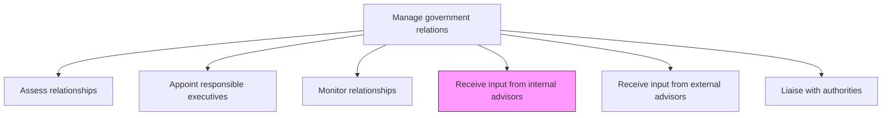
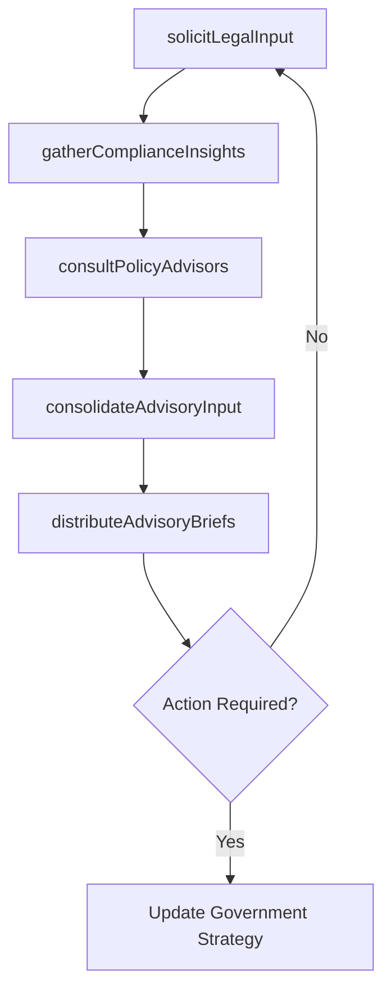

# Receive input from internal advisors

> Business-as-Code definition for gathering strategic guidance from internal legal, compliance, and policy advisors to inform and improve government engagement strategies.

## Overview

Garnering internal advice from an informal group in order to successfully maintain and advance relationships.

## Process Hierarchy



## GraphDL

```yaml
receive:
  object: Input From Internal Advisors
  actor: GovernmentAffairsDirector
  result: InternalAdvisoryBrief
```

## Actions

| Action | Description |
|--------|-------------|
| solicitLegalInput | Request guidance from in-house counsel on regulatory risks and compliance obligations |
| gatherComplianceInsights | Collect compliance team perspectives on government interaction requirements |
| consultPolicyAdvisors | Seek policy team analysis on legislative trends affecting government relations |
| consolidateAdvisoryInput | Compile and synthesize internal advisory recommendations into actionable briefs |
| distributeAdvisoryBriefs | Share consolidated advisory input with government affairs team and executive liaisons |

## Events

| Event | Description |
|-------|-------------|
| legalInputSolicited | In-house counsel advisory on government affairs matter received |
| complianceInsightsGathered | Compliance team input on government interaction documented |
| policyAdvisorsConsulted | Policy team analysis on legislative matters received |
| advisoryInputConsolidated | Internal advisory recommendations compiled into briefing document |
| advisoryBriefsDistributed | Consolidated advisory brief distributed to stakeholders |

## Searches

| Search | Description |
|--------|-------------|
| findAdvisoryBriefs | List internal advisory briefs by topic, date, or advisor |
| getAdvisorRecommendations | Retrieve specific advisor recommendations by policy area |
| getAdvisoryHistory | Query historical internal advisory input by agency or issue |

## Process Flow



## RACI Matrix

| Activity | Responsible | Accountable | Consulted | Informed |
|----------|-------------|-------------|-----------|----------|
| solicitLegalInput | GovernmentAffairsManager | GovernmentAffairsDirector | GeneralCounsel | CEO |
| gatherComplianceInsights | GovernmentAffairsManager | GovernmentAffairsDirector | ComplianceOfficer | Legal |
| consultPolicyAdvisors | GovernmentAffairsManager | GovernmentAffairsDirector | PolicyAnalyst | Strategy |
| consolidateAdvisoryInput | GovernmentAffairsDirector | CEO | Legal | ExecutiveLiaisons |

## Related Processes

| Process | Relationship |
|---------|-------------|
| 12.2.1.5 Receive input from external advisors | Parallel - external and internal advisory inputs are consolidated |
| 12.2.1.6 Liaise with authorities | Downstream - advisory input shapes authority engagement approach |
| 12.4.5 Ensure compliance | Upstream - compliance requirements inform internal advisory guidance |

## Related Departments

| Department | Role |
|-----------|------|
| Government Affairs | Solicits, consolidates, and acts on internal advisory input |
| Legal | Provides regulatory and legislative guidance |
| Compliance | Advises on government interaction obligations and restrictions |
| Public Policy | Analyzes legislative trends and policy implications |

## Related Occupations

| Occupation | Involvement |
|-----------|-------------|
| Government Affairs Director | Leads advisory input collection and integration into strategy |
| General Counsel | Provides legal advisory input on government matters |
| Compliance Officer | Advises on regulatory requirements for government engagement |

## KPIs

| KPI | Description | Unit |
|-----|-------------|------|
| Advisory Cycle Time | Average time from advisory request to consolidated brief delivery | Days |
| Advisory Coverage | Percentage of government engagement topics with internal advisory input | % |
| Recommendation Adoption Rate | Percentage of internal advisory recommendations implemented | % |
| Advisor Response Rate | Percentage of advisory requests receiving timely responses | % |

## Usage

```typescript
import { receiveInputFromInternalAdvisors } from '@headlessly/receive-input-from-internal-advisors'

const internalAdvisory = receiveInputFromInternalAdvisors()

// Solicit legal input on upcoming regulatory engagement
const legalInput = await internalAdvisory.solicitLegalInput({
  topic: 'data-privacy-regulation',
  agency: 'FTC',
  urgency: 'high',
  requestedBy: 'government-affairs-director'
})

// Consolidate all advisory input into a briefing
const brief = await internalAdvisory.consolidateAdvisoryInput({
  topic: 'emissions-standards-2026',
  sources: ['legal', 'compliance', 'policy'],
  format: 'executive-summary'
})
```
