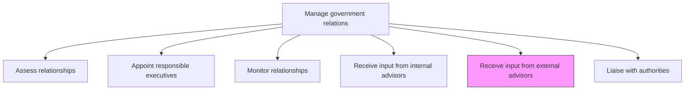
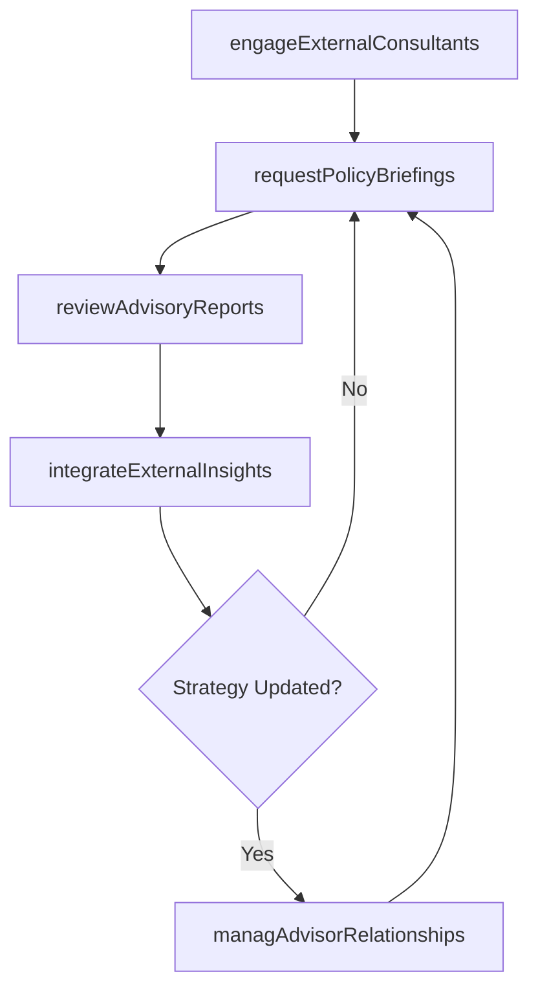

# Receive input from external advisors

> Business-as-Code definition for obtaining strategic guidance from external lobbyists, consultants, and policy experts to enhance government engagement and advance organizational advocacy objectives.

## Overview

Garnering third party advice from an informal group in order to successfully maintain and advance relationships.

## Process Hierarchy



## GraphDL

```yaml
receive:
  object: Input From External Advisors
  actor: GovernmentAffairsDirector
  result: ExternalAdvisoryBrief
```

## Actions

| Action | Description |
|--------|-------------|
| engageExternalConsultants | Contract with government affairs consultants and lobbying firms for specialized advice |
| requestPolicyBriefings | Obtain policy landscape briefings from external advisors on specific topics |
| reviewAdvisoryReports | Evaluate external advisory reports and recommendations for applicability |
| integrateExternalInsights | Merge external advisor recommendations with internal strategy |
| managAdvisorRelationships | Maintain productive relationships with external advisory firms and consultants |

## Events

| Event | Description |
|-------|-------------|
| externalConsultantsEngaged | External advisory engagement formalized or renewed |
| policyBriefingsReceived | External policy briefing delivered and documented |
| advisoryReportsReviewed | External advisory report evaluated for strategic relevance |
| externalInsightsIntegrated | External recommendations incorporated into government affairs strategy |
| advisorRelationshipsManaged | External advisor relationship review completed |

## Searches

| Search | Description |
|--------|-------------|
| findExternalAdvisors | List external advisory firms by specialty, jurisdiction, or engagement status |
| getExternalBriefings | Retrieve external policy briefings by topic or advisor |
| getAdvisorPerformance | Query external advisor effectiveness metrics and deliverables |

## Process Flow



## RACI Matrix

| Activity | Responsible | Accountable | Consulted | Informed |
|----------|-------------|-------------|-----------|----------|
| engageExternalConsultants | GovernmentAffairsDirector | CEO | Legal | Procurement |
| requestPolicyBriefings | GovernmentAffairsManager | GovernmentAffairsDirector | PublicPolicy | ExecutiveLiaisons |
| reviewAdvisoryReports | GovernmentAffairsDirector | CEO | Legal | Strategy |
| integrateExternalInsights | GovernmentAffairsDirector | CEO | InternalAdvisors | Board |

## Related Processes

| Process | Relationship |
|---------|-------------|
| 12.2.1.4 Receive input from internal advisors | Parallel - external insights complement internal advisory input |
| 12.2.1.6 Liaise with authorities | Downstream - external advice informs authority engagement tactics |
| 12.2.4 Manage lobby activities | Parallel - external advisors often support lobbying campaigns |

## Related Departments

| Department | Role |
|-----------|------|
| Government Affairs | Manages external advisor relationships and integrates their guidance |
| Legal | Reviews external advisor contracts and compliance with lobbying regulations |
| Procurement | Handles contracting and vendor management for external advisory firms |
| Strategy | Aligns external advisory recommendations with corporate direction |

## Related Occupations

| Occupation | Involvement |
|-----------|-------------|
| Government Affairs Director | Selects and manages external advisory engagements |
| Government Affairs Manager | Coordinates day-to-day interactions with external advisors |
| External Lobbyist | Provides policy intelligence and advocacy guidance |

## KPIs

| KPI | Description | Unit |
|-----|-------------|------|
| External Advisory Spend | Total expenditure on external government affairs consultants | Currency |
| Advisory Actionability Rate | Percentage of external recommendations resulting in action | % |
| Briefing Frequency | Number of external policy briefings received per quarter | Count |
| Advisor Satisfaction Score | Internal satisfaction rating of external advisory quality | Score (1-5) |

## Usage

```typescript
import { receiveInputFromExternalAdvisors } from '@headlessly/receive-input-from-external-advisors'

const externalAdvisory = receiveInputFromExternalAdvisors()

// Request a policy briefing from an external consultant
const briefing = await externalAdvisory.requestPolicyBriefings({
  advisor: 'Patton-Boggs-LLP',
  topic: 'infrastructure-bill-implications',
  jurisdiction: 'US-Federal',
  urgency: 'standard'
})

// Review and integrate external advisory reports
const insights = await externalAdvisory.integrateExternalInsights({
  reportIds: ['ADV-2025-012', 'ADV-2025-013'],
  targetStrategy: 'government-relations-Q1-2025',
  mergeWithInternal: true
})
```
