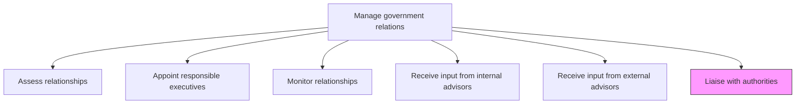
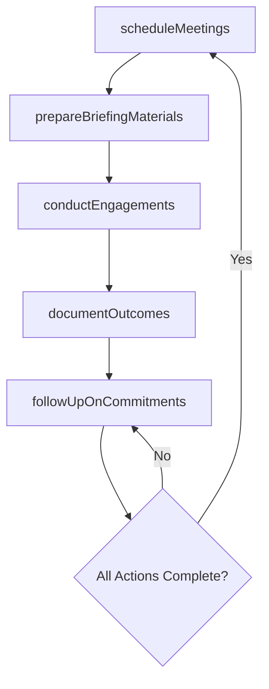

# Liaise with authorities

> Business-as-Code definition for conducting formal and informal meetings with government officials, regulators, and elected representatives to advance organizational interests and maintain productive dialogue.

## Overview

Meeting with government heads and representatives.

## Process Hierarchy



## GraphDL

```yaml
liaise:
  object: With Authorities
  actor: GovernmentAffairsDirector
  result: AuthorityEngagementRecord
```

## Actions

| Action | Description |
|--------|-------------|
| scheduleMeetings | Coordinate meetings with government officials, regulators, and elected representatives |
| prepareBriefingMaterials | Develop position papers, talking points, and data packages for authority meetings |
| conductEngagements | Attend and lead meetings with government authorities on behalf of the organization |
| documentOutcomes | Record meeting outcomes, commitments, and follow-up actions |
| followUpOnCommitments | Track and execute action items arising from authority engagements |

## Events

| Event | Description |
|-------|-------------|
| meetingsScheduled | Government authority meeting arranged and confirmed |
| briefingMaterialsPrepared | Position papers and talking points finalized for engagement |
| engagementsConducted | Meeting with government authority completed |
| outcomesDocumented | Meeting outcomes and follow-up actions recorded |
| commitmentsFollowedUp | Post-meeting action items executed or tracked to completion |

## Searches

| Search | Description |
|--------|-------------|
| findUpcomingMeetings | List scheduled government authority meetings by date, agency, or topic |
| getMeetingHistory | Retrieve past government engagement records by official or agency |
| getOutcomeLog | Query meeting outcomes and follow-up actions by status |
| getBriefingMaterials | Retrieve prepared briefing documents for specific engagements |

## Process Flow



## RACI Matrix

| Activity | Responsible | Accountable | Consulted | Informed |
|----------|-------------|-------------|-----------|----------|
| scheduleMeetings | GovernmentAffairsManager | GovernmentAffairsDirector | ExecutiveLiaisons | Legal |
| prepareBriefingMaterials | PolicyAnalyst | GovernmentAffairsDirector | Legal | ExecutiveLiaisons |
| conductEngagements | GovernmentAffairsDirector | CEO | Legal | Board |
| followUpOnCommitments | GovernmentAffairsManager | GovernmentAffairsDirector | Operations | ExecutiveLiaisons |

## Related Processes

| Process | Relationship |
|---------|-------------|
| 12.2.1.2 Appoint responsible executives | Upstream - appointed executives participate in authority engagements |
| 12.2.1.3 Monitor relationships | Downstream - engagement outcomes feed relationship monitoring |
| 12.2.4 Manage lobby activities | Parallel - lobbying campaigns complement direct authority engagement |

## Related Departments

| Department | Role |
|-----------|------|
| Government Affairs | Plans and executes government authority engagements |
| Legal | Reviews talking points and ensures compliance with lobbying regulations |
| Executive Leadership | Participates in high-level authority meetings |
| Public Policy | Provides analytical support for briefing material development |

## Related Occupations

| Occupation | Involvement |
|-----------|-------------|
| Government Affairs Director | Leads authority engagements and represents organizational interests |
| Government Affairs Manager | Coordinates meeting logistics and follow-up actions |
| Policy Analyst | Prepares briefing materials and position papers |

## KPIs

| KPI | Description | Unit |
|-----|-------------|------|
| Authority Meetings Conducted | Number of government authority meetings held per quarter | Count |
| Follow-up Completion Rate | Percentage of post-meeting commitments completed on time | % |
| Meeting Outcome Favorability | Percentage of engagements producing favorable outcomes | % |
| Briefing Preparation Lead Time | Average days between meeting confirmation and materials finalized | Days |

## Usage

```typescript
import { liaiseWithAuthorities } from '@headlessly/liaise-with-authorities'

const liaison = liaiseWithAuthorities()

// Schedule a meeting with a government authority
const meeting = await liaison.scheduleMeetings({
  agency: 'Department-of-Energy',
  officials: ['Deputy-Secretary', 'Office-of-Renewable-Energy'],
  topic: 'clean-energy-incentives',
  date: '2025-09-15',
  format: 'in-person'
})

// Document meeting outcomes
const outcomes = await liaison.documentOutcomes({
  meetingId: 'GOV-MTG-2025-042',
  summary: 'Discussed renewable energy tax credit extensions',
  commitments: ['submit-impact-data', 'follow-up-briefing'],
  nextMeetingDate: '2025-12-01'
})
```
