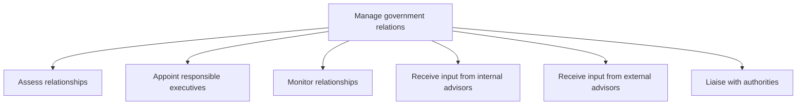
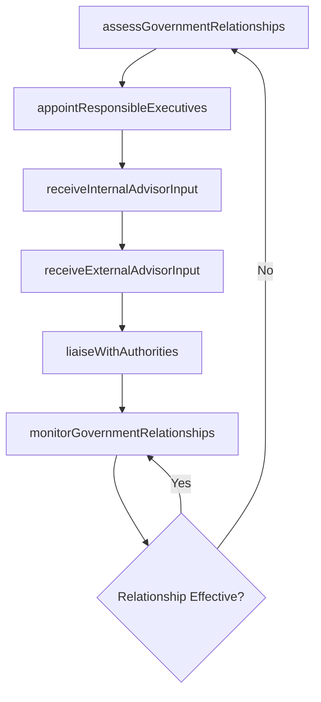

# Manage government relations

> Business-as-Code definition for assessing, building, and monitoring relationships with government officials at all levels, appointing executive liaisons, and engaging with authorities to advance organizational interests within regulatory boundaries.

## Overview

Persuading public and government policy at the local, regional, national, and global level (subject to government regulations).

## Process Hierarchy



## GraphDL

```yaml
manage:
  object: Government Relations
  actor: GovernmentAffairsDirector
  result: GovernmentRelationshipAssessment
```

## Actions

| Action | Description |
|--------|-------------|
| assessGovernmentRelationships | Evaluate current status and effectiveness of government relationships |
| appointResponsibleExecutives | Designate executive-level liaisons for key government relationships |
| monitorGovernmentRelationships | Track the health and progress of government engagement activities |
| receiveInternalAdvisorInput | Gather strategic input from internal policy and legal advisors |
| receiveExternalAdvisorInput | Obtain guidance from external consultants and policy experts |
| liaiseWithAuthorities | Conduct meetings and communications with government officials |

## Events

| Event | Description |
|-------|-------------|
| governmentRelationshipsAssessed | Government relationship assessment completed |
| responsibleExecutivesAppointed | Executive liaisons designated for government relationships |
| governmentRelationshipsMonitored | Government engagement activity review completed |
| internalAdvisorInputReceived | Internal advisory input on government affairs received |
| externalAdvisorInputReceived | External consultant guidance on government affairs received |
| authoritiesLiaisedWith | Meeting or communication with government officials completed |

## Searches

| Search | Description |
|--------|-------------|
| getGovernmentRelationships | Retrieve current government relationships by jurisdiction or agency |
| findExecutiveLiaisons | List designated executive liaisons by government body |
| getEngagementHistory | Retrieve government engagement activities by date or official |

## Process Flow



## RACI Matrix

| Activity | Responsible | Accountable | Consulted | Informed |
|----------|-------------|-------------|-----------|----------|
| assessGovernmentRelationships | GovernmentAffairsDirector | CEO | Legal | Board |
| appointResponsibleExecutives | CEO | Board | GovernmentAffairsDirector | HR |
| liaiseWithAuthorities | GovernmentAffairsDirector | CEO | Legal | PublicRelations |
| monitorGovernmentRelationships | GovernmentAffairsManager | GovernmentAffairsDirector | Legal | Executive |

## Sub-Processes

| ID | Name | Description |
|----|------|-------------|
| 12.2.1.1 | Assess relationships | Ascertaining how the business entity relates to all levels of government. Identify areas that needs  |
| 12.2.1.2 | Appoint responsible executives | Assigning executive level resources to manage, grow, and drive relationships with government bodies. |
| 12.2.1.3 | Monitor relationships | Analyzing current relationships with government bodies and entities. |
| 12.2.1.4 | Receive input from internal advisors | Garnering internal advice from an informal group in order to successfully maintain and advance relat |
| 12.2.1.5 | Receive input from external advisors | Garnering third party advice from an informal group in order to successfully maintain and advance re |
| 12.2.1.6 | Liaise with authorities | Meeting with government heads and representatives. |

## Related Processes

| Process | Relationship |
|---------|-------------|
| 12.2.2 Manage relations with quasi-government bodies | Parallel - quasi-government engagement complements direct government relations |
| 12.2.4 Manage lobby activities | Downstream - government relations inform lobbying strategy |
| 11.2.2 Manage regulatory compliance | Parallel - government relationships support regulatory navigation |

## Related Departments

| Department | Role |
|-----------|------|
| Government Affairs | Manages relationships with government officials and agencies |
| Legal | Advises on regulatory and legislative matters |
| Public Relations | Supports government-facing communications |
| Executive Leadership | Serves as executive liaisons to government bodies |

## Related Occupations

| Occupation | Involvement |
|-----------|-------------|
| Government Affairs Director | Leads government engagement strategy and executive liaison assignments |
| Government Affairs Manager | Manages day-to-day government relationship activities |
| Policy Analyst | Monitors legislative and regulatory developments |

## KPIs

| KPI | Description | Unit |
|-----|-------------|------|
| Government Engagement Frequency | Number of government meetings or interactions per quarter | Count |
| Policy Outcome Success Rate | Percentage of advocacy positions achieving favorable outcomes | % |
| Relationship Coverage | Percentage of key jurisdictions with active government relationships | % |

## Usage

```typescript
import { manageGovernmentRelations } from '@headlessly/manage-government-relations'

const govRelations = manageGovernmentRelations()

// Assess current government relationships
const assessment = await govRelations.assessGovernmentRelationships({
  jurisdictions: ['US-Federal', 'California', 'Texas'],
  agencies: ['EPA', 'DOE', 'OSHA'],
  assessmentDate: '2025-06-30'
})

// Liaise with a government authority
const meeting = await govRelations.liaiseWithAuthorities({
  agency: 'EPA',
  topic: 'emissions-standards-2026',
  executiveLiaison: 'VP-Sustainability',
  meetingDate: '2025-08-15'
})
```
