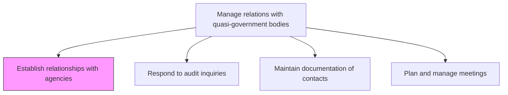
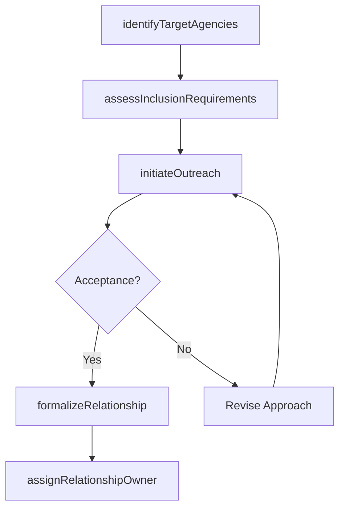

# Establish relationships with agencies

> Business-as-Code definition for initiating and formalizing relationships with quasi-governmental agencies by identifying key contacts, understanding requirements, and establishing engagement protocols.

## Overview

Engaging government, regulatory, or industry agencies to establish relationships. Analyze steps and requirements necessary for inclusion, if needed.

## Process Hierarchy



## GraphDL

```yaml
establish:
  object: Relationships With Agencies
  actor: RegulatoryAffairsManager
  result: AgencyRelationshipRecord
```

## Actions

| Action | Description |
|--------|-------------|
| identifyTargetAgencies | Research and prioritize quasi-government agencies relevant to organizational operations |
| assessInclusionRequirements | Determine regulatory, procedural, or membership requirements for agency engagement |
| initiateOutreach | Make formal introductions and present organizational credentials to agency contacts |
| formalizeRelationship | Execute memoranda of understanding or engagement agreements with agencies |
| assignRelationshipOwner | Designate internal personnel responsible for each agency relationship |

## Events

| Event | Description |
|-------|-------------|
| targetAgenciesIdentified | Quasi-government agencies prioritized for relationship establishment |
| inclusionRequirementsAssessed | Agency engagement prerequisites evaluated and documented |
| outreachInitiated | Initial contact made with target agency representatives |
| relationshipFormalized | Formal engagement agreement or MOU executed with agency |
| relationshipOwnerAssigned | Internal owner designated for ongoing agency relationship management |

## Searches

| Search | Description |
|--------|-------------|
| findTargetAgencies | List quasi-government agencies by jurisdiction, sector, or relevance |
| getRelationshipStatus | Retrieve current status of agency relationship establishment efforts |
| getInclusionRequirements | Query documented requirements for engaging specific agencies |

## Process Flow



## RACI Matrix

| Activity | Responsible | Accountable | Consulted | Informed |
|----------|-------------|-------------|-----------|----------|
| identifyTargetAgencies | RegulatoryAffairsManager | GovernmentAffairsDirector | Legal | Strategy |
| assessInclusionRequirements | RegulatoryAffairsManager | GovernmentAffairsDirector | Compliance | Legal |
| initiateOutreach | RegulatoryAffairsManager | GovernmentAffairsDirector | ExecutiveLiaisons | CEO |
| formalizeRelationship | GovernmentAffairsDirector | CEO | Legal | Board |

## Related Processes

| Process | Relationship |
|---------|-------------|
| 12.2.2.3 Maintain documentation of contacts | Downstream - new relationships require contact documentation |
| 12.2.2.4 Plan and manage meetings | Downstream - established relationships require meeting coordination |
| 12.2.1 Manage government relations | Parallel - direct government and quasi-government relations are complementary |

## Related Departments

| Department | Role |
|-----------|------|
| Regulatory Affairs | Leads agency outreach and relationship formalization |
| Legal | Reviews engagement agreements and regulatory obligations |
| Government Affairs | Provides strategic direction for agency engagement |
| Compliance | Ensures agency interactions meet regulatory standards |

## Related Occupations

| Occupation | Involvement |
|-----------|-------------|
| Regulatory Affairs Manager | Conducts agency research, outreach, and relationship formalization |
| Government Affairs Director | Approves and oversees agency relationship strategy |
| Compliance Analyst | Evaluates regulatory requirements for agency engagement |

## KPIs

| KPI | Description | Unit |
|-----|-------------|------|
| Agency Outreach Success Rate | Percentage of outreach efforts resulting in formalized relationships | % |
| Time to Establish Relationship | Average days from initial outreach to formalized engagement | Days |
| Target Agency Coverage | Percentage of identified target agencies with active relationships | % |
| Relationship Owner Assignment Rate | Percentage of agency relationships with designated internal owners | % |

## Usage

```typescript
import { establishRelationshipsWithAgencies } from '@headlessly/establish-relationships-with-agencies'

const agencyRelations = establishRelationshipsWithAgencies()

// Identify target quasi-government agencies
const targets = await agencyRelations.identifyTargetAgencies({
  sector: 'financial-services',
  jurisdictions: ['US-Federal', 'EU'],
  relevanceThreshold: 'high'
})

// Formalize relationship with an agency
const formalization = await agencyRelations.formalizeRelationship({
  agencyId: 'FINRA',
  engagementType: 'regulatory-consultation',
  internalOwner: 'regulatory-affairs-manager',
  reviewCadence: 'annual'
})
```
