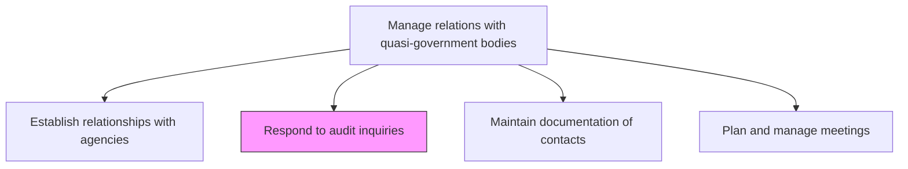
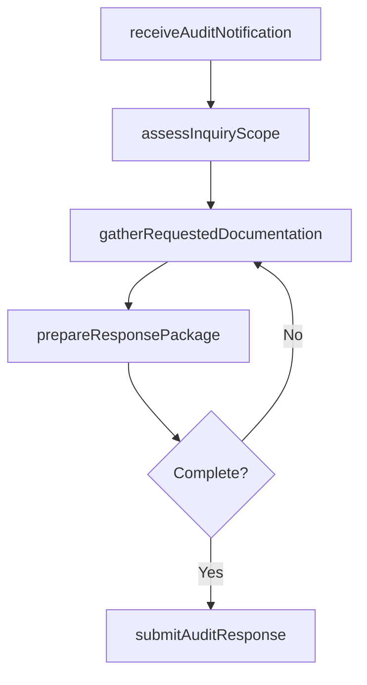

# Respond to audit inquiries

> Business-as-Code definition for coordinating timely, thorough responses to audit inquiries from quasi-governmental agencies, ensuring compliance and transparency throughout the process.

## Overview

Cooperating with auditors regarding potential or ongoing inquiries.

## Process Hierarchy



## GraphDL

```yaml
respond:
  object: To Audit Inquiries
  actor: ComplianceManager
  result: AuditResponsePackage
```

## Actions

| Action | Description |
|--------|-------------|
| receiveAuditNotification | Log and acknowledge incoming audit inquiry from quasi-government agency |
| assessInquiryScope | Evaluate the scope, timeline, and documentation requirements of the inquiry |
| gatherRequestedDocumentation | Collect financial records, compliance reports, and supporting evidence |
| prepareResponsePackage | Compile and review the formal response package for accuracy and completeness |
| submitAuditResponse | Deliver the response package to the auditing agency within the required timeframe |

## Events

| Event | Description |
|-------|-------------|
| auditNotificationReceived | Audit inquiry notification logged and acknowledged |
| inquiryScopeAssessed | Inquiry scope, timeline, and requirements documented |
| documentationGathered | Requested records and evidence collected from internal sources |
| responsePackagePrepared | Formal audit response reviewed and approved for submission |
| auditResponseSubmitted | Response package delivered to auditing agency |

## Searches

| Search | Description |
|--------|-------------|
| findAuditInquiries | List audit inquiries by agency, status, or due date |
| getResponsePackage | Retrieve audit response package and supporting documentation |
| getAuditHistory | Query historical audit inquiries and responses by agency |

## Process Flow



## RACI Matrix

| Activity | Responsible | Accountable | Consulted | Informed |
|----------|-------------|-------------|-----------|----------|
| receiveAuditNotification | ComplianceManager | GeneralCounsel | RegulatoryAffairs | CFO |
| assessInquiryScope | ComplianceManager | GeneralCounsel | Legal | GovernmentAffairs |
| gatherRequestedDocumentation | ComplianceAnalyst | ComplianceManager | Finance | InternalAudit |
| submitAuditResponse | ComplianceManager | GeneralCounsel | Legal | CEO |

## Related Processes

| Process | Relationship |
|---------|-------------|
| 12.2.2.1 Establish relationships with agencies | Upstream - agency relationships provide context for audit interactions |
| 12.2.2.3 Maintain documentation of contacts | Parallel - contact documentation supports audit coordination |
| 11.2.2 Manage regulatory compliance | Upstream - compliance posture determines audit readiness |

## Related Departments

| Department | Role |
|-----------|------|
| Compliance | Leads audit response coordination and documentation |
| Legal | Reviews response packages for legal adequacy |
| Finance | Provides financial records and data requested by auditors |
| Internal Audit | Supplies audit-ready documentation and compliance evidence |

## Related Occupations

| Occupation | Involvement |
|-----------|-------------|
| Compliance Manager | Coordinates audit response process and manages agency communication |
| Compliance Analyst | Gathers documentation and prepares response materials |
| General Counsel | Reviews and approves formal audit response submissions |

## KPIs

| KPI | Description | Unit |
|-----|-------------|------|
| Audit Response Timeliness | Percentage of audit responses submitted within required deadlines | % |
| Documentation Completeness | Percentage of audit requests with all requested items provided | % |
| Audit Finding Rate | Number of adverse findings per audit inquiry responded to | Count |
| Response Preparation Time | Average days from inquiry receipt to response submission | Days |

## Usage

```typescript
import { respondToAuditInquiries } from '@headlessly/respond-to-audit-inquiries'

const auditResponse = respondToAuditInquiries()

// Receive and assess an audit notification
const inquiry = await auditResponse.receiveAuditNotification({
  agency: 'FINRA',
  inquiryType: 'routine-examination',
  scope: ['trading-records', 'compliance-procedures'],
  dueDate: '2025-04-30'
})

// Prepare and submit the audit response package
const response = await auditResponse.prepareResponsePackage({
  inquiryId: 'AUD-2025-003',
  documents: ['trade-logs', 'compliance-certifications', 'policy-manuals'],
  reviewedBy: 'general-counsel'
})
```
