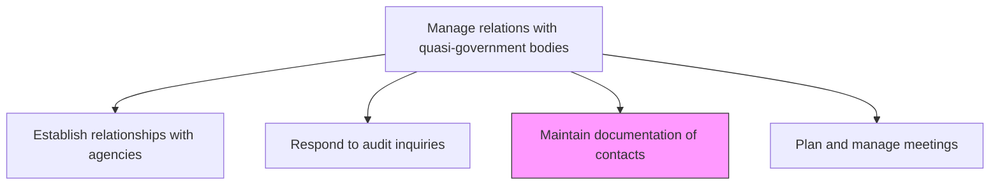
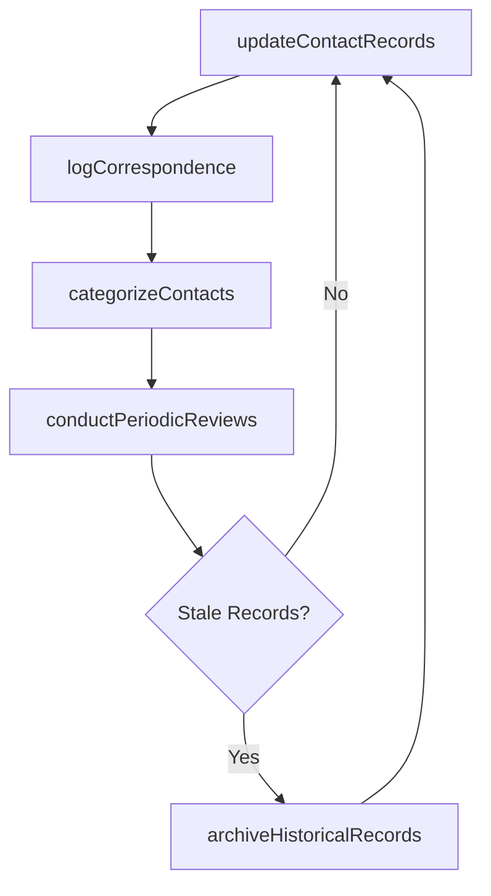

# Maintain documentation of contacts

> Business-as-Code definition for maintaining a comprehensive, up-to-date repository of agency contacts, correspondence records, and relationship documentation for quasi-government body engagement.

## Overview

Keeping a repository of documents that contain information about the network of partners, prospects and customers. Keep records up-to-date with routine reviews and modify as needed.

## Process Hierarchy



## GraphDL

```yaml
maintain:
  object: Documentation Of Contacts
  actor: RegulatoryAffairsCoordinator
  result: ContactDocumentationRepository
```

## Actions

| Action | Description |
|--------|-------------|
| updateContactRecords | Add or modify agency contact information including roles, phone numbers, and email addresses |
| logCorrespondence | Record all communications with agency contacts including emails, calls, and letters |
| conductPeriodicReviews | Perform routine reviews to verify accuracy of contact data and remove stale entries |
| categorizeContacts | Organize contacts by agency, jurisdiction, topic area, and relationship importance |
| archiveHistoricalRecords | Move inactive contact records and historical correspondence to the archive |

## Events

| Event | Description |
|-------|-------------|
| contactRecordsUpdated | Agency contact information added or modified in the repository |
| correspondenceLogged | Communication with agency contact documented |
| periodicReviewConducted | Contact repository accuracy review completed |
| contactsCategorized | Contact records organized by agency, jurisdiction, or topic |
| historicalRecordsArchived | Inactive records moved to archive storage |

## Searches

| Search | Description |
|--------|-------------|
| findContacts | List agency contacts by name, agency, jurisdiction, or role |
| getCorrespondenceHistory | Retrieve communication records for a specific agency contact |
| getStaleContacts | Query contact records not updated within a specified timeframe |
| getContactsByCategory | Retrieve contacts filtered by topic area or relationship importance |

## Process Flow



## RACI Matrix

| Activity | Responsible | Accountable | Consulted | Informed |
|----------|-------------|-------------|-----------|----------|
| updateContactRecords | RegulatoryAffairsCoordinator | RegulatoryAffairsManager | GovernmentAffairs | Legal |
| logCorrespondence | RegulatoryAffairsCoordinator | RegulatoryAffairsManager | Compliance | GovernmentAffairs |
| conductPeriodicReviews | RegulatoryAffairsCoordinator | RegulatoryAffairsManager | IT | GovernmentAffairs |
| archiveHistoricalRecords | RegulatoryAffairsCoordinator | RegulatoryAffairsManager | Records | Legal |

## Related Processes

| Process | Relationship |
|---------|-------------|
| 12.2.2.1 Establish relationships with agencies | Upstream - new relationships require initial contact documentation |
| 12.2.2.4 Plan and manage meetings | Parallel - meeting coordination relies on accurate contact data |
| 12.2.2.2 Respond to audit inquiries | Parallel - contact documentation supports audit response coordination |

## Related Departments

| Department | Role |
|-----------|------|
| Regulatory Affairs | Maintains and manages agency contact repository |
| Government Affairs | Provides updates on government contact changes |
| IT | Supports contact management systems and data integrity |
| Records Management | Governs retention policies for contact documentation |

## Related Occupations

| Occupation | Involvement |
|-----------|-------------|
| Regulatory Affairs Coordinator | Performs day-to-day contact record maintenance and updates |
| Regulatory Affairs Manager | Oversees contact documentation quality and completeness |
| Records Manager | Ensures compliance with document retention policies |

## KPIs

| KPI | Description | Unit |
|-----|-------------|------|
| Contact Record Accuracy | Percentage of contact records verified as current and accurate | % |
| Correspondence Logging Rate | Percentage of agency communications documented in the repository | % |
| Review Cycle Compliance | Percentage of periodic reviews completed on schedule | % |
| Stale Record Rate | Percentage of contact records not updated within required timeframe | % |

## Usage

```typescript
import { maintainDocumentationOfContacts } from '@headlessly/maintain-documentation-of-contacts'

const contactDocs = maintainDocumentationOfContacts()

// Update an agency contact record
const update = await contactDocs.updateContactRecords({
  agencyId: 'FINRA',
  contactName: 'Jane-Smith',
  role: 'Regional-Director',
  email: 'jsmith@finra.org',
  phone: '+1-202-555-0123'
})

// Conduct periodic review of contact records
const review = await contactDocs.conductPeriodicReviews({
  scope: 'all-agencies',
  stalePeriod: '6-months',
  includeArchiveCandidates: true
})
```
