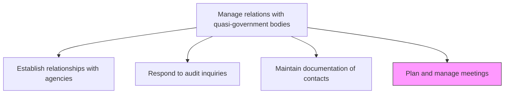
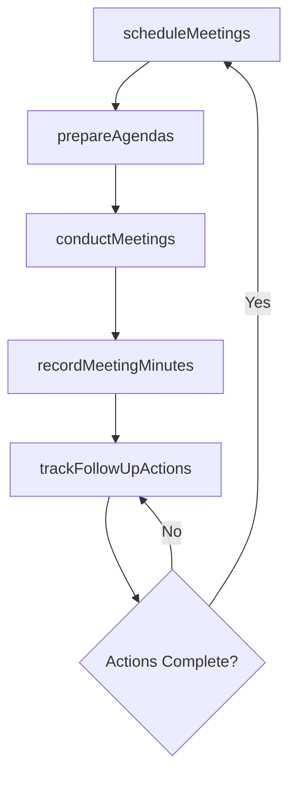

# Plan and manage meetings

> Business-as-Code definition for scheduling, coordinating, and documenting meetings with quasi-government bodies to maintain engagement cadence and capture actionable insights.

## Overview

Ensuring regular interaction between business entity and quasi-government bodies in order to maintain established relationships. Collect and record meeting data for further analysis and use.

## Process Hierarchy



## GraphDL

```yaml
plan:
  object: And Manage Meetings
  actor: RegulatoryAffairsManager
  result: MeetingRecord
```

## Actions

| Action | Description |
|--------|-------------|
| scheduleMeetings | Coordinate meeting dates, venues, and agendas with agency representatives |
| prepareAgendas | Develop meeting agendas aligned with relationship objectives and current topics |
| conductMeetings | Facilitate meetings with quasi-government body representatives |
| recordMeetingMinutes | Document discussion points, decisions, and action items from meetings |
| trackFollowUpActions | Monitor completion of action items and commitments from previous meetings |

## Events

| Event | Description |
|-------|-------------|
| meetingsScheduled | Meeting with quasi-government body confirmed and calendar invitations sent |
| agendasPrepared | Meeting agenda drafted and distributed to attendees |
| meetingsConducted | Quasi-government body meeting completed |
| meetingMinutesRecorded | Meeting minutes and action items documented |
| followUpActionsTracked | Post-meeting action items reviewed and completion status updated |

## Searches

| Search | Description |
|--------|-------------|
| findScheduledMeetings | List upcoming meetings by agency, date, or topic |
| getMeetingMinutes | Retrieve minutes and action items for a specific meeting |
| getMeetingHistory | Query historical meeting records by agency or date range |
| getPendingActions | List overdue or pending follow-up actions from past meetings |

## Process Flow



## RACI Matrix

| Activity | Responsible | Accountable | Consulted | Informed |
|----------|-------------|-------------|-----------|----------|
| scheduleMeetings | RegulatoryAffairsCoordinator | RegulatoryAffairsManager | GovernmentAffairs | ExecutiveLiaisons |
| prepareAgendas | RegulatoryAffairsManager | GovernmentAffairsDirector | Legal | PolicyAnalyst |
| conductMeetings | RegulatoryAffairsManager | GovernmentAffairsDirector | Legal | CEO |
| trackFollowUpActions | RegulatoryAffairsCoordinator | RegulatoryAffairsManager | Operations | GovernmentAffairs |

## Related Processes

| Process | Relationship |
|---------|-------------|
| 12.2.2.3 Maintain documentation of contacts | Upstream - contact records enable meeting scheduling |
| 12.2.2.1 Establish relationships with agencies | Upstream - established relationships define meeting participants |
| 12.2.1.6 Liaise with authorities | Parallel - authority liaison meetings follow similar planning processes |

## Related Departments

| Department | Role |
|-----------|------|
| Regulatory Affairs | Plans, coordinates, and facilitates agency meetings |
| Government Affairs | Provides strategic guidance on meeting agendas and objectives |
| Legal | Advises on sensitive topics and compliance matters for discussion |
| Executive Leadership | Participates in high-level agency meetings |

## Related Occupations

| Occupation | Involvement |
|-----------|-------------|
| Regulatory Affairs Manager | Leads meeting planning, facilitation, and follow-up tracking |
| Regulatory Affairs Coordinator | Handles logistics, scheduling, and minutes documentation |
| Government Affairs Director | Attends strategic meetings and provides direction |

## KPIs

| KPI | Description | Unit |
|-----|-------------|------|
| Meeting Cadence Compliance | Percentage of agencies meeting target interaction frequency | % |
| Follow-up Action Completion Rate | Percentage of meeting action items completed on time | % |
| Minutes Distribution Timeliness | Average days from meeting to minutes distribution | Days |
| Meeting Attendance Rate | Percentage of invited agency representatives attending | % |

## Usage

```typescript
import { planAndManageMeetings } from '@headlessly/plan-and-manage-meetings'

const meetings = planAndManageMeetings()

// Schedule a meeting with a quasi-government body
const meeting = await meetings.scheduleMeetings({
  agency: 'Federal-Reserve-Bank',
  attendees: ['regional-director', 'examiner-lead'],
  topic: 'quarterly-compliance-review',
  date: '2025-07-15',
  format: 'in-person'
})

// Track follow-up actions from a previous meeting
const actions = await meetings.trackFollowUpActions({
  meetingId: 'MTG-2025-018',
  filterByStatus: 'pending',
  escalateOverdue: true
})
```
