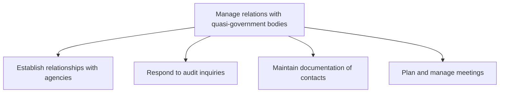
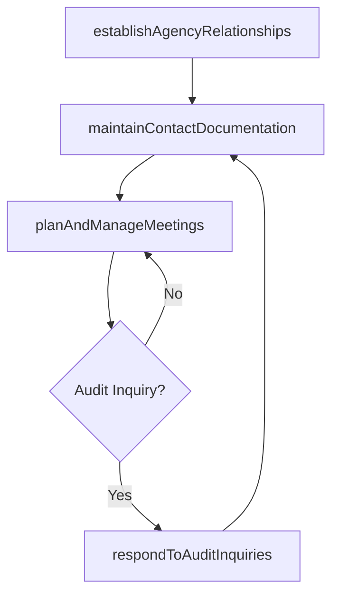

# Manage relations with quasi-government bodies

> Business-as-Code definition for establishing and maintaining relationships with quasi-governmental agencies, responding to audit inquiries, documenting contacts, and managing regular meetings to ensure constructive engagement.

## Overview

Managing relations with quasi-governmental organizations, corporations, businesses, or any other agency that is treated by national laws and principles to be under the supervision of the government but also distinct and self-directed from the government.

## Process Hierarchy



## GraphDL

```yaml
manage:
  object: Relations With Quasi-government Bodies
  actor: RegulatoryAffairsManager
  result: AgencyRelationshipRecord
```

## Actions

| Action | Description |
|--------|-------------|
| establishAgencyRelationships | Initiate and formalize relationships with quasi-governmental agencies |
| respondToAuditInquiries | Cooperate with agency audit requests and provide required documentation |
| maintainContactDocumentation | Keep a current repository of agency contacts, correspondence, and meeting records |
| planAndManageMeetings | Schedule and coordinate regular interactions with quasi-government bodies |

## Events

| Event | Description |
|-------|-------------|
| agencyRelationshipsEstablished | New agency relationship formalized with key contacts identified |
| auditInquiriesRespondedTo | Agency audit inquiry response submitted |
| contactDocumentationMaintained | Agency contact records updated |
| meetingsPlannedAndManaged | Agency meeting or engagement session completed |

## Searches

| Search | Description |
|--------|-------------|
| getAgencyRelationships | Retrieve current quasi-government agency relationships by type or jurisdiction |
| findAuditInquiries | List agency audit inquiries by status, agency, or date |
| getContactLog | Retrieve agency contact and correspondence records |

## Process Flow



## RACI Matrix

| Activity | Responsible | Accountable | Consulted | Informed |
|----------|-------------|-------------|-----------|----------|
| establishAgencyRelationships | RegulatoryAffairsManager | GovernmentAffairsDirector | Legal | Executive |
| respondToAuditInquiries | ComplianceManager | GeneralCounsel | Finance | RegulatoryAffairs |
| planAndManageMeetings | RegulatoryAffairsManager | GovernmentAffairsDirector | Legal | Operations |

## Sub-Processes

| ID | Name | Description |
|----|------|-------------|
| 12.2.2.1 | Establish relationships with agencies | Engaging government, regulatory, or industry agencies to establish relationships. Analyze steps and  |
| 12.2.2.2 | Respond to audit inquiries | Cooperating with auditors regarding potential or ongoing inquiries. |
| 12.2.2.3 | Maintain documentation of contacts | Keeping a repository of documents that contain information about the network of partners, prospects  |
| 12.2.2.4 | Plan and manage meetings | Ensuring regular interaction between business entity and quasi-government bodies in order to maintai |

## Related Processes

| Process | Relationship |
|---------|-------------|
| 12.2.1 Manage government relations | Parallel - direct government relations complement quasi-government engagement |
| 12.2.3 Manage relations with trade or industry groups | Parallel - industry group relations often intersect with quasi-government bodies |
| 11.2.2 Manage regulatory compliance | Parallel - agency relationships support regulatory compliance |

## Related Departments

| Department | Role |
|-----------|------|
| Regulatory Affairs | Manages engagement with quasi-governmental agencies |
| Legal | Advises on regulatory obligations and audit responses |
| Compliance | Ensures adherence to agency requirements and standards |

## Related Occupations

| Occupation | Involvement |
|-----------|-------------|
| Regulatory Affairs Manager | Manages day-to-day engagement with quasi-government agencies |
| Compliance Manager | Coordinates audit responses and ensures agency requirement adherence |
| Government Affairs Director | Oversees strategic agency relationship management |

## KPIs

| KPI | Description | Unit |
|-----|-------------|------|
| Agency Relationship Coverage | Percentage of relevant quasi-government bodies with active relationships | % |
| Audit Response Timeliness | Percentage of audit inquiries responded to within required timeframe | % |
| Meeting Cadence Compliance | Percentage of agencies meeting target engagement frequency | % |
| Contact Record Accuracy | Percentage of agency contact records current and verified | % |

## Usage

```typescript
import { manageRelationsWithQuasiGovernmentBodies } from '@headlessly/manage-relations-with-quasi-government-bodies'

const quasiGov = manageRelationsWithQuasiGovernmentBodies()

// Establish a new agency relationship
const relationship = await quasiGov.establishAgencyRelationships({
  agency: 'Federal-Reserve-Bank',
  contactLevel: 'regional-director',
  purpose: 'regulatory-consultation'
})

// Respond to an audit inquiry
const response = await quasiGov.respondToAuditInquiries({
  inquiryId: 'AUDIT-2025-007',
  agency: 'FINRA',
  documentationPackage: ['financial-statements', 'compliance-records'],
  dueDate: '2025-03-15'
})
```
