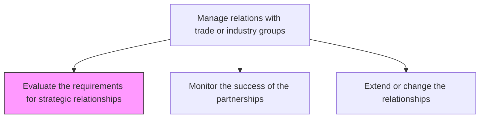
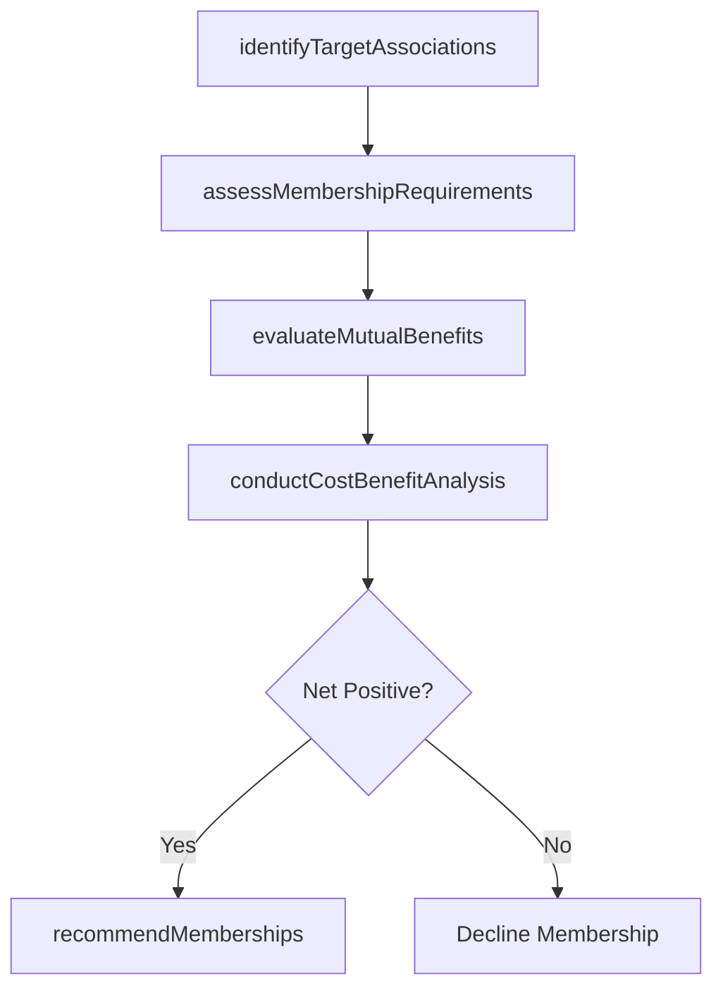

# Evaluate the requirements for strategic relationships

> Business-as-Code definition for assessing the prerequisites, costs, and mutual benefits required to establish productive agreements with trade associations and industry groups.

## Overview

Determining the requirements to enter in to an agreement with trade or industry agencies. Discover what activities or processes can be conducted to provide the best mutual outcome.

## Process Hierarchy



## GraphDL

```yaml
evaluate:
  object: Requirements For Strategic Relationships
  actor: IndustryAffairsManager
  result: StrategicRelationshipAssessment
```

## Actions

| Action | Description |
|--------|-------------|
| identifyTargetAssociations | Research and prioritize trade associations aligned with organizational strategy |
| assessMembershipRequirements | Document dues, participation obligations, and governance requirements for each association |
| evaluateMutualBenefits | Analyze expected value exchange including lobbying access, standards influence, and networking |
| conductCostBenefitAnalysis | Compare membership costs against anticipated strategic and operational benefits |
| recommendMemberships | Present evaluated associations with recommendations to leadership for approval |

## Events

| Event | Description |
|-------|-------------|
| targetAssociationsIdentified | Potential trade associations researched and shortlisted |
| membershipRequirementsAssessed | Association prerequisites and obligations documented |
| mutualBenefitsEvaluated | Expected value exchange analysis completed |
| costBenefitAnalysisCompleted | Financial and strategic cost-benefit analysis finalized |
| membershipsRecommended | Association membership recommendations presented to leadership |

## Searches

| Search | Description |
|--------|-------------|
| findTargetAssociations | List potential trade associations by industry, geography, or strategic alignment |
| getMembershipRequirements | Retrieve documented requirements for specific trade associations |
| getCostBenefitAnalysis | Query cost-benefit analysis results by association |

## Process Flow



## RACI Matrix

| Activity | Responsible | Accountable | Consulted | Informed |
|----------|-------------|-------------|-----------|----------|
| identifyTargetAssociations | IndustryAffairsManager | GovernmentAffairsDirector | Strategy | Marketing |
| assessMembershipRequirements | IndustryAffairsManager | GovernmentAffairsDirector | Legal | Finance |
| conductCostBenefitAnalysis | IndustryAffairsManager | GovernmentAffairsDirector | Finance | CEO |
| recommendMemberships | GovernmentAffairsDirector | CEO | Strategy | Board |

## Related Processes

| Process | Relationship |
|---------|-------------|
| 12.2.3.2 Monitor the success of the partnerships | Downstream - evaluation criteria become monitoring benchmarks |
| 12.2.3.3 Extend or change the relationships | Downstream - evaluation framework supports relationship evolution decisions |
| 12.2.1.1 Assess relationships | Parallel - government relationship assessment informs trade group evaluation |

## Related Departments

| Department | Role |
|-----------|------|
| Industry Affairs | Conducts association research and evaluates membership requirements |
| Finance | Supports cost-benefit analysis and budget allocation |
| Strategy | Aligns trade group evaluation with strategic priorities |
| Legal | Reviews membership agreements and governance obligations |

## Related Occupations

| Occupation | Involvement |
|-----------|-------------|
| Industry Affairs Manager | Leads evaluation of trade association membership requirements |
| Financial Analyst | Supports cost-benefit analysis of membership investments |
| Strategy Analyst | Assesses strategic alignment of potential trade partnerships |

## KPIs

| KPI | Description | Unit |
|-----|-------------|------|
| Evaluation Cycle Time | Average time from identification to membership recommendation | Days |
| Recommendation Approval Rate | Percentage of recommended memberships approved by leadership | % |
| Cost-Benefit Ratio | Average ratio of expected benefits to membership costs | Ratio |
| Target Association Coverage | Percentage of identified target associations fully evaluated | % |

## Usage

```typescript
import { evaluateRequirementsForStrategicRelationships } from '@headlessly/evaluate-requirements-for-strategic-relationships'

const evaluation = evaluateRequirementsForStrategicRelationships()

// Identify target trade associations
const targets = await evaluation.identifyTargetAssociations({
  industry: 'technology',
  geography: 'North-America',
  minimumMembers: 100,
  focusAreas: ['standards', 'advocacy', 'networking']
})

// Conduct cost-benefit analysis for a specific association
const analysis = await evaluation.conductCostBenefitAnalysis({
  association: 'CompTIA',
  annualDues: 25000,
  expectedBenefits: ['certification-programs', 'policy-influence', 'industry-data'],
  timeHorizon: '3-years'
})
```
