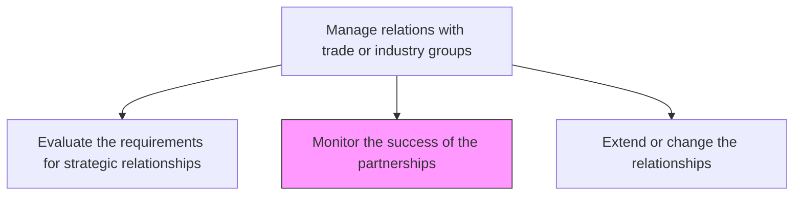
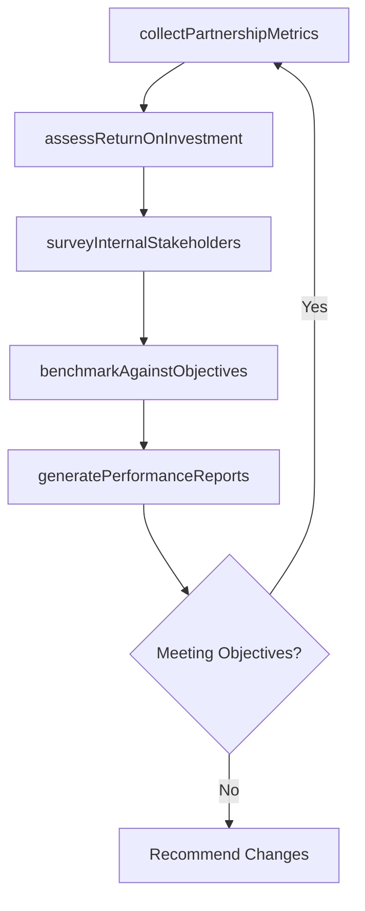

# Monitor the success of the partnerships

> Business-as-Code definition for tracking and evaluating the effectiveness of trade and industry group partnerships to ensure they deliver expected value and inform decisions on continuation or modification.

## Overview

Analyzing current relationships with trade and industry groups. Ensure that the partnership in successful and make modifications where needed.

## Process Hierarchy



## GraphDL

```yaml
monitor:
  object: Success Of Partnerships
  actor: IndustryAffairsManager
  result: PartnershipPerformanceReport
```

## Actions

| Action | Description |
|--------|-------------|
| collectPartnershipMetrics | Gather data on participation levels, advocacy outcomes, and networking value from each partnership |
| assessReturnOnInvestment | Calculate ROI by comparing membership costs against quantifiable and qualitative benefits |
| surveyInternalStakeholders | Poll internal teams on the perceived value and usefulness of each partnership |
| benchmarkAgainstObjectives | Compare partnership outcomes against the original strategic objectives set during evaluation |
| generatePerformanceReports | Produce periodic partnership performance reports for leadership review |

## Events

| Event | Description |
|-------|-------------|
| partnershipMetricsCollected | Partnership participation and outcome data gathered for review period |
| returnOnInvestmentAssessed | Partnership ROI calculation completed |
| internalStakeholdersSurveyed | Internal satisfaction survey on partnership value completed |
| objectivesBenchmarked | Partnership outcomes compared against original strategic objectives |
| performanceReportsGenerated | Periodic partnership performance report published |

## Searches

| Search | Description |
|--------|-------------|
| getPartnershipMetrics | Retrieve participation and outcome metrics by trade association |
| getROIAnalysis | Query return on investment data for specific partnerships |
| getStakeholderFeedback | Retrieve internal survey results on partnership value |
| getPerformanceReports | Query historical partnership performance reports by period |

## Process Flow



## RACI Matrix

| Activity | Responsible | Accountable | Consulted | Informed |
|----------|-------------|-------------|-----------|----------|
| collectPartnershipMetrics | IndustryAffairsManager | GovernmentAffairsDirector | Finance | Marketing |
| assessReturnOnInvestment | IndustryAffairsManager | GovernmentAffairsDirector | Finance | CEO |
| surveyInternalStakeholders | IndustryAffairsManager | GovernmentAffairsDirector | HR | Strategy |
| generatePerformanceReports | IndustryAffairsManager | GovernmentAffairsDirector | Finance | Board |

## Related Processes

| Process | Relationship |
|---------|-------------|
| 12.2.3.1 Evaluate the requirements for strategic relationships | Upstream - evaluation criteria serve as monitoring benchmarks |
| 12.2.3.3 Extend or change the relationships | Downstream - monitoring results drive partnership modification decisions |
| 12.2.1.3 Monitor relationships | Parallel - government relationship monitoring follows similar patterns |

## Related Departments

| Department | Role |
|-----------|------|
| Industry Affairs | Conducts ongoing partnership monitoring and performance analysis |
| Finance | Supports ROI calculations and budget impact assessment |
| Strategy | Evaluates partnership alignment with evolving corporate priorities |
| Marketing | Provides input on brand value derived from trade association participation |

## Related Occupations

| Occupation | Involvement |
|-----------|-------------|
| Industry Affairs Manager | Leads partnership monitoring and performance reporting |
| Financial Analyst | Supports ROI analysis and cost tracking |
| Strategy Analyst | Assesses strategic alignment of ongoing partnerships |

## KPIs

| KPI | Description | Unit |
|-----|-------------|------|
| Partnership ROI | Return on investment from trade association memberships | Ratio |
| Objective Achievement Rate | Percentage of original partnership objectives met | % |
| Internal Satisfaction Score | Average internal stakeholder satisfaction with partnership value | Score (1-5) |
| Monitoring Cycle Timeliness | Percentage of partnership reviews completed on schedule | % |

## Usage

```typescript
import { monitorSuccessOfPartnerships } from '@headlessly/monitor-success-of-partnerships'

const partnershipMonitor = monitorSuccessOfPartnerships()

// Collect partnership metrics for the year
const metrics = await partnershipMonitor.collectPartnershipMetrics({
  period: '2024',
  associations: ['NAM', 'CompTIA', 'Chamber-of-Commerce'],
  includeParticipation: true,
  includeAdvocacyOutcomes: true
})

// Assess ROI for a specific partnership
const roi = await partnershipMonitor.assessReturnOnInvestment({
  association: 'NAM',
  investmentPeriod: '2024',
  includeIndirectBenefits: true
})
```
