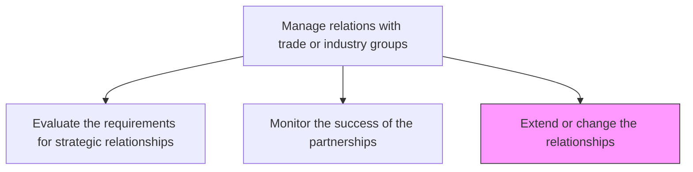
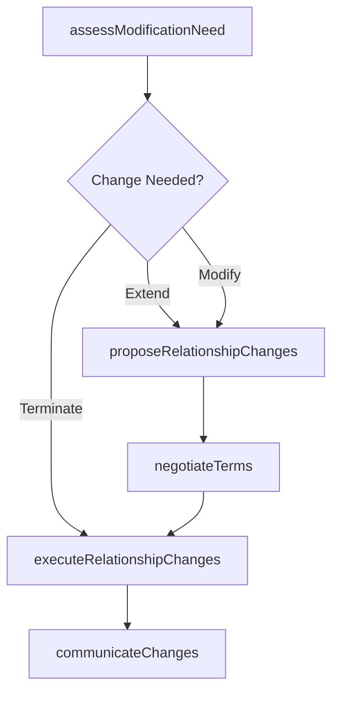

# Extend or change the relationships

> Business-as-Code definition for expanding, modifying, or terminating trade and industry group relationships based on performance reviews and evolving strategic priorities.

## Overview

Providing additional information or inclusion for third party trade or industry entities; or changing existing parameters to modify the current relationship. Communicate and execute changes.

## Process Hierarchy



## GraphDL

```yaml
extend:
  object: Or Change Relationships
  actor: IndustryAffairsManager
  result: RelationshipModificationRecord
```

## Actions

| Action | Description |
|--------|-------------|
| assessModificationNeed | Review partnership performance data to determine if changes are warranted |
| proposeRelationshipChanges | Develop proposals to extend, modify scope, or terminate trade group relationships |
| negotiateTerms | Negotiate revised membership terms, participation levels, or committee involvement |
| executeRelationshipChanges | Implement approved changes including renewals, expansions, or exits |
| communicateChanges | Notify internal stakeholders and trade group contacts of relationship modifications |

## Events

| Event | Description |
|-------|-------------|
| modificationNeedAssessed | Partnership performance reviewed and change requirement determined |
| relationshipChangesProposed | Formal proposal for relationship modification drafted and submitted |
| termsNegotiated | Revised membership or participation terms agreed upon |
| relationshipChangesExecuted | Approved relationship modifications implemented |
| changesCommunicated | Relationship changes communicated to all affected parties |

## Searches

| Search | Description |
|--------|-------------|
| findRelationshipsForReview | List partnerships due for renewal, modification, or termination review |
| getModificationHistory | Retrieve history of relationship changes by association |
| getPendingChanges | Query relationship modifications awaiting approval or execution |

## Process Flow



## RACI Matrix

| Activity | Responsible | Accountable | Consulted | Informed |
|----------|-------------|-------------|-----------|----------|
| assessModificationNeed | IndustryAffairsManager | GovernmentAffairsDirector | Strategy | Finance |
| proposeRelationshipChanges | IndustryAffairsManager | GovernmentAffairsDirector | Legal | CEO |
| negotiateTerms | IndustryAffairsManager | GovernmentAffairsDirector | Legal | Finance |
| communicateChanges | IndustryAffairsManager | GovernmentAffairsDirector | PublicRelations | Executive |

## Related Processes

| Process | Relationship |
|---------|-------------|
| 12.2.3.2 Monitor the success of the partnerships | Upstream - monitoring results trigger relationship modification decisions |
| 12.2.3.1 Evaluate the requirements for strategic relationships | Parallel - evaluation framework informs modification proposals |
| 12.2.2 Manage relations with quasi-government bodies | Parallel - similar modification processes apply to quasi-government relationships |

## Related Departments

| Department | Role |
|-----------|------|
| Industry Affairs | Leads relationship modification proposals and execution |
| Legal | Reviews modified terms and exit obligations |
| Finance | Assesses budget implications of relationship changes |
| Strategy | Validates alignment of modifications with strategic direction |

## Related Occupations

| Occupation | Involvement |
|-----------|-------------|
| Industry Affairs Manager | Manages the relationship modification process end to end |
| Government Affairs Director | Approves significant relationship changes |
| Contracts Manager | Reviews and negotiates revised membership agreements |

## KPIs

| KPI | Description | Unit |
|-----|-------------|------|
| Modification Cycle Time | Average days from change identification to execution | Days |
| Renewal Rate | Percentage of expiring partnerships renewed | % |
| Termination Rate | Percentage of partnerships terminated per review cycle | % |
| Negotiation Savings | Cost savings achieved through renegotiated membership terms | Currency |

## Usage

```typescript
import { extendOrChangeRelationships } from '@headlessly/extend-or-change-relationships'

const relationshipChanges = extendOrChangeRelationships()

// Assess whether a partnership needs modification
const assessment = await relationshipChanges.assessModificationNeed({
  association: 'Chamber-of-Commerce',
  performanceData: 'partnership-review-2024',
  strategicAlignment: 'current-priorities'
})

// Execute a relationship extension with expanded scope
const extension = await relationshipChanges.executeRelationshipChanges({
  association: 'CompTIA',
  changeType: 'extend',
  newScope: ['standards-committee', 'workforce-development'],
  effectiveDate: '2025-01-01'
})
```
