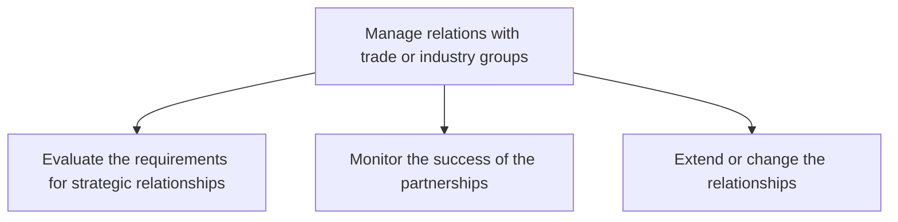
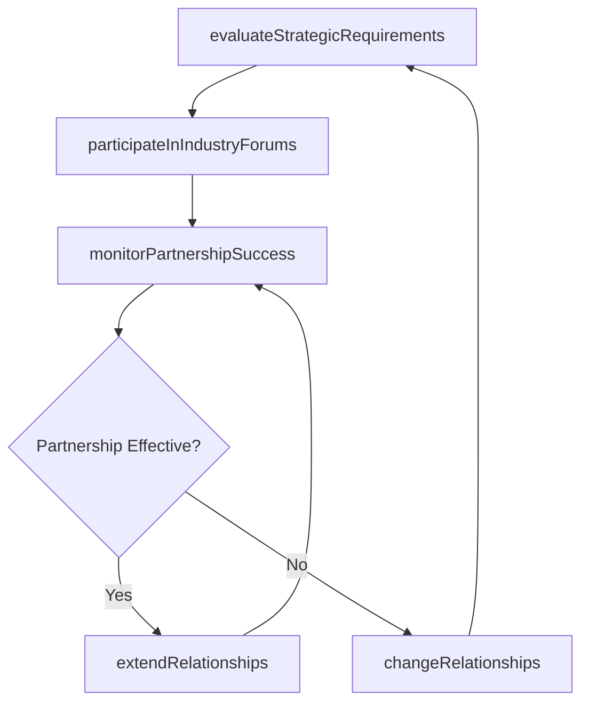

# Manage relations with trade or industry groups

> Business-as-Code definition for managing strategic relationships with trade associations and industry groups through membership evaluation, partnership monitoring, and relationship evolution.

## Overview

Managing relations with organizations established and financed by businesses that operate in a specific industry. Participate in public relations actions such as lobbying and publishing, advertising, education, and political donations.

## Process Hierarchy



## GraphDL

```yaml
manage:
  object: Relations With Trade Or Industry Groups
  actor: IndustryAffairsManager
  result: TradeRelationshipPortfolio
```

## Actions

| Action | Description |
|--------|-------------|
| evaluateStrategicRequirements | Assess prerequisites and mutual benefits of trade association memberships |
| monitorPartnershipSuccess | Track the effectiveness and ROI of trade and industry group partnerships |
| extendRelationships | Expand existing trade group relationships with deeper committee involvement |
| changeRelationships | Modify or terminate trade group memberships based on performance review |
| participateInIndustryForums | Represent the organization in industry conferences, panels, and working groups |

## Events

| Event | Description |
|-------|-------------|
| strategicRequirementsEvaluated | Trade association membership prerequisites and benefits assessed |
| partnershipSuccessMonitored | Partnership effectiveness review completed for reporting period |
| relationshipsExtended | Trade group membership expanded with additional involvement |
| relationshipsChanged | Trade group membership modified or terminated |
| industryForumsParticipated | Organization represented at industry conference or working group |

## Searches

| Search | Description |
|--------|-------------|
| findTradeAssociations | List trade association memberships by industry, status, or investment level |
| getPartnershipPerformance | Retrieve partnership effectiveness metrics by association |
| getIndustryForumCalendar | Query upcoming industry conferences and working group meetings |
| getMembershipHistory | Retrieve historical trade group membership and involvement records |

## Process Flow



## RACI Matrix

| Activity | Responsible | Accountable | Consulted | Informed |
|----------|-------------|-------------|-----------|----------|
| evaluateStrategicRequirements | IndustryAffairsManager | GovernmentAffairsDirector | Strategy | Legal |
| monitorPartnershipSuccess | IndustryAffairsManager | GovernmentAffairsDirector | Finance | CEO |
| extendRelationships | IndustryAffairsManager | GovernmentAffairsDirector | Marketing | Legal |
| participateInIndustryForums | IndustryAffairsManager | GovernmentAffairsDirector | PublicRelations | Executive |

## Sub-Processes

| ID | Name | Description |
|----|------|-------------|
| 12.2.3.1 | Evaluate the requirements for strategic relationships | Determining the requirements to enter in to an agreement with trade or industry agencies. Discover w |
| 12.2.3.2 | Monitor the success of the partnerships | Analyzing current relationships with trade and industry groups. Ensure that the partnership in succe |
| 12.2.3.3 | Extend or change the relationships | Providing additional information or inclusion for third party trade or industry entities; or changin |

## Related Processes

| Process | Relationship |
|---------|-------------|
| 12.2.1 Manage government relations | Parallel - trade groups often advocate on government policy |
| 12.2.4 Manage lobby activities | Downstream - trade group positions inform lobbying campaigns |
| 12.5.1 Manage community relations | Parallel - industry group participation supports community presence |

## Related Departments

| Department | Role |
|-----------|------|
| Industry Affairs | Manages trade association memberships and participation |
| Government Affairs | Coordinates trade group advocacy with government relations strategy |
| Marketing | Leverages trade association events for brand visibility |
| Strategy | Aligns trade group participation with corporate priorities |

## Related Occupations

| Occupation | Involvement |
|-----------|-------------|
| Industry Affairs Manager | Manages day-to-day trade association relationships and participation |
| Government Affairs Director | Provides strategic direction for industry group engagement |
| Public Relations Specialist | Coordinates messaging at industry events and conferences |

## KPIs

| KPI | Description | Unit |
|-----|-------------|------|
| Trade Association ROI | Return on investment from trade group memberships and participation | Ratio |
| Committee Participation Rate | Percentage of target trade group committees with active representation | % |
| Industry Forum Attendance | Number of industry conferences and forums attended per year | Count |
| Partnership Satisfaction Score | Internal satisfaction rating of trade association value | Score (1-5) |

## Usage

```typescript
import { manageRelationsWithTradeOrIndustryGroups } from '@headlessly/manage-relations-with-trade-or-industry-groups'

const tradeRelations = manageRelationsWithTradeOrIndustryGroups()

// Evaluate a potential trade association membership
const evaluation = await tradeRelations.evaluateStrategicRequirements({
  association: 'National-Association-of-Manufacturers',
  benefits: ['lobbying-access', 'standards-committees', 'networking'],
  annualDues: 50000
})

// Monitor partnership effectiveness
const performance = await tradeRelations.monitorPartnershipSuccess({
  period: '2024',
  associations: ['NAM', 'Chamber-of-Commerce'],
  metrics: ['advocacy-outcomes', 'networking-value', 'knowledge-access']
})
```
