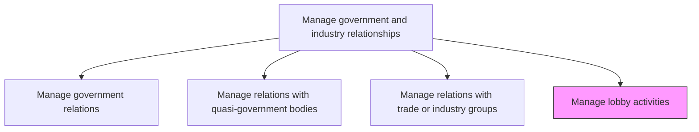
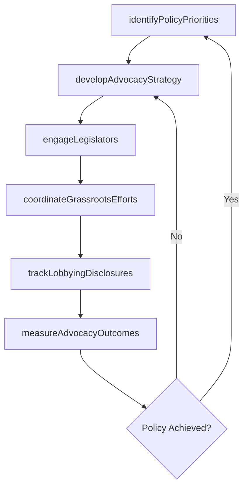

# Manage lobby activities

> Business-as-Code definition for organizing and executing lobbying campaigns to influence government policy, including engagement with legislators, compliance with lobbying disclosure requirements, and tracking advocacy outcomes.

## Overview

Managing lobbying activities to affect government policies.

## Process Hierarchy



## GraphDL

```yaml
manage:
  object: Lobby Activities
  actor: LobbyCoordinator
  result: LobbyingCampaignRecord
```

## Actions

| Action | Description |
|--------|-------------|
| identifyPolicyPriorities | Determine key legislative and regulatory issues requiring advocacy |
| developAdvocacyStrategy | Create campaign plans outlining lobbying objectives, targets, and tactics |
| engageLegislators | Meet with elected officials and their staff to present organizational positions |
| coordinateGrassrootsEfforts | Mobilize employees, partners, and stakeholders for grassroots advocacy campaigns |
| trackLobbyingDisclosures | Ensure compliance with lobbying registration and disclosure requirements |
| measureAdvocacyOutcomes | Evaluate the effectiveness of lobbying campaigns against stated objectives |

## Events

| Event | Description |
|-------|-------------|
| policyPrioritiesIdentified | Key legislative issues requiring advocacy determined for the period |
| advocacyStrategyDeveloped | Lobbying campaign plan approved and funded |
| legislatorsEngaged | Meeting with elected officials or staff completed |
| grassrootsEffortsCoordinated | Grassroots advocacy campaign launched or milestone completed |
| lobbyingDisclosuresTracked | Lobbying registration and disclosure filings submitted on time |
| advocacyOutcomesMeasured | Campaign effectiveness evaluation completed |

## Searches

| Search | Description |
|--------|-------------|
| findPolicyPriorities | List active policy priorities by topic, jurisdiction, or urgency |
| getLobbyingCampaigns | Retrieve lobbying campaigns by status, topic, or legislator |
| getDisclosureFilings | Query lobbying disclosure filings by period or jurisdiction |
| getAdvocacyResults | Retrieve advocacy outcome data by campaign or policy issue |

## Process Flow



## RACI Matrix

| Activity | Responsible | Accountable | Consulted | Informed |
|----------|-------------|-------------|-----------|----------|
| identifyPolicyPriorities | GovernmentAffairsDirector | CEO | Legal | Board |
| developAdvocacyStrategy | LobbyCoordinator | GovernmentAffairsDirector | ExternalLobbyist | Legal |
| engageLegislators | LobbyCoordinator | GovernmentAffairsDirector | ExecutiveLiaisons | PublicRelations |
| trackLobbyingDisclosures | ComplianceManager | GeneralCounsel | LobbyCoordinator | GovernmentAffairs |

## Related Processes

| Process | Relationship |
|---------|-------------|
| 12.2.1 Manage government relations | Upstream - government relationships enable effective lobbying |
| 12.2.3 Manage relations with trade or industry groups | Parallel - trade associations amplify lobbying campaigns |
| 12.5 Manage public relations program | Parallel - public communications support advocacy messaging |

## Related Departments

| Department | Role |
|-----------|------|
| Government Affairs | Manages lobbying campaigns and legislator engagement |
| Legal | Ensures compliance with lobbying registration and disclosure laws |
| Public Relations | Supports public messaging aligned with advocacy positions |
| Executive Leadership | Provides executive sponsorship for key advocacy initiatives |

## Related Occupations

| Occupation | Involvement |
|-----------|-------------|
| Lobby Coordinator | Plans and executes lobbying campaigns and legislator meetings |
| Government Affairs Director | Sets advocacy strategy and oversees lobbying activities |
| External Lobbyist | Provides specialized advocacy services and government access |

## KPIs

| KPI | Description | Unit |
|-----|-------------|------|
| Policy Win Rate | Percentage of lobbying campaigns achieving desired policy outcome | % |
| Legislator Meeting Volume | Number of legislator meetings conducted per quarter | Count |
| Lobbying Compliance Rate | Percentage of disclosure filings submitted on time and accurately | % |
| Advocacy Spend Efficiency | Cost per successful policy advocacy outcome | Currency |

## Usage

```typescript
import { manageLobbyActivities } from '@headlessly/manage-lobby-activities'

const lobbying = manageLobbyActivities()

// Develop advocacy strategy for a policy issue
const strategy = await lobbying.developAdvocacyStrategy({
  issue: 'data-privacy-reform',
  jurisdiction: 'US-Federal',
  objectives: ['amendment-support', 'safe-harbor-provision'],
  budget: 500000
})

// Track lobbying disclosure compliance
const disclosures = await lobbying.trackLobbyingDisclosures({
  period: 'Q1-2025',
  jurisdictions: ['US-Federal', 'California'],
  includeExternalLobbyists: true
})
```
