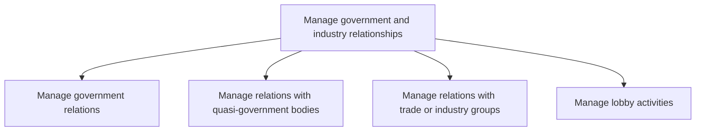
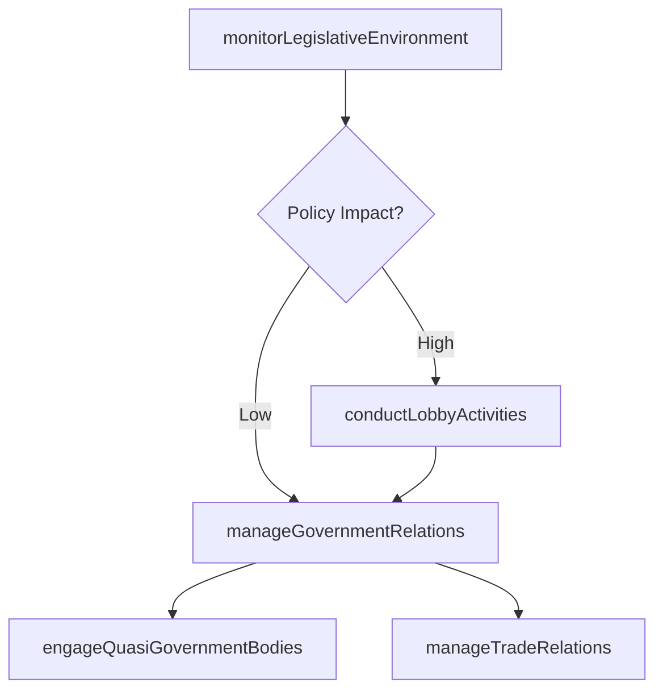

# Manage government and industry relationships

> Business-as-Code definition for creating and maintaining strategic relationships with government agencies, quasi-government bodies, trade associations, and industry groups, including lobbying activities and regulatory engagement.

## Overview

Creating and maintaining relationships with government and industry representatives.

## Process Hierarchy



## GraphDL

```yaml
manage:
  object: Government And Industry Relationships
  actor: GovernmentAffairsDirector
  result: GovernmentRelationshipRegister
```

## Actions

| Action | Description |
|--------|-------------|
| manageGovernmentRelations | Coordinate interactions with government officials and regulatory agencies |
| engageQuasiGovernmentBodies | Maintain relationships with standards bodies, commissions, and agencies |
| manageTradeRelations | Participate in trade associations and industry consortia |
| conductLobbyActivities | Organize and manage advocacy campaigns to influence public policy |
| monitorLegislativeEnvironment | Track proposed legislation and regulatory changes affecting operations |

## Events

| Event | Description |
|-------|-------------|
| governmentRelationsManaged | Government engagement activity completed and documented |
| quasiGovernmentBodiesEngaged | Quasi-government body interaction recorded |
| tradeRelationsManaged | Trade association or industry group engagement completed |
| lobbyActivitiesConducted | Lobbying campaign or advocacy action executed |
| legislativeEnvironmentMonitored | Legislative or regulatory change assessment completed |

## Searches

| Search | Description |
|--------|-------------|
| findGovernmentContacts | List government and regulatory contacts by agency, jurisdiction, or topic |
| getTradeAssociationMemberships | Retrieve active trade association and industry group memberships |
| findLegislativeChanges | Query tracked legislative and regulatory proposals by impact area |
| getLobbyingActivity | Retrieve history of lobbying activities and expenditures |

## Process Flow



## RACI Matrix

| Activity | Responsible | Accountable | Consulted | Informed |
|----------|-------------|-------------|-----------|----------|
| manageGovernmentRelations | GovernmentAffairsManager | GeneralCounsel | PublicPolicy | CEO |
| engageQuasiGovernmentBodies | RegulatoryAffairsLead | GovernmentAffairsDirector | Compliance | Legal |
| manageTradeRelations | IndustryAffairsManager | GovernmentAffairsDirector | Marketing | Strategy |
| conductLobbyActivities | LobbyCoordinator | GovernmentAffairsDirector | Legal | Board |

## Sub-Processes

| ID | Name | Description |
|----|------|-------------|
| 12.2.1 | Manage government relations | Persuading public and government policy at the local, regional, national, and global level (subject  |
| 12.2.2 | Manage relations with quasi-government bodies | Managing relations with quasi-governmental organizations, corporations, businesses, or any other age |
| 12.2.3 | Manage relations with trade or industry groups | Managing relations with organizations established and financed by businesses that operate in a speci |
| 12.2.4 | Manage lobby activities | Managing lobbying activities to affect government policies. |

## Related Processes

| Process | Relationship |
|---------|-------------|
| 12.4 Manage legal and ethical issues | Parallel - legal compliance intersects with government relations |
| 11.2 Manage compliance | Upstream - regulatory requirements drive government engagement |
| 12.5 Manage public relations program | Parallel - public messaging coordinates with government positioning |

## Related Departments

| Department | Role |
|-----------|------|
| Government Affairs | Owns government and regulatory body engagement strategies |
| Legal | Advises on lobbying regulations and compliance obligations |
| Public Policy | Analyzes legislative proposals and policy impacts |
| Industry Affairs | Manages trade association memberships and participation |

## Related Occupations

| Occupation | Involvement |
|-----------|-------------|
| Government Affairs Director | Leads government engagement and lobbying strategy |
| Regulatory Affairs Specialist | Coordinates with regulatory bodies and standards organizations |
| Public Policy Analyst | Monitors and analyzes legislative proposals and regulatory trends |

## KPIs

| KPI | Description | Unit |
|-----|-------------|------|
| Government Engagement Frequency | Number of substantive government interactions per quarter | Count |
| Policy Win Rate | Percentage of lobbying initiatives achieving desired outcome | % |
| Trade Association Participation | Number of active trade association committee memberships | Count |
| Regulatory Response Time | Average time to respond to regulatory inquiries | Days |

## Usage

```typescript
import { manageGovernmentAndIndustryRelationships } from '@headlessly/manage-government-and-industry-relationships'

const govRelations = manageGovernmentAndIndustryRelationships()

// Monitor legislative environment for policy changes
const changes = await govRelations.monitorLegislativeEnvironment({
  jurisdictions: ['US-Federal', 'EU'],
  topics: ['data-privacy', 'environmental', 'trade'],
  impactThreshold: 'medium'
})

// Manage trade association engagement
const trade = await govRelations.manageTradeRelations({
  association: 'National-Association-of-Manufacturers',
  activity: 'committee-meeting',
  topic: 'supply-chain-standards'
})
```
