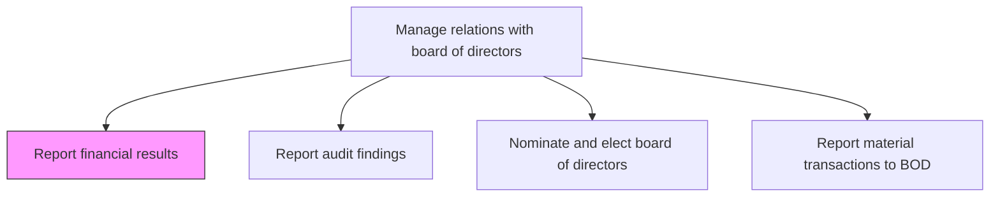
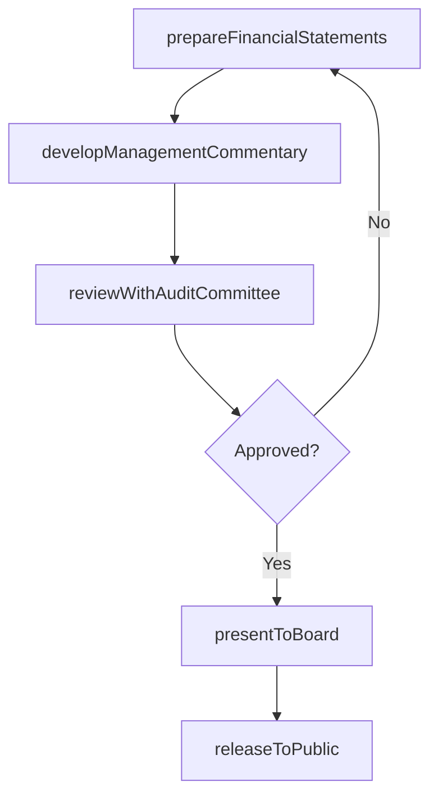

# Report financial results

> Business-as-Code definition for preparing and presenting quarterly and annual financial statements to the board of directors and releasing results to the public, including income statements, balance sheets, and cash flow statements.

## Overview

Reporting financial results to management, and releasing results to the public. Report financial statements, including the income statement, balance sheet, and statement of cash flows.

## Process Hierarchy



## GraphDL

```yaml
report:
  object: Financial Results
  actor: CFO
  result: FinancialResultsPackage
```

## Actions

| Action | Description |
|--------|-------------|
| prepareFinancialStatements | Compile income statement, balance sheet, and cash flow statement for reporting period |
| developManagementCommentary | Draft management discussion and analysis explaining financial performance |
| reviewWithAuditCommittee | Present financial results to the audit committee for review before board presentation |
| presentToBoard | Deliver financial results presentation to the full board of directors |
| releaseToPublic | Coordinate public release of financial results through earnings announcements |

## Events

| Event | Description |
|-------|-------------|
| financialStatementsPrepared | Financial statements compiled and reviewed for accuracy |
| managementCommentaryDeveloped | Management discussion and analysis drafted and approved |
| auditCommitteeReviewCompleted | Audit committee review of financial results completed |
| boardPresentationDelivered | Financial results presented to the board of directors |
| resultsReleasedToPublic | Financial results published through public channels |

## Searches

| Search | Description |
|--------|-------------|
| getFinancialStatements | Retrieve financial statements by period, type, or entity |
| getManagementCommentary | Query management discussion and analysis by reporting period |
| getBoardPresentations | Retrieve board financial presentations by date or quarter |
| getEarningsReleases | List public earnings releases by period |

## Process Flow



## RACI Matrix

| Activity | Responsible | Accountable | Consulted | Informed |
|----------|-------------|-------------|-----------|----------|
| prepareFinancialStatements | Controller | CFO | ExternalAuditor | InternalAudit |
| developManagementCommentary | CFO | CEO | Controller | Legal |
| reviewWithAuditCommittee | CFO | AuditCommitteeChair | ExternalAuditor | GeneralCounsel |
| presentToBoard | CFO | CEO | CorporateSecretary | AllDirectors |
| releaseToPublic | InvestorRelationsManager | CFO | Legal | PublicRelations |

## Related Processes

| Process | Relationship |
|---------|-------------|
| 12.3.2 Report audit findings | Parallel - audit findings presented alongside financial results |
| 12.1.3 Communicate with shareholders | Downstream - board-approved results are communicated to shareholders |
| 8.3 Manage treasury operations | Upstream - treasury data feeds into financial statements |

## Related Departments

| Department | Role |
|-----------|------|
| Finance | Prepares financial statements and management commentary |
| Internal Audit | Validates controls supporting financial reporting |
| Legal | Reviews disclosures for regulatory compliance |
| Investor Relations | Coordinates public release of financial results |

## Related Occupations

| Occupation | Involvement |
|-----------|-------------|
| Chief Financial Officer | Presents financial results to the board and audit committee |
| Corporate Controller | Prepares financial statements and supporting schedules |
| Investor Relations Manager | Manages public earnings release process |

## KPIs

| KPI | Description | Unit |
|-----|-------------|------|
| Reporting Timeliness | Days from period close to board financial presentation | Days |
| Financial Restatement Rate | Number of financial restatements issued per reporting cycle | Count |
| Audit Committee Approval Rate | Percentage of financial packages approved without revision | % |
| Earnings Release Accuracy | Percentage of public releases requiring no subsequent corrections | % |

## Usage

```typescript
import { reportFinancialResults } from '@headlessly/report-financial-results'

const financialReporting = reportFinancialResults()

// Prepare quarterly financial statements
const statements = await financialReporting.prepareFinancialStatements({
  period: 'Q4-2024',
  entity: 'consolidated',
  standards: 'US-GAAP',
  includeSegments: true
})

// Present to the board of directors
const presentation = await financialReporting.presentToBoard({
  meetingDate: '2025-02-20',
  financialPackage: statements.id,
  includeForecasts: true,
  comparisonPeriods: ['Q4-2023', 'Q3-2024']
})
```
