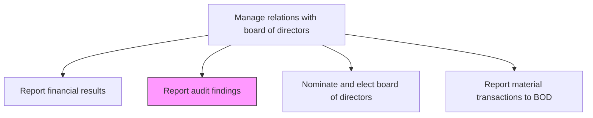
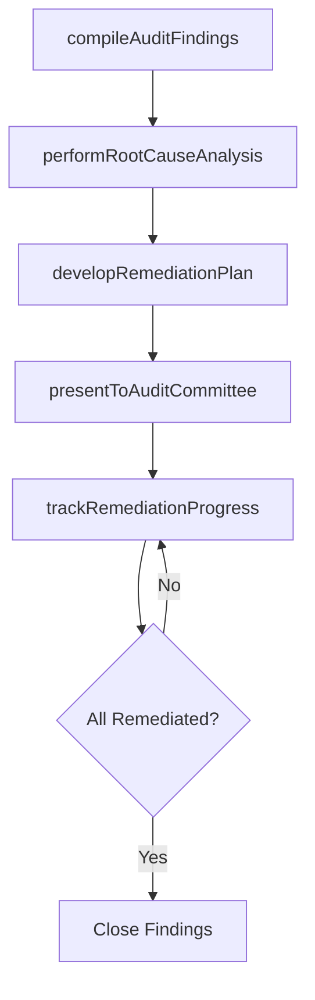

# Report audit findings

> Business-as-Code definition for presenting internal and external audit findings, root cause analyses, and remediation recommendations to management and the board audit committee.

## Overview

Reporting audit findings to management. Practice an internal audit with criteria for confirming a problem, a description of the situation, and the root cause of the problem. Make recommendations that resolve the issue.

## Process Hierarchy



## GraphDL

```yaml
report:
  object: Audit Findings
  actor: InternalAuditDirector
  result: AuditFindingsReport
```

## Actions

| Action | Description |
|--------|-------------|
| compileAuditFindings | Consolidate findings from internal and external audit engagements with severity ratings |
| performRootCauseAnalysis | Identify underlying causes of each audit finding using structured analysis |
| developRemediationPlan | Create actionable recommendations to address identified issues |
| presentToAuditCommittee | Deliver audit findings and remediation plans to the board audit committee |
| trackRemediationProgress | Monitor implementation status of management action plans for each finding |

## Events

| Event | Description |
|-------|-------------|
| auditFindingsCompiled | Audit findings consolidated and severity-rated for reporting |
| rootCauseAnalysisCompleted | Root cause analysis performed for each significant finding |
| remediationPlanDeveloped | Management action plans created and approved for findings |
| auditCommitteePresented | Audit findings report delivered to audit committee |
| remediationProgressTracked | Implementation status of action plans updated |

## Searches

| Search | Description |
|--------|-------------|
| findAuditFindings | List audit findings by severity, type, or department |
| getRemediationPlans | Retrieve remediation plans by finding or implementation status |
| getAuditReports | Query audit reports by engagement type or period |
| getRemediationStatus | Retrieve implementation status of management action plans |

## Process Flow



## RACI Matrix

| Activity | Responsible | Accountable | Consulted | Informed |
|----------|-------------|-------------|-----------|----------|
| compileAuditFindings | InternalAuditDirector | AuditCommitteeChair | ExternalAuditor | CFO |
| performRootCauseAnalysis | InternalAuditManager | InternalAuditDirector | ProcessOwners | Compliance |
| developRemediationPlan | ProcessOwners | InternalAuditDirector | Legal | CFO |
| presentToAuditCommittee | InternalAuditDirector | AuditCommitteeChair | CFO | CEO |

## Related Processes

| Process | Relationship |
|---------|-------------|
| 12.3.1 Report financial results | Parallel - audit findings provide assurance on financial reporting |
| 11.2 Manage compliance | Upstream - compliance reviews generate audit findings |
| 12.4.5 Ensure compliance | Parallel - compliance program audits feed into findings reports |

## Related Departments

| Department | Role |
|-----------|------|
| Internal Audit | Conducts audits and compiles findings for board reporting |
| Finance | Provides financial data and supports remediation of financial control findings |
| Compliance | Addresses regulatory compliance findings |
| Legal | Advises on legal implications of significant audit findings |

## Related Occupations

| Occupation | Involvement |
|-----------|-------------|
| Internal Audit Director | Leads audit findings compilation and board presentation |
| Internal Audit Manager | Performs root cause analysis and monitors remediation |
| External Auditor | Provides independent audit findings and assurance |

## KPIs

| KPI | Description | Unit |
|-----|-------------|------|
| Finding Remediation Rate | Percentage of audit findings remediated within target timeline | % |
| Open Finding Age | Average number of days findings remain open and unremediated | Days |
| Repeat Finding Rate | Percentage of audit findings that recur in subsequent audit cycles | % |
| Audit Committee Reporting Timeliness | Days from audit completion to audit committee presentation | Days |

## Usage

```typescript
import { reportAuditFindings } from '@headlessly/report-audit-findings'

const auditReporting = reportAuditFindings()

// Compile findings from recent audit engagements
const findings = await auditReporting.compileAuditFindings({
  period: 'Q4-2024',
  engagementTypes: ['internal-audit', 'external-audit', 'SOX-testing'],
  minimumSeverity: 'medium'
})

// Track remediation progress for open findings
const remediation = await auditReporting.trackRemediationProgress({
  findingStatus: 'open',
  includeOverdue: true,
  departments: ['finance', 'operations', 'IT']
})
```
