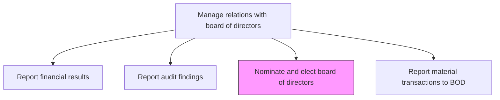
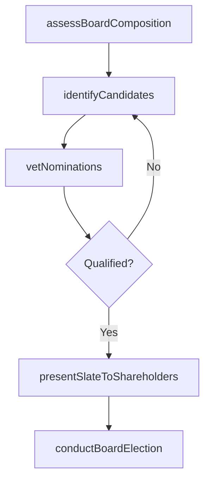

# Nominate and elect board of directors

> Business-as-Code definition for managing the process of identifying qualified board candidates, vetting nominations, conducting elections, and ensuring diverse, competent board composition aligned with governance best practices.

## Overview

Managing the process of identifying qualified candidates for the board of directors, reviewing nominations through the nominating and governance committee, conducting board elections at annual shareholder meetings, and ensuring the board composition reflects required skills, experience, and diversity.

## Process Hierarchy



## GraphDL

```yaml
nominate:
  object: And Elect Board Of Directors
  actor: NominatingCommitteeChair
  result: BoardElectionRecord
```

## Actions

| Action | Description |
|--------|-------------|
| assessBoardComposition | Evaluate current board skills, experience gaps, diversity, and term expirations |
| identifyCandidates | Source and screen potential board candidates through search firms and networks |
| vetNominations | Conduct due diligence on candidates including background checks and conflict-of-interest review |
| presentSlateToShareholders | Prepare proxy materials with director nominee profiles for shareholder voting |
| conductBoardElection | Administer the board election process at the annual meeting and tabulate results |

## Events

| Event | Description |
|-------|-------------|
| boardCompositionAssessed | Board skills matrix and gap analysis completed |
| candidatesIdentified | Potential board candidates sourced and shortlisted |
| nominationsVetted | Candidate due diligence and background checks completed |
| slatePresented | Director nominee slate included in proxy materials for shareholder review |
| boardElectionConducted | Board election results certified at annual meeting |

## Searches

| Search | Description |
|--------|-------------|
| getBoardComposition | Retrieve current board member profiles, terms, and committee assignments |
| findCandidates | List potential board candidates by expertise, industry, or diversity criteria |
| getNominationHistory | Query historical board nominations and election results |
| getProxyVotingResults | Retrieve shareholder voting results for director elections |

## Process Flow



## RACI Matrix

| Activity | Responsible | Accountable | Consulted | Informed |
|----------|-------------|-------------|-----------|----------|
| assessBoardComposition | NominatingCommittee | BoardChair | GovernanceAdvisor | Shareholders |
| identifyCandidates | NominatingCommitteeChair | BoardChair | ExecutiveSearchFirm | CEO |
| vetNominations | CorporateSecretary | NominatingCommitteeChair | GeneralCounsel | Board |
| conductBoardElection | CorporateSecretary | BoardChair | Legal | Shareholders |

## Related Processes

| Process | Relationship |
|---------|-------------|
| 12.1.4.2 Develop and manage shareholder/investor relations | Upstream - shareholder sentiment influences director elections |
| 12.4.3 Manage corporate governance policies | Parallel - governance policies guide board composition requirements |
| 12.1.3 Communicate with shareholders | Downstream - election results communicated to shareholders |

## Related Departments

| Department | Role |
|-----------|------|
| Corporate Secretary | Administers the nomination and election process |
| Legal | Reviews candidate vetting and proxy materials for compliance |
| Human Resources | Supports executive skills assessment for board composition |
| Investor Relations | Manages shareholder communications regarding board elections |

## Related Occupations

| Occupation | Involvement |
|-----------|-------------|
| Corporate Secretary | Coordinates nomination logistics, proxy preparation, and election administration |
| Nominating Committee Chair | Leads candidate identification and evaluation |
| General Counsel | Advises on regulatory compliance and candidate due diligence |

## KPIs

| KPI | Description | Unit |
|-----|-------------|------|
| Board Diversity Index | Percentage of board members meeting diversity criteria | % |
| Director Election Support Rate | Average shareholder vote in favor of nominated directors | % |
| Candidate Pipeline Depth | Number of qualified candidates in the board candidate pipeline | Count |
| Board Skill Coverage | Percentage of required board competencies covered by current members | % |

## Usage

```typescript
import { nominateAndElectBoardOfDirectors } from '@headlessly/nominate-and-elect-board-of-directors'

const boardElections = nominateAndElectBoardOfDirectors()

// Assess current board composition for gaps
const assessment = await boardElections.assessBoardComposition({
  criteria: ['financial-expertise', 'technology', 'ESG', 'international'],
  diversityTargets: { gender: 0.4, ethnicity: 0.3 },
  expiringTerms: 2025
})

// Vet a board candidate nomination
const vetting = await boardElections.vetNominations({
  candidateId: 'CAND-2025-003',
  checks: ['background', 'conflict-of-interest', 'public-company-experience'],
  committeeFit: ['audit', 'compensation']
})
```
