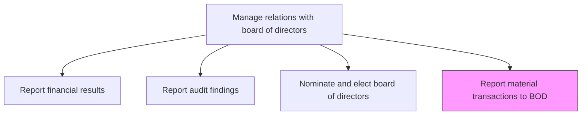
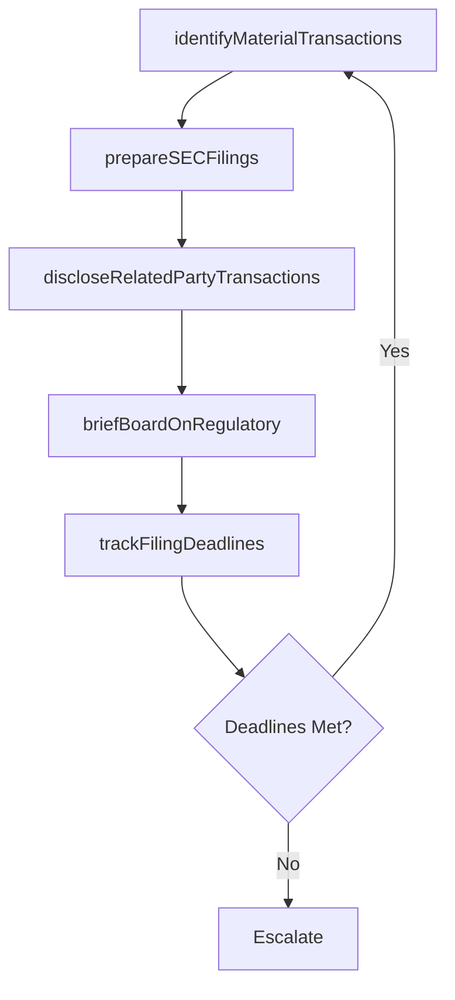

# Report material transactions, securities and exchange commission (SEC) reporting, etc. to BOD

> Business-as-Code definition for disclosing material transactions, SEC filings, regulatory matters, and significant corporate events to the board of directors to fulfill governance and fiduciary obligations.

## Overview

Disclosing material transactions, regulatory filings, securities and exchange commission (SEC) reporting matters, and other significant corporate events to the board of directors. Ensure the board is informed of transactions and filings that affect the organization's financial position, legal standing, or public disclosure obligations.

## Process Hierarchy



## GraphDL

```yaml
report:
  object: Material Transactions To BOD
  actor: CorporateSecretary
  result: MaterialTransactionDisclosure
```

## Actions

| Action | Description |
|--------|-------------|
| identifyMaterialTransactions | Monitor and flag transactions meeting materiality thresholds for board disclosure |
| prepareSECFilings | Compile and review SEC filings including 10-K, 10-Q, 8-K, and proxy statements |
| briefBoardOnRegulatory | Present regulatory filings, enforcement actions, and compliance matters to the board |
| discloseRelatedPartyTransactions | Report related-party transactions and potential conflicts of interest to the board |
| trackFilingDeadlines | Maintain a calendar of SEC and regulatory filing deadlines and submission status |

## Events

| Event | Description |
|-------|-------------|
| materialTransactionsIdentified | Transactions meeting materiality thresholds flagged for board disclosure |
| SECFilingsPrepared | SEC filing package reviewed and ready for submission |
| boardBriefedOnRegulatory | Regulatory matters presented to the board of directors |
| relatedPartyTransactionsDisclosed | Related-party transaction disclosures reviewed by the board |
| filingDeadlinesTracked | Filing calendar updated and upcoming deadlines monitored |

## Searches

| Search | Description |
|--------|-------------|
| findMaterialTransactions | List transactions meeting materiality thresholds by type or period |
| getSECFilingHistory | Retrieve SEC filing submissions by type, period, or status |
| getRelatedPartyTransactions | Query related-party transactions by party, amount, or disclosure status |
| getFilingCalendar | Retrieve upcoming SEC and regulatory filing deadlines |

## Process Flow



## RACI Matrix

| Activity | Responsible | Accountable | Consulted | Informed |
|----------|-------------|-------------|-----------|----------|
| identifyMaterialTransactions | CorporateSecretary | GeneralCounsel | CFO | CEO |
| prepareSECFilings | SecuritiesCounsel | GeneralCounsel | CFO | CorporateSecretary |
| briefBoardOnRegulatory | GeneralCounsel | CEO | CorporateSecretary | Board |
| trackFilingDeadlines | CorporateSecretary | GeneralCounsel | Finance | InvestorRelations |

## Related Processes

| Process | Relationship |
|---------|-------------|
| 12.3.1 Report financial results | Parallel - financial results are a component of SEC filings |
| 12.4.5 Ensure compliance | Upstream - compliance framework governs filing obligations |
| 12.1.3 Communicate with shareholders | Downstream - SEC filings are disclosed to shareholders |

## Related Departments

| Department | Role |
|-----------|------|
| Legal | Prepares SEC filings and advises on materiality determinations |
| Corporate Secretary | Coordinates board disclosures and maintains filing calendar |
| Finance | Provides financial data for filings and transaction disclosures |
| Investor Relations | Communicates public filings to the investment community |

## Related Occupations

| Occupation | Involvement |
|-----------|-------------|
| General Counsel | Oversees SEC filing preparation and materiality assessments |
| Corporate Secretary | Manages board disclosure process and filing deadline tracking |
| Securities Counsel | Prepares and reviews specific SEC filing documents |

## KPIs

| KPI | Description | Unit |
|-----|-------------|------|
| Filing Deadline Compliance | Percentage of SEC and regulatory filings submitted on time | % |
| Material Transaction Disclosure Timeliness | Average days from transaction identification to board notification | Days |
| Filing Amendment Rate | Number of amended filings as a percentage of total filings | % |
| Board Disclosure Completeness | Percentage of material events disclosed to the board within policy timeframe | % |

## Usage

```typescript
import { reportMaterialTransactionsToBoard } from '@headlessly/report-material-transactions-to-bod'

const materialReporting = reportMaterialTransactionsToBoard()

// Identify material transactions requiring board disclosure
const transactions = await materialReporting.identifyMaterialTransactions({
  period: 'Q4-2024',
  materialityThreshold: 5000000,
  types: ['acquisitions', 'divestitures', 'related-party']
})

// Track SEC filing deadlines
const deadlines = await materialReporting.trackFilingDeadlines({
  filingTypes: ['10-K', '10-Q', '8-K', 'proxy-statement'],
  lookAhead: '90-days',
  includeSubmitted: true
})
```
