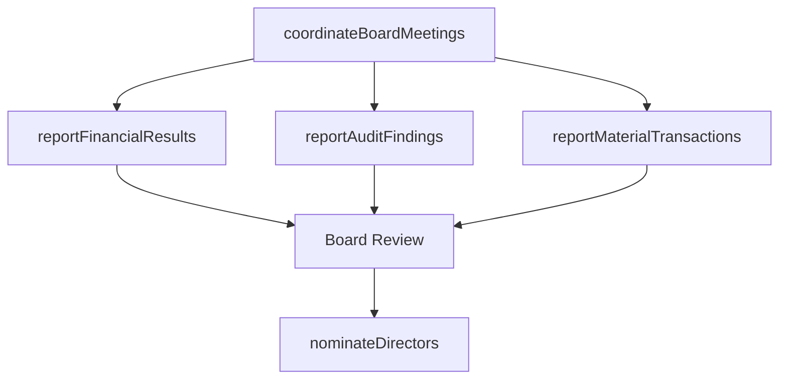

# Manage relations with board of directors

> Business-as-Code definition for maintaining effective governance relationships with the board of directors through financial reporting, audit communications, director nominations, and regulatory filings to support sound corporate decision-making.

## Overview

Maintaining relations with representatives of the stockholders. Establish corporate management-related policies and to make decisions on major company issues. Implement practices designed to engender communication, trust, and cooperation.

## Process Hierarchy

```mermaid
graph TD
    A[Manage relations with board of directors]
    A --> B[Report financial results]
    A --> C[Report audit findings]
    A --> D[Nominate and elect board of directors]
    A --> E[Report material transactions, securities and exchange commission (SEC) reporting, etc. to BOD]
```

## GraphDL

```yaml
manage:
  object: Relations With Board Of Directors
  actor: CorporateSecretary
  result: BoardGovernanceRecord
```

## Actions

| Action | Description |
|--------|-------------|
| reportFinancialResults | Present quarterly and annual financial performance to the board |
| reportAuditFindings | Communicate internal and external audit results to the audit committee |
| nominateDirectors | Manage the process of nominating and electing board members |
| reportMaterialTransactions | Disclose material transactions, SEC filings, and regulatory matters to the board |
| coordinateBoardMeetings | Plan agendas, distribute materials, and manage board meeting logistics |

## Events

| Event | Description |
|-------|-------------|
| financialResultsReported | Financial performance presentation delivered to the board |
| auditFindingsReported | Audit results communicated to audit committee |
| directorsNominated | Board member nominations completed and ratified |
| materialTransactionsReported | Material disclosures and SEC filings presented to the board |
| boardMeetingCoordinated | Board meeting conducted with minutes recorded |

## Searches

| Search | Description |
|--------|-------------|
| getBoardCalendar | Retrieve upcoming board meetings and committee sessions |
| findBoardResolutions | Query board resolutions by date, topic, or committee |
| getBoardComposition | Retrieve current board member profiles and committee assignments |
| getFilingHistory | List regulatory filings submitted to SEC or other authorities |

## Process Flow



## RACI Matrix

| Activity | Responsible | Accountable | Consulted | Informed |
|----------|-------------|-------------|-----------|----------|
| reportFinancialResults | CFO | CEO | Controller | Board |
| reportAuditFindings | InternalAuditDirector | AuditCommitteeChair | ExternalAuditor | CFO |
| nominateDirectors | NominatingCommittee | BoardChair | GeneralCounsel | Shareholders |
| reportMaterialTransactions | CorporateSecretary | CEO | Legal | Board |
| coordinateBoardMeetings | CorporateSecretary | BoardChair | CEO | AllDirectors |

## Sub-Processes

| ID | Name | Description |
|----|------|-------------|
| 12.3.1 | Report financial results | Reporting financial results to management, and releasing results to the public. Report financial sta |
| 12.3.2 | Report audit findings | Reporting audit findings to management. Practice an internal audit with criteria for confirming a pr |
| 12.3.3 | Nominate and elect board of directors | Managing the process of identifying qualified candidates, reviewing nominations, and conducting board |
| 12.3.4 | Report material transactions, securities and exchange commission (SEC) reporting, etc. to BOD | Disclosing material transactions, regulatory filings, and SEC reporting matters to the board of dire |

## Related Processes

| Process | Relationship |
|---------|-------------|
| 12.1 Build investor relationships | Upstream - investor intelligence informs board discussions |
| 8.0 Manage Financial Resources | Upstream - financial data drives board reporting |
| 11.0 Manage Enterprise Risk | Upstream - risk posture reported to board oversight committees |

## Related Departments

| Department | Role |
|-----------|------|
| Corporate Secretary | Coordinates board meetings, minutes, and governance records |
| Finance | Prepares financial reports and presentations for the board |
| Internal Audit | Reports audit findings and control assessments |
| Legal | Ensures regulatory filings and corporate governance compliance |

## Related Occupations

| Occupation | Involvement |
|-----------|-------------|
| Corporate Secretary | Manages board governance processes and record-keeping |
| Chief Financial Officer | Presents financial performance to the board |
| Internal Audit Director | Reports audit findings to the audit committee |

## KPIs

| KPI | Description | Unit |
|-----|-------------|------|
| Board Meeting Attendance | Average director attendance rate across board meetings | % |
| Filing Timeliness | Percentage of SEC and regulatory filings submitted on time | % |
| Board Material Delivery Lead Time | Average days board materials are distributed before meetings | Days |
| Resolution Implementation Rate | Percentage of board resolutions fully implemented within timeline | % |

## Usage

```typescript
import { manageRelationsWithBoardOfDirectors } from '@headlessly/manage-relations-with-board-of-directors'

const boardRelations = manageRelationsWithBoardOfDirectors()

// Coordinate upcoming board meeting
const meeting = await boardRelations.coordinateBoardMeetings({
  type: 'quarterly',
  date: '2025-03-15',
  agenda: ['financial-review', 'risk-report', 'strategic-initiatives']
})

// Report financial results to the board
const report = await boardRelations.reportFinancialResults({
  period: 'Q4-2024',
  includeForecasts: true,
  comparisonPeriod: 'Q4-2023'
})

// Retrieve board resolution history
const resolutions = await boardRelations.findBoardResolutions({
  year: 2024,
  committee: 'audit',
  status: 'implemented'
})
```
