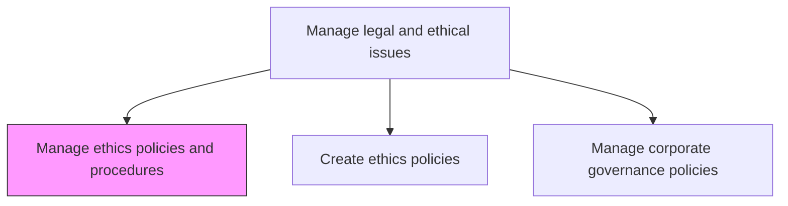
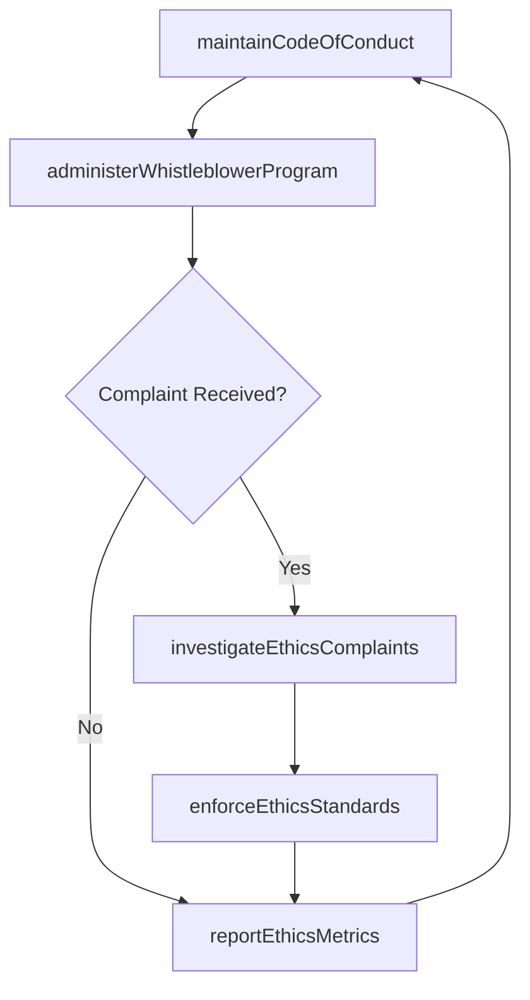

# Manage ethics policies and procedures

> Business-as-Code definition for overseeing the lifecycle of organizational ethics policies including development, dissemination, enforcement, monitoring, and continuous improvement of ethical standards.

## Overview

Overseeing the lifecycle of organizational ethics policies including development, dissemination, enforcement, monitoring, and continuous improvement of ethical standards across the organization. Manage the code of conduct, whistleblower programs, and ethics investigation processes.

## Process Hierarchy



## GraphDL

```yaml
manage:
  object: Ethics Policies And Procedures
  actor: EthicsOfficer
  result: EthicsProgramStatus
```

## Actions

| Action | Description |
|--------|-------------|
| maintainCodeOfConduct | Develop and update the organization's code of conduct and ethics standards |
| administerWhistleblowerProgram | Manage ethics hotline, anonymous reporting channels, and non-retaliation protections |
| investigateEthicsComplaints | Conduct or oversee investigations of reported ethics violations |
| enforceEthicsStandards | Apply disciplinary measures for confirmed ethics violations |
| reportEthicsMetrics | Compile and present ethics program data to leadership and the board |

## Events

| Event | Description |
|-------|-------------|
| codeOfConductMaintained | Code of conduct reviewed and updated for current standards |
| whistleblowerProgramAdministered | Ethics hotline or reporting channel reviewed and operational |
| ethicsComplaintInvestigated | Ethics violation investigation completed with findings documented |
| ethicsStandardsEnforced | Disciplinary action taken for confirmed ethics violation |
| ethicsMetricsReported | Ethics program performance data presented to leadership |

## Searches

| Search | Description |
|--------|-------------|
| getEthicsPolicies | Retrieve current ethics policies by topic, version, or effective date |
| findEthicsComplaints | List ethics complaints by category, status, or reporting channel |
| getInvestigationResults | Query ethics investigation outcomes by department or severity |
| getEthicsMetrics | Retrieve ethics program performance metrics by period |

## Process Flow



## RACI Matrix

| Activity | Responsible | Accountable | Consulted | Informed |
|----------|-------------|-------------|-----------|----------|
| maintainCodeOfConduct | EthicsOfficer | GeneralCounsel | HR | AllStaff |
| administerWhistleblowerProgram | EthicsOfficer | GeneralCounsel | InternalAudit | Board |
| investigateEthicsComplaints | EthicsInvestigator | EthicsOfficer | Legal | HR |
| reportEthicsMetrics | EthicsOfficer | GeneralCounsel | Compliance | Board |

## Related Processes

| Process | Relationship |
|---------|-------------|
| 12.4.2 Create ethics policies | Downstream - policy creation feeds into lifecycle management |
| 12.4.3 Manage corporate governance policies | Parallel - governance and ethics policies are interdependent |
| 9.6.1 Manage employee grievances | Parallel - ethics complaints may overlap with HR grievances |

## Related Departments

| Department | Role |
|-----------|------|
| Ethics and Compliance | Owns ethics policy management and investigation processes |
| Legal | Advises on legal implications of ethics matters |
| Human Resources | Supports enforcement actions and training delivery |
| Internal Audit | Provides independent review of ethics program effectiveness |

## Related Occupations

| Occupation | Involvement |
|-----------|-------------|
| Ethics Officer | Leads ethics program administration and investigation oversight |
| Ethics Investigator | Conducts investigations of reported ethics violations |
| General Counsel | Provides legal oversight of the ethics program |

## KPIs

| KPI | Description | Unit |
|-----|-------------|------|
| Ethics Complaint Volume | Number of ethics complaints received per period | Count |
| Investigation Closure Time | Average days to complete an ethics investigation | Days |
| Substantiation Rate | Percentage of ethics complaints with confirmed violations | % |
| Ethics Policy Acknowledgment Rate | Percentage of employees acknowledging the code of conduct annually | % |

## Usage

```typescript
import { manageEthicsPoliciesAndProcedures } from '@headlessly/manage-ethics-policies-and-procedures'

const ethics = manageEthicsPoliciesAndProcedures()

// Review current code of conduct
const codeOfConduct = await ethics.maintainCodeOfConduct({
  reviewType: 'annual',
  includeUpdatedSections: ['anti-bribery', 'conflicts-of-interest', 'data-privacy'],
  effectiveDate: '2025-01-01'
})

// Investigate an ethics complaint
const investigation = await ethics.investigateEthicsComplaints({
  complaintId: 'ETH-2025-042',
  assignInvestigator: 'ethics-investigator-01',
  scope: ['document-review', 'witness-interviews'],
  targetCompletionDate: '2025-03-15'
})
```
